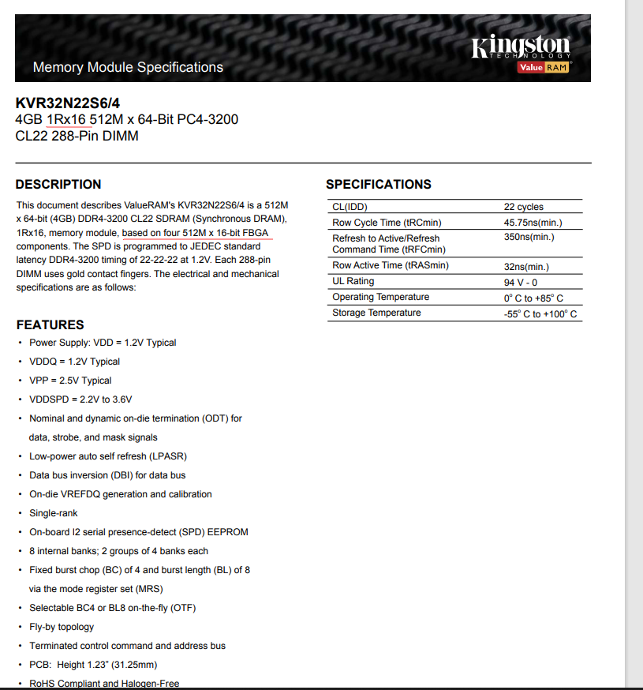
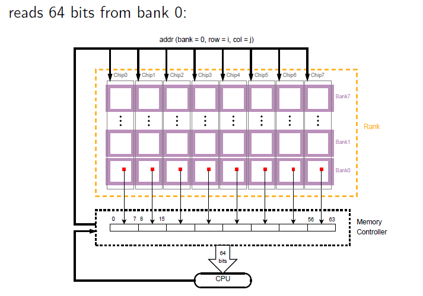

# 内存管理


### memory hierarchy
* 
* CPU可以直接访问内存数据，但缓存的存在可以提供更快速的数据访问

### (MMU)memory management unit
* **其实是CPU中的一部分**
* CPU <---> MMU (TLB,Translation Lookaside Buffer，如果hit只要一个clock cycle) <---> Front-Sied Bus(前端总线) <---> Memory controller <---> memory rows and columns 
* 只能指定一个地址，而不能指定长度，长度取决于cache line的长度
* PTE(page table entry)，
* page fault
* PP: Physical Page, VP: Virtual Page
* 地址管理不可能精确到每个地址，一定是一块一块的进行管理，否则管理成本太高
* TLB(Translation Lookaside Buffer):  MMU中的一个缓冲区，其中每一行都保存着一个由单个PTE组成的块。
* 一个n位的虚拟地址包含两个部分，一个p位的虚拟页面偏移量（Virtual Page Offset, VPO）和一个（n - p）位的虚拟页号（Virtual Page Number, VPN）, VPN又被分为VPN[1-n],对应多级页表
* 页表
  * 向前映射页表,分层分页
  * 哈希页表,64bit系统，分层表也过于庞当，使用哈希页表，也可以使用多级页表
* CR3(Control Register 3) 用来存放页表的基地址（这里是实际的物理地址）
* Page Global Directory(PGD index)
* Page Table Entry (PTE index)


### RAM 
* SRAM(Static Random Access Memory): 6个晶体管存储一个bit
* DRAM(Dynamic Random Access Memory): 一个晶体管和一个电容存储一个bit，1或者0其实就是电容的电量，所以需要不断刷新，因为电容会漏电
* SDRAM(synchronous DRAM): synchronized with the clock speed that the microprocessor is optimized for
* DDR: Double Data Rate Synchronous Dynamic Random-Access Memory (DDR SDRAM) 
  * 不同的DDR之间不兼容，比如ddr3的主板槽想要升级ddr4，需要更换主板
  * 意思是，在一个时钟周期中可以在上升沿和下降沿传输两次数据
* 双通道：相当于内存有两个门，允许两个通道同时访问
* channel > rank > chip(dram芯片，内存条上的黑片) > bank(基本阵列) > row > col > cell, 
* P-Bank(物理bank)其实就是rank，逻辑bank才是通常说的bank（L-Bank）
* module指一块内存条，对于64bit的内存，一个rank就是组成64bit长度的一组bank；所以rank不是由芯片的数目决定的，而是由bank的数量
* x4,x8指的是一个chip中bank的数量
* cell为一个bit，supercell为一个Byte，8个cell组成supercell
* CoreI7就将内存控制器和PCI控制器集成到了，所以北桥芯片就没用了
* DRAM的密度一般就是chip中晶体管的数量
* 内存的基本单位是bit
* 每一个 DRAM 芯片的存储结构是一个二维矩阵，二维矩阵中存储的元素我们称为超单元（supercell），每个 supercell 大小为一个字节（8 bit）。每个 supercell 都由一个坐标地址（i，j）。 i 表示二维矩阵中的行地址，在计算机中行地址称为 RAS (row access strobe，行访问选通脉冲)。 j 表示二维矩阵中的列地址，在计算机中列地址称为 CAS (column access strobe,列访问选通脉冲)。所以芯片的IO单位是一个SuperCell，**矩阵寻址的结果是一个字节**
* 1R: 1 rank，一组chips； 2R： 2组chips
* 64bit的bus的话，一个时钟周期需要收发64bit的数据，而单个内存颗粒的位宽仅有4bit、8bit或16bit，个别也有32bit的。显然发送方和接收方的位宽必须一致，不能说我发了64位数据出来，你才收到前面的16位，后面的就丢掉了。因此，**必须把多个颗粒并联起来，组成一个位宽为64bit的数据集合**，才可以和CPU互连。而一个rank则向cpu提供一个通道
* **dimm上多个rank数目是为了增加容量**,多个rank共享同一组addr/command信号线，利用cs片选线选择欲读取或是写入的那一组内存颗粒，之后，就可以对这一组内存颗粒进行读写
* 2Rx8: x8 **代表一个chip提供的位数**，2Rx8计算芯片数目: 2 * 64 / 8 = 16; 1R * 8 = 64 / 8 = 8;主流的内存颗粒（DRAM Devices）的数据位宽有4bit，8bit和16bit，分别对应x4，x8和x16类型内存颗粒. ，所以**supercell的位数与芯片对外提供的位数是相等的**
* 每个通道的总线是独立的，它们在物理上是分开的，不共享任何电气或逻辑资源。每个通道具有自己的数据总线、地址总线和控制总线，用于独立地传输数据和控制信号。**一个通道可以控制一个或者多个dimm**
* 程序员眼里连续的物理内存地址实际上在物理上是不连续的。因为这连续的 8 个字节其实是存储于不同的 DRAM 芯片上的。每个 DRAM 芯片存储一个字节（supercell） 
* 每个bank有一个row bufffer，作为一个bank page，所有bank共享地址、数据总线，但是每个channel有他们自己的地址、数据总线。正因为有buffer，所以每次bank都会预读64bit的数据
* 一个chip中一个时钟周期只能访问一个bank，而memory controller生成的内存的地址是面向bank的，不是面向某个chip的

### FBGA(Fine Pitch Ball Grid Array)
* 底部有焊球的面阵引脚结构, 使封装所需的安装面积接近于芯片尺寸。BGA是英文Ball Grid Array Package的缩写, 即球栅阵列封装。
  
### （memory controller）内存控制器
* 将物理地址转化为对bank的访问
* **注意不是MMU**
### DIMM (Dual-Inline-Memory-Modules),双列直插式存储模块
* 双面都有芯片的意思
* 对应Single-Inline-Memory-Module(单列直插式内存模块)，只有单面芯片
* 内存插槽的接口模式
* SO-DIMM（Small Outline DIMM Module），笔记本使用的
## 内核栈
* 一个用户态进程/线程在内核中都是用一个task_struct的实例描述的，这个有点类似设计模式里面的桥接模式(handle-body), 用户态看到的进程PID，线程TID都是handle, task_struct是body
* C语言书里面讲的堆、栈大部分都是用户态的概念，用户态的堆、栈对应用户进程虚拟地址空间里的一个区域，栈向下增长，堆用malloc分配，向上增长。用户空间的堆栈，在task_struct->mm->vm_area里面描述，都是属于进程虚拟地址空间的一个区域。
* 内核态的栈在tsak_struct->stack里面描述，其底部是thread_info对象，thread_info可以用来快速获取task_struct对象。所以一个进程的内核栈，也是进程私有的，只是在task_struct->stack里面获取。
* 内核态没有堆的概念，用kmalloc()分配内存，实际上是Linux内核统一管理的，一般用slab分配器，也就是一个内存缓存池，管理所有可以kmalloc()分配的内存。所以从原理上看，在Linux内核态，kmalloc分配的所有的内存，都是可以被所有运行在Linux内核态的task访问到的。
* code
```
struct task_struct {
 volatile long state; /* -1 unrunnable, 0 runnable, >0 stopped */
 void *stack;
 atomic_t usage;
 unsigned int flags; /* per process flags, defined below */
 unsigned int ptrace;
 int lock_depth; /* BKL lock depth */ 
 /* ...... */ 
};
```
* 每个进程被创建的时候，在生成进程描述符task_struct的同时，会生成两个栈，一个是用户栈，位于用户地址空间；一个是内核栈，位于内核空间。当进程在用户地址空间中执行的时候，使用的是用户栈，CPU堆栈指针寄存器中存的是用户栈的地址；同理，当进程在内核空间执行时，CPU堆栈指针寄存器中放的是内核栈的地址。
* 当位于用户空间的进程进行系统调用时，它会陷入内核，让内核代其执行。此时，进程用户栈的地址会被存进内核栈中，CPU堆栈指针寄存器中的内容也会变为内核栈的地址。当系统调用执行完毕，进程从内核栈找到用户栈的地址，继续在用户空间中执行，此时CPU堆栈指针寄存器就变为了用户栈的地址。

## real mode & protected mode
* real mode 就是直接访问物理内存
* 保护模式是利用虚拟地址访问物理内存

## 几个地址概念
* 线性地址(linear address是intel手册中使用的概念) == 虚拟地址(内核中使用的概念)
* 逻辑地址 == 相对地址: selector:offset
* 物理地址: 内存的直接地址
* 转换： 汇编指令中使用的是相对地址，需要使用"段式内存管理"转为线性地址，然后利用"页式内存管理"转为物理地址
* 段式内存管理: 利用selector:offset，对应的CS:IP两个寄存器中的值，使用GDT(Global Descriptor Table，对应的内核的段)和LDT(Local Descriptor Table，对应用户的代码段)找到段对应的起始地址

## intel定义的三大表子
* IDT(Interrupt Descriptor Table), 对应寄存器IDTR, LIDT指令
* LDT ( Local Descriptor Table), 对应寄存器LDTR, LLDT
* GDT ( Global Descriptor Table ), 对应寄存器GDTR, LGDT指令
* TSS (Task State Segment ),对应寄存器TR, LTR
* 不知道为什么，总是喜欢使用Descriptor这个词

## TSS(Task State Segment)
* 进程的任务状态段信息结构。在任务从执行中被切换出时tss_struct结构保存了当前处理器的所有寄存器值。当任务又被CPU重新执行时，CPU就会利用这些值恢复到任务被切换出时的状态，并开始执行。

## 理解
* 在内核栈上可以操作一切用户态的数据的
* 一定要时刻谨记用户态还是内核态
* 不管是内核态还是用户态执行，都是同一个进程在运行
* 在内核态，堆、栈、向下增长等概念都消失不见了
* 缓存是一种提供运行期望的方法

## mmap
* 实现文件地址空间与虚拟地址空间的映射
* 间接效果，通过文件做为关联实现两个进程间共享内存
* 比较swap，也是内存与硬盘的勾兑

### 芯片硬件封装
* 一个package包括一个Die，则为SDP
* 一个package包括两个Die，则为DDP（double-die package），容量就是2个内存颗粒的大小
* 一个Package就是内存条上的一个小黑块

## swap 
```
> free -m 
              total        used        free      shared  buff/cache   available
Mem:           2827         465        1201          14        1160        2092
Swap:          2048         135        1913
> swapon -s
Filename                                Type            Size    Used    Priority
/dev/sda2                               partition       2098172 139008  -2
```