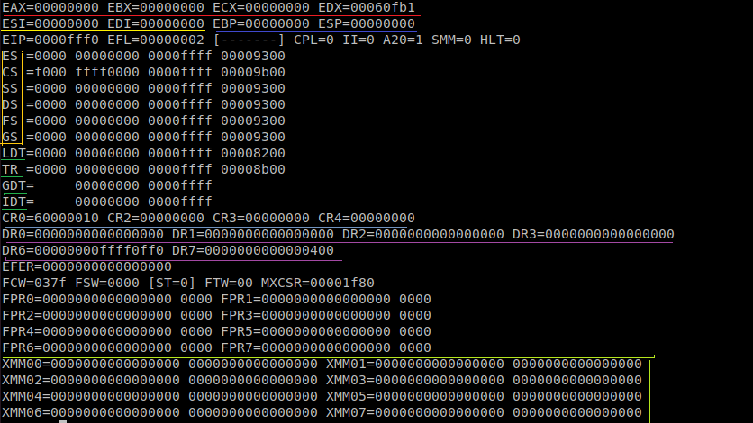
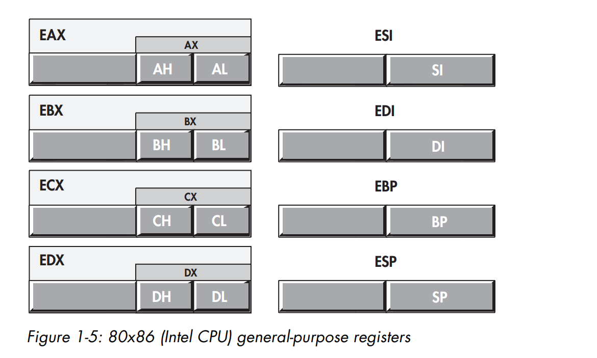
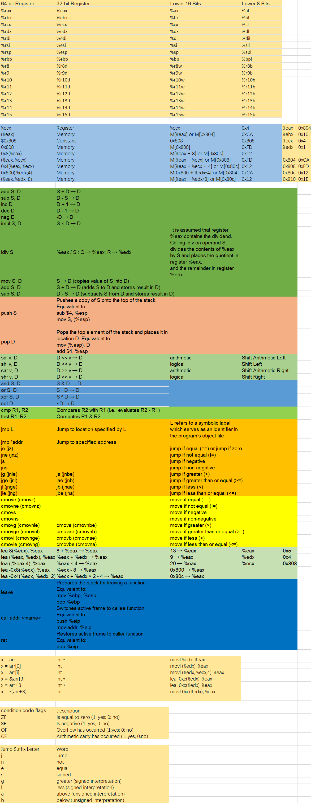
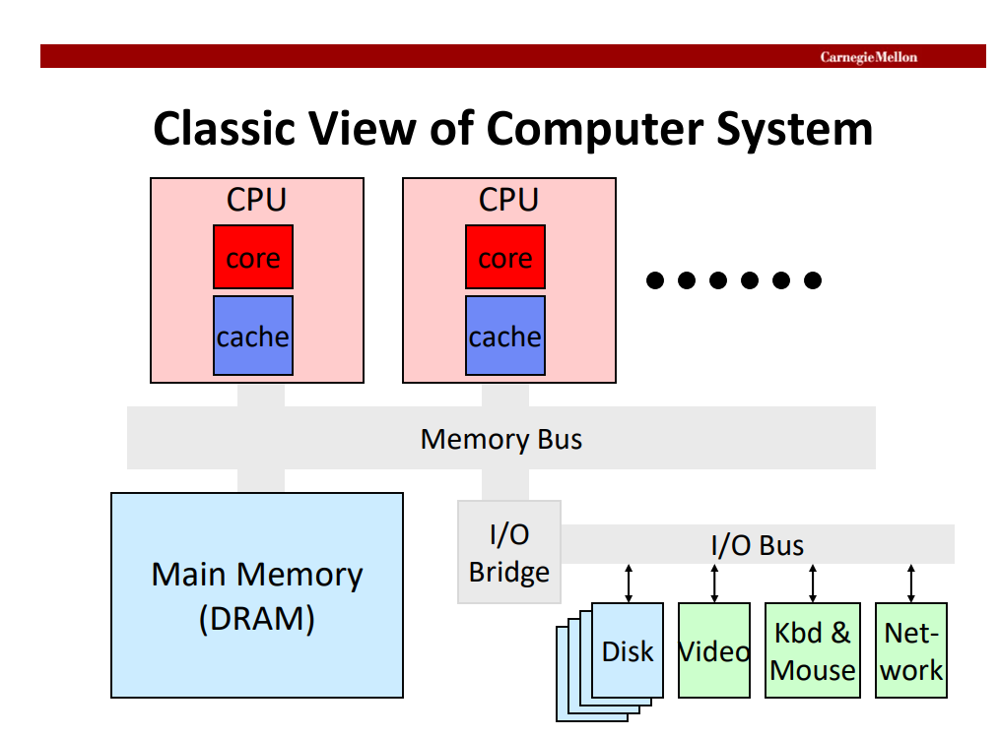
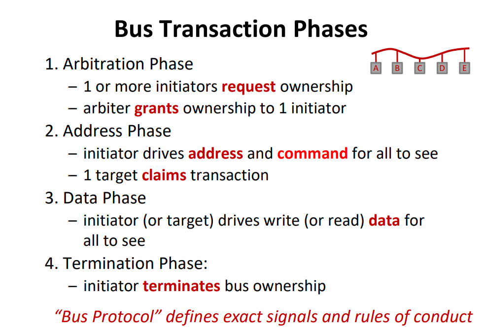
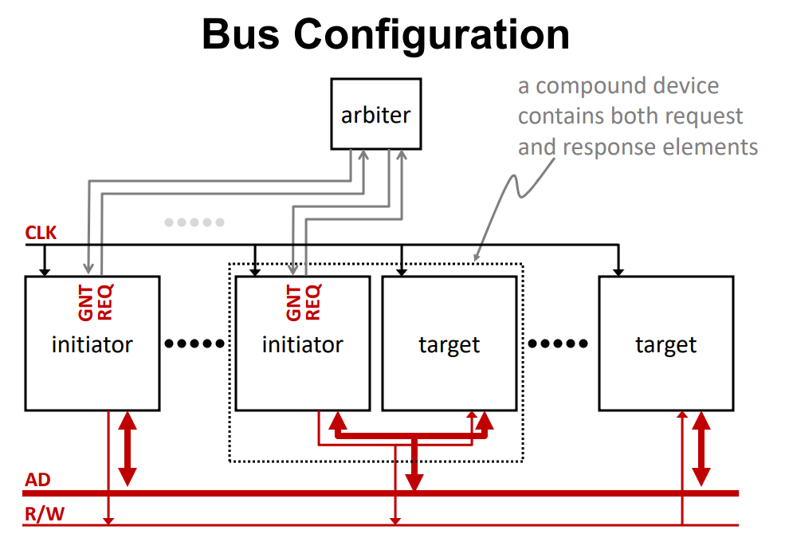
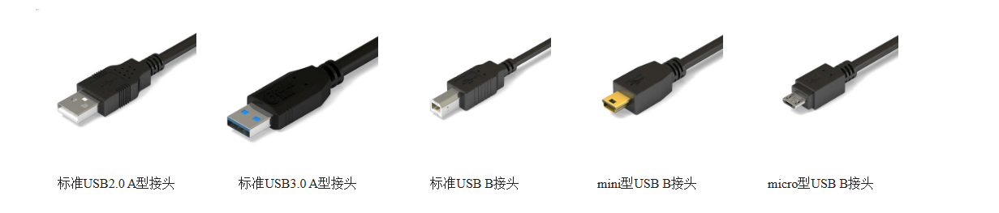
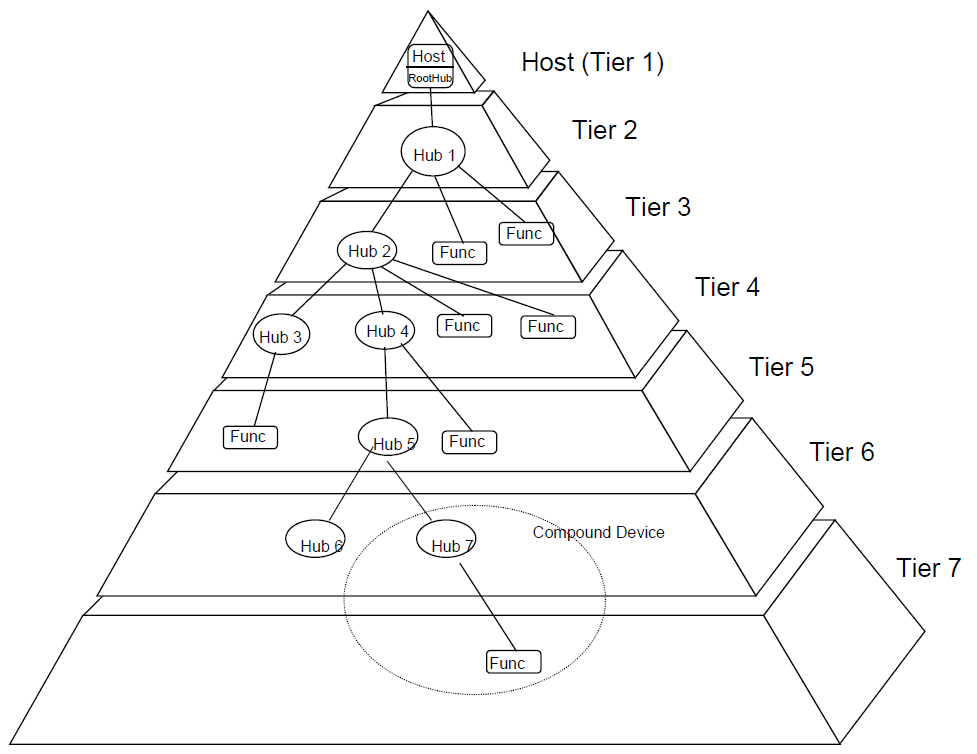

### Physics

### Circuit
* [涉及练习](https://circuitverse.org/simulator)
* [已有模型](https://circuitverse.org/simulator/51702)
* [逻辑练习](http://www.ee.unb.ca/cgi-bin/tervo/alu.pl?num=1001100110011001&den=1101101110011101&f=x)


### 什么是寄存器
* 寄存器就是一种常用的时序逻辑电路，但这种时序逻辑电路只包含存储电路
* 就是晶体管的阵列
* 寄存器的存储电路是由锁存器或触发器构成的，因为一个锁存器或触发器能存储1位二进制数，所以由N个锁存器或触发器可以构成N位寄存器。
* 
* 
* E 代表Extend
* CR (Control Registers)
  ```
  CR0、CR2、CR3 和 CR4 是 x86 架构中的控制寄存器（Control Registers），它们用于管理和控制处理器的各种特性和操作。
  CR0（Control Register 0）：CR0 寄存器用于控制处理器的基本运行模式和特性，包括分页机制、保护模式、任务切换、浮点运算等。它包含了一系列的标志位，如分页使能标志、保护模式标志、浮点协处理器存在标志等。
  CR2（Control Register 2）：CR2 寄存器用于存储导致页面错误（Page Fault）的线性地址。当程序访问虚拟地址时，如果相关页面未映射或权限错误，就会引发页面错误异常，此时 CR2 寄存器记录了导致页面错误的地址。
  CR3（Control Register 3）：CR3 寄存器是页表基址寄存器（Page Table Base Register），用于存储页表的物理地址。页表是操作系统使用的一种数据结构，用于管理虚拟地址和物理地址之间的映射关系。
  CR4（Control Register 4）：CR4 寄存器包含了一些扩展的系统控制标志位，用于控制处理器的一些高级特性，如分页扩展、虚拟机扩展、时间戳计数器等。
  ```
* DR（Debug Registers）系列寄存器是 x86 架构中的调试寄存器，用于支持调试和性能分析操作。
* FPR（Floating-Point Registers）系列寄存器用于处理浮点数运算。FPR 寄存器是浮点单元（Floating-Point Unit, FPU）的一部分，用于执行浮点数操作和浮点数运算。
  * FEER（Floating-Point Exception Enable Register）：FEER 寄存器用于控制浮点异常的使能和屏蔽。它的每个位对应一个浮点异常，例如溢出、除零等。通过设置 FEER 的位，可以选择是否使能或屏蔽相应的浮点异常。
  * FCW（Floating-Point Control Word）：FCW 寄存器存储浮点数的控制信息，如舍入模式、精度控制等。它的位字段用于控制浮点运算的行为，例如舍入方式（向上舍入、向下舍入等）和浮点数精度（单精度、双精度等）。
  * FSW（Floating-Point Status Word）：FSW 寄存器存储浮点运算的状态信息，如浮点异常状态和标志位。当浮点操作发生异常时，FSW 寄存器的相应位将被设置，以指示异常类型和状态。
  * ST（Floating-Point Stack Top）：ST 寄存器是一个栈，用于存储浮点数值。FPU 的操作涉及到对栈顶 ST 寄存器中的数据进行操作，例如加载、存储和计算。
  * FTW（Floating-Point Tag Word）：FTW 寄存器用于标记 FPU 中每个寄存器的状态。每个 ST 寄存器都有一个对应的 FTW 位，用于指示寄存器中的数据类型（有效数、空闲、特殊值等）。
  * MXCSR（Floating-Point Control and Status Register）：MXCSR 寄存器是扩展的浮点控制和状态寄存器，用于存储更多的浮点控制和状态信息。它包含了各种标志位，用于控制浮点运算、处理浮点异常和捕捉 SSE（Streaming SIMD Extensions）指令集的异常。
* XMM 寄存器是在x86 架构中引入的一组寄存器，用于支持 SIMD（Single Instruction, Multiple Data）指令集和向量化操作。
* The CPU’s set of general-purpose registers is organized into a **register file** circuit
* **ESP不一定指向栈所有数据的顶部**
### overview
* 
### 通用架构
* CIR（Current Instruction Register）和MDR（Memory Data Register）是基于经典的冯·诺依曼计算机体系结构中的概念，而不是特定于某个具体的计算机架构。

### 总线
* 总线上传输的地址是广播给所有连接的设备的,所有设备都能接收到总线上传输的地址信号。**设备通过地址解码（Address Decoding）将指令进行匹配**，类似网卡筛选网络数据
##### IO 总线
* PCI总线是最常见的IO总线，属于内部总线
* 另外还有ISA总线、USB总线、SCSI、SATA，属于外部总线

### EEPROM 
* EEPROM的全称是“电可擦除可编程只读存储器”，即Electrically Erasable Programmable Read-Only Memory。
* 可以保存100年，可以擦写100w次
* BIOS使用

### SoC
* system on a chip 


### BIOS 
* 存储最基础的信息
* [open-bios](https://openfirmware.info/Welcome_to_OpenBIOS)
* [git-open-bios](https://github.com/openbios/openbios)
* [TianoCore](https://www.tianocore.org/)
* [edk2](https://github.com/tianocore/edk2/tree/master)
* 可以写，否则怎么进行bios设置呢
* bios可以很复杂， 想想bios的设置界面

### IO总线之PCI(Peripheral Component Interconnect)
* PCI是共享式的，所有设备共享地址和数据线路，使用总线事务进行调节
* 
* 
* 
* 仲裁者通常位于南桥芯片中
* 设备握手是单独的line，而数据和地址传输是共享的
* 在IN 或者OUT指令的时候，如果存在北桥芯片，**则可能需要北桥将指令转发到南桥**


### 理解
* 总有一种技术将各种设备连接在一起，这就是总线

### 防呆口
* 比如内存金手指中间的那个缝隙


### USB (Universal Serial Bus)
* USB的一个核心设计理念就是，为PC机上各种各样的接口提供一种统一的解决方案，否则计算机就会被各种奇奇怪怪的接口所插满，因为有太多外设想接进去了
* 
* 
* USB系统是一种"阶梯式星型拓扑(Tiered star topology)"结构的主从通信系统。 它由一个主机(host)和最多127个外设(Devices或者Peripheral)构成。

### FPGA
* Field-Programmable Gate Array
* 便于硬件升级
* VHDL Verilog 编程语言
* 普通的CPU或者各种芯片，功能都是设定好的，而FPGA能够升级调整
* 受能耗、工艺的影响较大


### RTC (Real-Time Clock)
* 实时时钟是计算机内部的一个独立时钟，用于追踪当前的时间和日期。它是一个独立于计算机操作系统的硬件设备，在计算机关机或断电时也能保持时间的记录。
* 相当于计算机的挂钟

### PLL (Phase-Locked Loop)
#### 主存与CPU之间通过PLL的通信过程如下
1. 时钟信号生成：PLL接收一个稳定的参考时钟信号作为输入，这可以是系统中的主时钟源。PLL使用参考时钟信号作为基准，并通过内部电路和反馈回路生成一个稳定的高频时钟信号，用于驱动FSB或互连接口。
2. 时钟分配：通过PLL生成的高频时钟信号被分配给FSB或互连接口，成为它们的工作时钟。这样，主存和CPU之间的通信可以在共享的时钟基准下进行，确保数据的传输和处理同步性。
3. 时钟同步：通过PLL提供的时钟信号，**主存和CPU能够保持同步的时钟相位和频率**。这对于数据的正确传输和协调操作至关重要。时钟同步确保主存和CPU能够在正确的时间进行数据读取和写入，从而确保数据的可靠性和一致性。
4. 时钟调节：在某些情况下，CPU可能需要动态地调整工作频率，以满足不同的计算需求和功耗要求。通过调节PLL的控制信号或调整PLL的倍频因子，可以改变FSB或互连接口的时钟频率，从而影响主存和CPU之间的通信速率。


### 不同频率的硬件之间数据同步方式
* 分频和倍频：某些硬件模块可以通过分频或倍频的方式来调整其时钟频率，以适应其他模块的工作频率。例如，通过将一个模块的时钟信号分频为另一个模块所需的频率，或者将一个模块的时钟信号倍频为其他模块所需的频率。
* PLL调节：PLL（Phase-Locked Loop）可以用于调节时钟信号的频率。通过调整PLL的倍频因子或控制电压，可以改变时钟信号的频率，以适应其他模块的工作频率。
* 数据缓冲和同步：在不同频率的硬件模块之间进行数据传输时，可能需要使用数据缓冲和同步技术来解决时钟差异带来的问题。这些技术可以将数据进行临时存储和同步，以确保数据在不同频率的模块之间正确传输。


### XPU
* NPU: neural 
* GPU: graphic
* FPU: float


### 时序逻辑电路 组合逻辑电路
* 组合逻辑电路的输出仅依赖于当前的输入状态，而不受任何时钟或时序限制。它的输出是根据输入信号通过逻辑门（如与门、或门、非门等）的组合来进行逻辑运算产生的。
* 时序逻辑电路的输出不仅取决于当前的输入状态，还受到时钟信号和先前的状态存储元件（如触发器、锁存器）的影响。它的输出在时钟信号的作用下，按照一定的时序规则进行状态转换和存储。
* 触发器的命名来源于它的工作原理和功能。触发器在数字电路中的作用是响应特定的触发事件或信号，并在触发条件满足时改变其状态。因此，这种电路元件被称为 "触发器"（Trigger）。
* RS 触发器
  * Reset  Set 
* D(Data) 触发器，锁存器
* 触发器是一种**存储元件**，用于存储和传递数据。