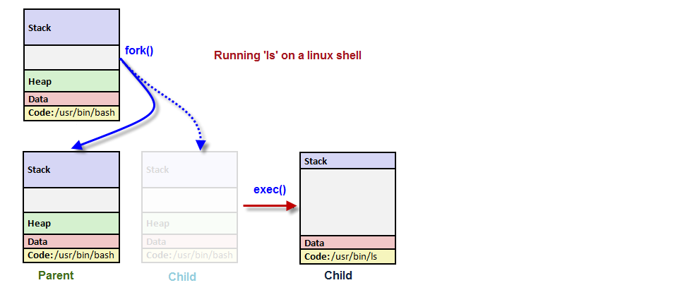
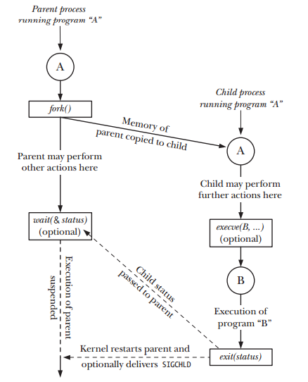

# process
## fork
* 一道面试题开始
```
一道经典面试题, 题目：请问下面的程序一共输出多少个“-”？
#include <stdio.h>
#include <sys/types.h>
#include <unistd.h>
int main(void)
{
   int i;
   for(i=0; i<2; i++){
      fork();
      printf("-");
   }
   wait(NULL);
   wait(NULL);
   return 0;
}
----------------------------------------------------------------------
答案：8个
```
* 知识点： fork & 缓冲区
* In COW, the parent's data, stack and heap are shared by the parent and child and have their protection changed by the kernel to read-only. If either process tries to modify these regions, the kernel then makes a copy of that piece of memory only, typically a page.
* copy list

        - pcb(process control block)，用来将子进程加入cpu的调度队列中
        - code
        - global
        - heap
        - opend files
        - stack     (拷贝了寄存器，就必须拷贝栈)
        - registers (这个是最厉害的，这样就在机器层保持了一致)
* 为什么子进程也从fork返回： this is because it is a duplicate -- it has the same memory and registers, and thus the same stack pointer, frame pointer, and program counter, and thus has to return from the fork() call
* fork的过程类似js的prototype，从自身复制
* linux唯一生成进程的方式就是复制自己
* 

## context switch 
* 进程恢复执行前必须装入寄存器的一组数据称为硬件上下文；硬件上下文是进程可执行上下文的一个子集，因为可执行上下文包含进程执行时需要的所有信息。在Linux中，进程硬件上下文的一部分存在TSS段，而剩余部分存放在内核态的堆栈中。
* 每个进程描述符包含一个类型为thread_struct的thread字段，只要进程被切换出去，内核就把其硬件上下文保存在这个结构中。随后我们会看到，这个数据结构包含的字段涉及大部分CPU寄存器，但不包括诸如exa、ebx等等这些通用寄存器，它们的值保留在内核堆栈中。(各个进程自带铺盖卷)

## execve
* execl，execle，execlp，execv，execvp 都是在调用execve
* The exec() family of functions replaces the current process image with a new process image. It loads the program into the current process space and runs it from the entry point.
* C示例
``` 
    char * argv_list[] = {"ls","-lart","/home",NULL}; 
    execv("ls",argv_list); 
```
* exec后，PID不变
* the only system call that invokes a new program is execve()
* The execve system call is installing a fresh new virtual address space in your process (so the old virtual address space of the program doing execve successfully disappears, being overwritten by the new one), so you don't share any data with the previous one (and a successful execve does not return, since the new program is started). 
* vm会被替换掉，所以对应的stack、bss、data、code也都会被替换
* What happens is that the kernel arranges for the execve system call, upon returning to user mode, to have the IP (instruction pointer) register set to point to the beginning of the _start function, and the SP (stack pointer) register set to point to the beginning of the argv + env string list
* Neither execve nor the kernel code do call the _start function (the entry point of an executable, whatever it's called), ever. That's because they're running in different contexts; think as if they were running on different machines.
* IMAGE的替换，对OS而言就是普通的文件加载的过程；而对程序员视角的话，则是非常关键的运行数据


## program vs process
* program 是躺在磁盘里的
* process 是在内存中的
