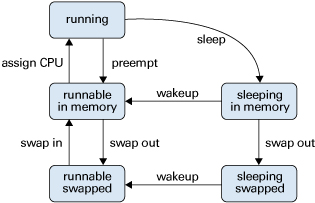
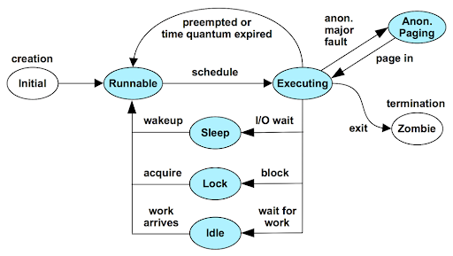
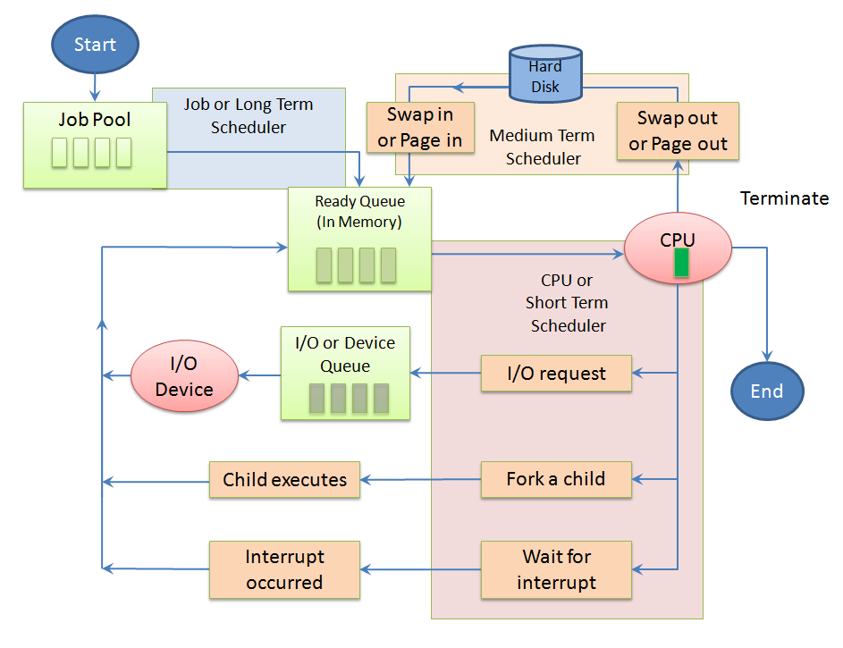
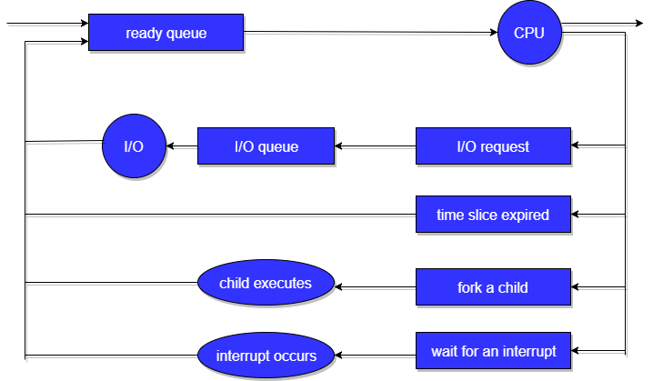

# process
## fork
* 一道面试题开始
```
一道经典面试题, 题目：请问下面的程序一共输出多少个“-”？
#include <stdio.h>
#include <sys/types.h>
#include <unistd.h>
int main(void)
{
   int i;
   for(i=0; i<2; i++){
      fork();
      printf("-");
   }
   wait(NULL);
   wait(NULL);
   return 0;
}
----------------------------------------------------------------------
答案：8个
```
* 知识点： fork & 缓冲区
* In COW, the parent's data, stack and heap are shared by the parent and child and have their protection changed by the kernel to read-only. If either process tries to modify these regions, the kernel then makes a copy of that piece of memory only, typically a page.
* copy list

        - pcb(process control block)，用来将子进程加入cpu的调度队列中
        - code
        - global
        - heap
        - opend files
        - stack     (拷贝了寄存器，就必须拷贝栈)
        - registers (这个是最厉害的，这样就在机器层保持了一致)
* 为什么子进程也从fork返回： this is because it is a duplicate -- it has the same memory and registers, and thus the same stack pointer, frame pointer, and program counter, and thus has to return from the fork() call
* fork的过程类似js的prototype，从自身复制
* linux唯一生成进程的方式就是复制自己
* 

## context switch 
* 进程恢复执行前必须装入寄存器的一组数据称为硬件上下文；硬件上下文是进程可执行上下文的一个子集，因为可执行上下文包含进程执行时需要的所有信息。在Linux中，进程硬件上下文的一部分存在TSS段，而剩余部分存放在内核态的堆栈中。
* 每个进程描述符包含一个类型为thread_struct的thread字段，只要进程被切换出去，内核就把其硬件上下文保存在这个结构中。随后我们会看到，这个数据结构包含的字段涉及大部分CPU寄存器，但不包括诸如exa、ebx等等这些通用寄存器，它们的值保留在内核堆栈中。(各个进程自带铺盖卷)

## execve
* execl，execle，execlp，execv，execvp 都是在调用execve
* The exec() family of functions replaces the current process image with a new process image. It loads the program into the current process space and runs it from the entry point.
* C示例
``` 
    char * argv_list[] = {"ls","-lart","/home",NULL}; 
    execv("ls",argv_list); 
```
* exec后，PID不变
* the only system call that invokes a new program is execve()
* The execve system call is installing a fresh new virtual address space in your process (so the old virtual address space of the program doing execve successfully disappears, being overwritten by the new one), so you don't share any data with the previous one (and a successful execve does not return, since the new program is started). 
* vm会被替换掉，所以对应的stack、bss、data、code也都会被替换
* What happens is that the kernel arranges for the execve system call, upon returning to user mode, to have the IP (instruction pointer) register set to point to the beginning of the _start function, and the SP (stack pointer) register set to point to the beginning of the argv + env string list
* Neither execve nor the kernel code do call the _start function (the entry point of an executable, whatever it's called), ever. That's because they're running in different contexts; think as if they were running on different machines.
* IMAGE的替换，对OS而言就是普通的文件加载的过程；而对程序员视角的话，则是非常关键的运行数据


## program vs process
* program 是躺在磁盘里的
* process 是在内存中的


## scheduling 
* The process scheduler is the component of the operating system that is responsible for deciding whether the currently running process should continue running and, if not, which process should run next. 
* fsm

An active process is can be one of the five states in the diagram. The arrows show how the process changes states.

```
1. A process is running if the process is assigned to a CPU. A process is removed from the running state by a scheduler if a process with a higher priority becomes runnable. A process is also preempted if a process of equal priority is runnable when the original process consumes its entire time slice.

2. A process is runnable in memory if the process is in primary memory and ready to run, but is not assigned to a CPU.

3. A process is sleeping in memory if the process is in primary memory but is waiting for a specific event before continuing execution. For example, a process sleeps while waiting for an I/O operation to complete, for a locked resource to be unlocked, or for a timer to expire. When the event occurs, a wakeup call is sent to the process and the process becomes runnable.

When an address space of a process has been written to the secondary memory, and that process is not waiting for a specific event, the process is runnable and swapped.

4. If a process is waiting for a specific event and has its whole address space written to the secondary memory, the process is sleeping and swapped.

5. If a system does not have enough primary memory to hold all its active processes, that system must page or swap some address space to the secondary memory.

When the system is short of primary memory, the system writes individual pages of some processes to the secondary memory but leaves those processes runnable. When a running process, accesses those pages, the process sleeps while the pages are read back into primary memory.

When the system encounters a more serious shortage of primary memory, the system writes all the pages of some processes to secondary memory. The system marks the pages that have been written to the secondary memory as swapped. Such processes can only be scheduled when the system scheduler daemon selects these processes to be read back into memory.
```

* 流程


```
job pool: When a process enters into a system, they are added into a job pool. This pool consists of all the processes in the system. Job scheduler also called as Long Term Scheduler, takes the job or process from Job-pool and puts in the ready queue

ready-queue: This queue consists of processes which are residing in the main memory and are ready and waiting to execute. CPU Scheduler or Short Term Scheduler takes the process from Ready queue and puts in the the CPU for execution. The process to be put in the CPU is decided by a Scheduling Algorithm.

device queue | io queue | waiting queue: This queue contains the processes which are waiting for the completion of I/O request. Each device has its own device queue.
 
```
* events
```
There are four events that may occur where the scheduler needs to step in and make this decision:

1. The current process goes from the running to the waiting state because it issues an I/O request or some operating system request that cannot be satisfied immediately.

2. The current process terminates.

3. A timer interrupt causes the scheduler to run and decide that a process has run for its allotted interval of time and it is time to move it from the running to the ready state.

4. An I/O operation is complete for a process that requested it and the process now moves from the waiting to the ready state. The scheduler may then decide to preempt the currently-running process and move this newly-ready process into the running state.
```

* running switch (running -----fork/intterrupt/io ----> ready/waiting)
```
Once the process is assigned to the CPU and is executing, one of the following several events can occur:

The process could issue an I/O request, and then be placed in the I/O queue.
The process could create a new subprocess and wait for its termination.
The process could be removed forcibly from the CPU, as a result of an interrupt, and be put back in the ready queue
```


* schedule type 

   long term  (job schedule)

   middle term (swap schdule)

   short term (cpu schedule)

* cpu schedule 调度策略
```
Be fair – give each process a fair share of the CPU, allow each process to run in a reasonable amount of time.
Be efficient – keep the CPU busy all the time.
Maximize throughput – service the largest possible number of jobs in a given amount of time; minimize the amount of time users must wait for their results.
Minimize response time – interactive users should see good performance.
Be predictable – a given job should take about the same amount of time to run when run multiple times. This keeps users sane.
Minimize overhead – don’t waste too many resources. Keep scheduling time and context switch time at a minimum.
Maximize resource use – favor processes that will use underutilized resources. There are two motives for this. Most devices are slow compared to CPU operations. We’ll achieve better system throughput by keeping devices busy as often as possible. The second reason is that a process may be holding a key resource and other, possibly more important, processes cannot use it until it is released. Giving the process more CPU time may free up the resource quicker.
Avoid indefinite postponement – every process should get a chance to run eventually.
Enforce priorities – if the scheduler allows a process to be assigned a priority, it should be meaningful and enforced.
Degrade gracefully – as the system becomes more heavily loaded, performance should deteriorate gradually, not abruptly.
```
* 心得： 
1. 一共两个task list， reading 和waiting， waiting用来等待某种事件（io、时间等）
2. 硬盘上有调度，门口有调度，运行中还有调度