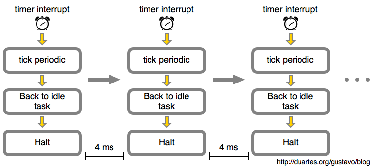

# 时间
## kernel 系统时钟
* 内核维护两个HZ参数， CONFIG_HZ 和 USER_HZ
### jiffies
*  jiffies是内核中的一个全局变量，用来记录自系统启动一来产生的节拍数
*  硬件给内核提供一个系统定时器用以计算和管理时间，内核通过编程预设系统定时器的频率，即节拍率（tick rate),每一个周期称作一个tick(节拍）
* CPU的利用率就是用执行用户态+系统态的Jiffies除以总的Jifffies来表示。
### CONFIG_HZ/HZ
* 该参数决定了内核的时钟频率，由硬件中断产生，每次中断是一次 tick ，也就是内核的一次时钟滴答，同时 jiffies++(jiffies在启动的时候设置为0)
* 查看：grep ^CONFIG_HZ /boot/config-`uname -r`
### USER_HZ
* 在用户空间使用 clock_t 表示时钟的滴答数。由于内核的 CONFIG_HZ 是变化的，那么如果类似于 glibc 或用户应用程序，在需要获得 clock_t 时，要么通过 sysctl 系统调用，要么通过 /proc 或 /sys 文件系统去获得
* 查看： getconf CLK_TCK

## RTC(实时时钟)
* 这是一个硬件时钟，用来持久存放系统时间，系统关闭后靠主板上的微型电池保持计时。系统启动时，内核通过读取RTC来初始化Wall Time,并存放在xtime变量中，这是RTC最主要的作用。

## 定时器中断
* 例子

* 在上面的示例中，由内核计划的定时器中断会每 4 毫秒发生一次。这就是滴答tick周期。也就是说每秒钟将有 250 个滴答，因此，这个滴答速率（频率）是 250 Hz。这是运行在 Intel 处理器上的 Linux 的典型值，而其它操作系统喜欢使用 100 Hz。这是由你构建内核时在 CONFIG_HZ 选项中定义的。
* 对于一个空闲 CPU 来说，它看起来似乎是个无意义的工作。如果外部世界没有新的输入，在你的笔记本电脑的电池耗尽之前，CPU 将始终处于这种每秒钟被唤醒 250 次的地狱般折磨的小憩中。如果它运行在一个虚拟机中，那我们正在消耗着宿主机 CPU 的性能和宝贵的时钟周期。
* 解决无休止滴答的方案： 动态滴答，无滴答模式，自适应滴答
* 对于阅读一篇文章来说，CPU 基本是无事可做的。内核的这种空闲行为是操作系统难题的一个重要部分
### 实现方式

## sleep做了什么
* 