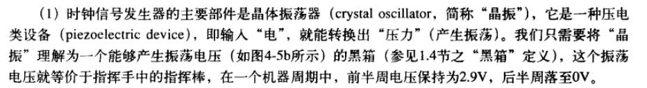

# 时间
## kernel 系统时钟
* 内核维护两个HZ参数， CONFIG_HZ 和 USER_HZ
### jiffies
*  jiffies是内核中的一个全局变量，用来记录自系统启动一来产生的节拍数
*  硬件给内核提供一个系统定时器用以计算和管理时间，内核通过编程预设系统定时器的频率，即节拍率（tick rate),每一个周期称作一个tick(节拍）
* CPU的利用率就是用执行用户态+系统态的Jiffies除以总的Jifffies来表示。
### CONFIG_HZ/HZ
* 该参数决定了内核的时钟频率，由硬件中断产生，每次中断是一次 tick ，也就是内核的一次时钟滴答，同时 jiffies++(jiffies在启动的时候设置为0)
* 查看：grep ^CONFIG_HZ /boot/config-`uname -r`
### USER_HZ
* 在用户空间使用 clock_t 表示时钟的滴答数。由于内核的 CONFIG_HZ 是变化的，那么如果类似于 glibc 或用户应用程序，在需要获得 clock_t 时，要么通过 sysctl 系统调用，要么通过 /proc 或 /sys 文件系统去获得
* 查看： getconf CLK_TCK

## RTC(实时时钟)
* 这是一个硬件时钟，用来持久存放系统时间，系统关闭后靠主板上的微型电池保持计时。系统启动时，内核通过读取RTC来初始化Wall Time,并存放在xtime变量中，这是RTC最主要的作用。

## 定时器中断
* 例子

* 在上面的示例中，由内核计划的定时器中断会每 4 毫秒发生一次。这就是滴答tick周期。也就是说每秒钟将有 250 个滴答，因此，这个滴答速率（频率）是 250 Hz。这是运行在 Intel 处理器上的 Linux 的典型值，而其它操作系统喜欢使用 100 Hz。这是由你构建内核时在 CONFIG_HZ 选项中定义的。
* 对于一个空闲 CPU 来说，它看起来似乎是个无意义的工作。如果外部世界没有新的输入，在你的笔记本电脑的电池耗尽之前，CPU 将始终处于这种每秒钟被唤醒 250 次的地狱般折磨的小憩中。如果它运行在一个虚拟机中，那我们正在消耗着宿主机 CPU 的性能和宝贵的时钟周期。
* 解决无休止滴答的方案： 动态滴答，无滴答模式，自适应滴答
* 对于阅读一篇文章来说，CPU 基本是无事可做的。内核的这种空闲行为是操作系统难题的一个重要部分
### 硬件基础
* The Programmable Interval Timer (PIT) is an essential component of modern computers, especially in a multi-tasking environment. The PIT chip can be made ‒ by setting various register values ‒ to count up or down, at certain rates, and to trigger interrupts at certain times. The timer can be set into a cyclic mode, so that when it triggers it automatically starts counting again, or it can be set into a one-time-only countdown mode.
* On newer hardware, a HPET (High Precision Event Timer), which is an evolution of the PIT concept, is likely to be available.
* Operating systems designed before HPET existed cannot use HPET, so they use other timer facilities. Newer operating systems tend to be able to use either. Some hardware has both. Indeed, most current southbridge chips have legacy-supporting instances of PIT, PIC, Advanced Programmable Interrupt Controller (APIC) and RTC devices incorporated into their silicon whether or not they are used by the operating system, which helps very modern PCs run older operating systems.
* 总之，现在有两种，PIT和HPET，低精度和高精度的两种，通常在南桥部分
* 由PIT或者HPET产生中断，会增加jiffies的值

## sleep做了什么
* Programming languages and libraries implement "sleep" functionality with the aid of the kernel. Without kernel-level support, they'd have to busy-wait, spinning in a tight loop, until the requested sleep duration elapsed. This would wastefully consume the processor.
* 大致过程
```
(1) Suspend execution of the process and mark it as not runnable.
(2) Set a timer for the given wait time. Systems provide hardware timers that let the kernel register to receive an interrupt at a given point in the future.
(3) When the timer hits, mark the process as runnable.
```
* sleep() essentially will make a system call (nanosleep()) (for a full list of system call in Linux
* do_nanosleep，可以看到是一个高精度定时器
```
 hrtimer_start_expires(&t->timer, mode);

                if (likely(t->task))

                        freezable_schedule();

                hrtimer_cancel(&t->timer);
```
* 从调度器的角度来看
```
The scheduler itself works by using the internal timers of a processor, these timers will be programmed to raise an interrupt at certain interval (depending on the timer resolution and kernel's timing requirement, it can be in the order of nanoseconds ), Once an interrupt is raised, the scheduler will be informed of the timer event and will check its queues to identify which's process is ready for execution - in terms of the state of the process. In this case scheduler can keep track of processes waiting for timeout completion.
```
* 从应用层面看
```
There are several ways to sleep in unix/linux, at least these:
(1) a special system call, e.g. nanosleep
(2) alarm+pause
(3) select or poll without file descriptors
```
* 总之，如果没有os的支持，应用层是不可能实现真正的sleep的，不管是alarm信号还是select，其实最终都是nanosleep的延伸

## HLT instruction
* The HLT instruction will cause the 8086 to stop fetching and executing instructions. The 8086 will enter a halt state. The only ways to get the processor out of the halt state are with an interrupt signal on the INTR pin, an interrupt signal on the NMI（非屏蔽终端请求） pin, or a reset signal on the RESET input.
* 当CPU没有可运行的任务的时候，CPU将会执行idle task（循环地执行HLT指令），即CPU执行HLT指令后，将会进入HALT状态。当CPU接收到时钟中断的时候，将会执行中断服务函数，然后继续执行idle task，进入HALT状态。如下图所示，即CPU周期性地进入HALT状态，并被唤醒，直到CPU检测到有可运行的任务。
* 当CPU处于HALT状态的时候，CPU虽然停止指令执行，并且CPU的部分功能模块将会被关闭（达到降低功耗的目的），但是CPU的LAPIC（Local Advanced Programmable Interrupt Controller）并不会停止工作，即CPU将会继续接收外部中断、异常等事件（事实上，CPU HALT状态的退出将由外部事件触发）。当CPU接收到这些外部事件的时候，将会从HALT状态恢复回来，执行中断服务函数，并且当中断服务函数执行完毕后，指令寄存器（CS:EIP）将会指向HLT指令的下一条指令，即CPU继续执行HLT指令之后的程序。


## 时钟信号发生器


## sleep vs halt
* sleep 是进程级的, halt是指令级的
* 谁都有要休息的时候


## time wheel algorithm
* A timing wheel has N number of slots. A slot represents a time unit such as si (slot interval). A cursor in the timing wheel moves one location every time unit, just like a second hand on a clock. Whenever a cursor moves to a slot, for example, cs (current slot), it implies that the list of timers in that slot, if any, expire at that instant or when the cursor reaches the same slot in the subsequent cycles.


## 留下的问题
* hlt到底有没有停止clock pulse的运行