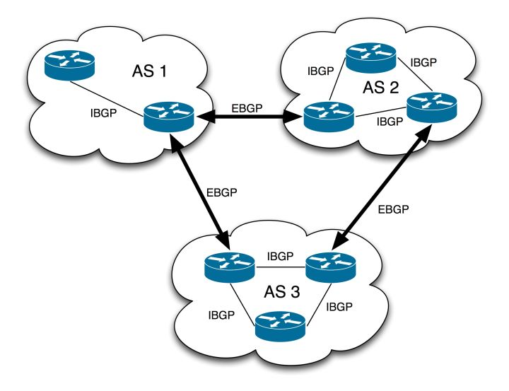

## BGP 
* 边界网关协议（英语：Border Gateway Protocol，缩写：BGP）是互联网上一个核心的去中心化自治路由协议。
* BGP是一种路径矢量协议（Path vector protocol）的实现。因此，它的工作原理也是基于路径矢量(路径适量：向某个ip地址的距离(跳数))。 
* BGP不做路由发现，路由发现的功能是IGP(interior gateway protocol，比如RIP、OSPF)完成的，BGP做的是路由控制，路由的信息需要读取IGP的数据
* BGP相当于是AS(Autonomous system)的网关,世界的网络是由BGP连接起来的AS组成的
* 路由器不可能做到全球寻址的，所以会被切割为AS，每个AS有独立的编号, AS号是一个16bit的数字，全球共用这60000多个编号。1 – 64511 是全球唯一的，而 64512 – 65535 是可以自用的，类似于私网网段。每个自治网络都需要申请自己的AS编号，联通的AS号是9800，[AS编号查询](http://www.cidr-report.org/as2.0/aggr.html)
* 
* TCP层的协议，网络中竟然有tcp层的协议

### 