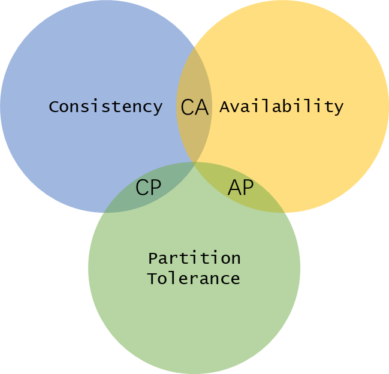

# 从信息传播的角度简述几个协议（Gossip、Raft、2PC、CAP）

## 简单自我介绍
大家好，我叫信息，相信能大家对我都不陌生，我自从出生起就有两个特点，一个是可以传播，一个是可以复制，我的生存环境也有很多种，我可以生活在绳子中，我可以生活在墙壁上，我也可以生活在文字中，我也可以生活在绘画中，其实，我可以无处不在，有点像病毒和细菌。我在这个地球上无忧无虑的生活了很多很多年，直到地球上出现了一种东西叫计算机。这个家伙把我们信息可以说是一网打尽了，它把我们用电表示出来了，把我们关在内存中，把我们在电缆中传播，在光纤中传播，存储在一个叫磁盘的不见天日黑盒子中，只有我们遇见一个叫做显示器，才能看到光明，我超喜欢显示器。

## 如何走出去
因为人类需要把我告诉很多人，就像以前曾经有人把我们放在纸上一样，计算机把我们塞进了电缆中传播，这个电缆需要用电，还要经过各种路口，我可能会遇到断电、交通阻塞、迷路等等，我有的走着走着就消失了。为了防止这些事情的发生，计算机世界设计了各种各样的方法与规则来保证我尽量能够准时到达对方。我听说的有MAC/IP地址、Broadcast、ARP、TCP/IP/ICMP、RIP/OSPF/BGP，这些都是针对我设计的，想想还有点骄傲。

## 一个叫CAP的讨厌的家伙
我被这样使用了一段时间之后呢，发现问题了，如果那个叫磁盘的家伙坏了，我就在世界中消失了，这就糟糕了。为了可靠性或者说高可用，那就意味必须将我拷贝到别的地方，这个如果在一个计算机内部就是RAID了，可是如果计算机自身网络不通了，我的信息兄弟们也就没出路了，所以还是需要传播到别的计算机里面。如果是采用所谓的冷备的方式一天备份一次或者更长时间备份一次，那就简单多了，可是有的人想让我们热备，所谓即时备份，这可就涉及到一致性的问题还有网络异常的问题了，所以高可用、复制、传播问题这三者就不明不白的掺和在了一起，这个时候就有聪明的科学家证明了，C(Consistency)A(Availability)P(Partition tolerance)这是个不可能三角，什么是C呢，C就是同一个数据同一个时刻不能读出两个不同的值。 什么是A呢，就是一直可以被访问，什么是P呢，就是节点之间出现网络分区(脑裂，说白就是不知道听谁的了)。从这个定义看出，只有涉及到数据的复制的问题才能应用CAP理论。比如下单了但是钱被多扣或者少扣，这个场景不涉及到数据的复制，应该是一个事务的问题，不是CAP针对的问题。
所以CAP定理决定了现实中只能有AP、CP、CA三者之间进行选择。如果不存在网络，比如单点的处理系统，那么就是一个CA系统。如果涉及到了网络传输，那就需要在CP和AP之间进行选择，有的时候为了可用性放弃了一致性，比如有些非敏感的数据，有的社会为了一致性放弃了可靠性，比如大多数的分布式数据库都是必须保证一致性的。而对于AP系统也不是完全不处理一致性，而是要保证最终一致性，或者说这就是BA(Basically Available)S(Soft-state)E(Eventually Consistent)理论要解决的问题。

## 举个栗子
* CAP在框架上约束了计算机如何传播信息的方式，下面我列举一个场景： 张三、李四、王五、赵六四兄弟一块做生意，但是他们谁都不看到谁，只能通过网络联系，我们先假设这四个人都是可靠的即对所有的信息都能完好无损的复制和传播，避免"村东头老王感冒了"传到村西头就成了"老王被绿了"(这就是一个所谓的拜占庭问题了，这种情形就会变得更加复杂我们暂且不讲了)。

### 单播/广播
但是即使这样其实要想让我们被安全并且准确的传达也挺难的，比如我举个栗子，他们四个最简单的联系方式就是互相打电话了，这就是信息的单播；如果他们四个语音会议，这就是信息的广播了。可是广播人少的时候还行，如果他们公司有个几万人再用广播的时候，总会遇见有些人没上班，有些人生病的情形，广播不到啊，可是让认识一对一打电话也太慢了吧。于是Gossip出现了。 

### Gossip协议

如果张三告诉了李四和王五，王五又告诉了赵六，那这就有点gossip了，所以gossip就是我们信息的一个兄弟在多个节点之间被准确的传播直到所有节点都被告知了，这也就是最终一致性了（P2P下载用的就是这个协议）。其实说白了，Gossip就是所谓的"敬请互相告知"。但是这种方式有点问题，如果这时候有Jack和Jim同时分别问张三和李四"你们今年挣了多少钱啊"，这个时候张三说400万，李四说600万，那Jack和Jim就可能觉得他们四兄弟有问题啊。 那怎么保证了无论何时Jack和Jim都能从四兄弟那里得到一致的信息呢。请召唤Raft协议。

### Raft(Reliable, Replicated, Redundant, And Fault-Tolerant)协议

Raft协议要求有一个leader，还有一些follower，candidate，那比如四兄弟中（正常情况下Raft需要奇数个节点此处4人只是举例）张三是轮值CEO，他那里能率先知道所有最新的信息，然后再告诉其他三兄弟。但是张三给兄弟们讲，我们得遵守一些协议，所有事情要么我们都知道，要么我们都不知道。不能有的人知道有的人不知道，我们在信息上是平等的。这样以来，他们四兄弟对外表现的就像一个人似的达成了某种统一。所以Raft协议是一个有角色概念的协议，而Gossip协议则是一个对等的协议，没有区分角色。这种基于角色的协议都会存在角色转换的问题，Raft就存在选举的机制，这个达成共识的关键，也是是大家都听大哥的，而大哥又负责信息的添加与更新；当然这个大哥出现问题的时候，一帮小弟也可以重新推举新的大哥，但是这个新大哥也需要足够大的Term(任期)和LogIndex(单调的日志编号),大伙才能听他的。其实说到底，就是LogIndex的单调增长与Term的单调增长推动了这个协议的前进。

说到这里，可能有朋友问了，Raft协议一般需要几个节点呢，答案就是最少3个，可以按照2n+1的公式增加更多的节点，即5、7、9等奇数节点都是可以的，这里需要提到一个原则叫"多数派原则"，即如果不是多数派存活，则系统不提供服务；信息必须通告到大多数节点(n+1)。也就是说2n+1个节点的网络，要想能够继续对外服务只能接受一次分区，这个时候最大切割就是n和n+1，如果发生了多次分区，直接就不对外提供服务了。如果发生了一次分区(A(n个节点),B(n+1个节点))的情况出现，分区A是不能对外提供服务的，分区B是有可能的，B区可能需要重新选举，更新LogIndex然后才能对外提供服务。说了这么多，到底这东西有用没用呢, Facts speak louder than words, ETCD、TiDB中都用到了Raft协议。

### 2PC(Two-phase Commit)

但是他们四个合伙做生意，总有需要一起做事的时候吧，比如有一天需要李四投资10w，王五注资10w来提高公司的账面资金，而他们之间只能通过网络联系，张三作为CEO如何确认他们两个都完成了然后对外宣布公司账面资金增加了20w呢？这个时候就需要2PC了，张三先对李四说，你准备10w，李四说准备好了，然后对王五说准备10w，王五说准备好了；张三知道他俩都准备好了后就对他俩说可以达到公司账户了，然后他俩就执行了，张三就对外发布说公司资金又多了啊。在这个模型中，张三充当的是协调者的角色，他来居中协调事情的推进，其他角色来执行相关的动作。说白了这个就是Ready-Go协作模式，日常生活我们经常遇到，一起唱歌，一起跳舞，一起做运动。但是2PC也有它的问题，如果有一个人无法完成，那这个模式就进行不下去了。于是有人提出了3PC，这会引入新的开销，也不是完美的解决方案，在实际中大多数是根据实际情况去舍弃和选择。那有什么地方用到了2PC呢，据我所知呢，Mysql的Inoodb引擎与Binlog之间就存在协作的问题，避免了备份和存储出现分歧。

所以，看到这里明白了，2PC是针对有关系的信息兄弟（据说被人类成为事务）协同处理的，而Raft则是针对我们信息的复制传播的。如果你看到这里还不明白我的意思的话，建议去隔壁看一下各个协议的实现细节吧，据说有很多。