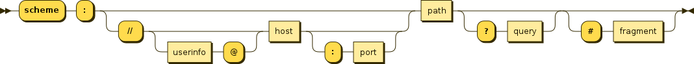

# HTTP
## 释义
* 超文本传输协议，是互联网上重要的一个协议，由欧洲核子研究委员会CERN的英国工程师 Tim Berners-Lee 发明的（图领奖的获得者），同时，他也是WWW的发明人，最初的主要是用于传递通过HTML封装过的数据。

## www vs internet vs dns
* 万维网 vs 互联网
* 万维网是互联网的一种，是一个由许多互相链接的超文本组成的系统，通过互联网访问。
* dns和http、www没有关系，dns可以用作任何一种域名和ip的映射,
* www 使用http协议和dns来实现功能

## dns
* 是形式语言在互联网上层的体现
* 使用分布式数据库存储信息，就是互联网层级的缓存系统
* 使用UDP协议
* A address ipv4地址, CNAME canonical name (别名)
* AAAA ipv6地址
* MX记录，邮箱地址
* ping www.baidu.com 这个是测试baidu.com的www服务的地址; 而ping http://www.baidu.com 则无效，因为不是一个主机地址
* 

## URI & URN & URL
* A Uniform Resource Identifier (URI) is a string of characters that unambiguously identifies a particular resource.
* The most common form of URI is the Uniform Resource Locator (URL), frequently referred to informally as a web address. 
* 所以URL是一种URI
* A Uniform Resource Name (URN) is a URI that identifies a resource by name in a particular namespace. A URN may be used to talk about a resource without implying its location or how to access it. For example, in the International Standard Book Number (ISBN) system, ISBN 0-486-27557-4 identifies a specific edition of Shakespeare's play Romeo and Juliet. The URN for that edition would be urn:isbn:0-486-27557-4. However, it gives no information as to where to find a copy of that book. (URN是一个唯一的名字，但是没有指明如何获取一个copy)
* A URN may be compared to a person's name, while a URL may be compared to their street address. In other words, a URN identifies an item and a URL provides a method for finding it.
* URI syntax: URI = scheme:[//authority]path[?query][#fragment], 注意//在可选里面

* A Uniform Resource Locator (URL), colloquially termed a web address,[1] is a reference to a web resource that specifies its location on a computer network and a mechanism for retrieving it. (所以URL特指一个网络地址)

## inventor words
```
“我只要把超文本系统和传输控制协议、域名系统结合在一起，然后─哒哒！─就有了万维网[23]...创建万维网真是一份叫人绝望的苦差事，因为我在CERN工作的时候，没有它的情况是非常糟糕的。万维网需要的技术，例如超文本系统、互联网和多种字体的文本对象等等，大部分都已经设计出来了。我需要做的只是把它们结合在一起。这是一个广义化步骤，要进入更高的抽象层次，把现有的文件系统想象为一个更大的虚拟文件系统的一部分。

“麦克·森德尔买了一台NeXT cube进行评估，并交给蒂姆。蒂姆在几个月的时间里实践了构想，感谢NeXTStep的软件开发系统的良好质量。这个原型提供所见即所得的浏览或编写！现时用于“网上冲浪”的浏览器只是一个被动的窗口，剥夺了用户的贡献。在参与一些会议的时候，蒂姆和我尝试为系统找到一个吸引人的名字。我确定这个名字不应该再取自希腊神话...蒂姆提出了“万维网”。我非常喜欢这个名字，除了很难用法语发音......”
```

## version
* 
* 
* h3-Q050 表明知乎支持了HTTP3，也就是支持了QUIC
* h2表示支持了http2
* 普通的网站支持了1.1
* Http3 = http2 + quic，即HTTP over QUIC
* 
* 重要的版本: 0.9 -> 1.0 -> 1.1 -> 2 -> 3
* 0.9的问题:
```
只支持GET
```
* 1.0的优化与问题
```
在请求中加入了HTTP版本号，如：GET /coolshell/index.html HTTP/1.0

HTTP 开始有 header了，不管是request还是response 都有header了。

增加了HTTP Status Code 标识相关的状态码。


还有 Content-Type 可以传输其它的文件了。

问题：
每请求一个资源都要新建一个TCP链接，而且是串行请求
```
* 1.1的优化与问题
```
可以设置 keepalive 来让HTTP重用TCP链接，重用TCP链接可以省了每次请求都要在广域网上进行的TCP的三次握手的巨大开销。这是所谓的“HTTP 长链接” 或是 “请求响应式的HTTP 持久链接”。英文叫 HTTP Persistent connection.

然后支持pipeline网络传输，只要第一个请求发出去了，不必等其回来，就可以发第二个请求出去，可以减少整体的响应时间。（注：非幂等的POST 方法或是有依赖的请求是不能被pipeline化的）
支持 Chunked Responses ，也就是说，在Response的时候，不必说明 Content-Length 这样，客户端就不能断连接，直到收到服务端的EOF标识。这种技术又叫 “服务端Push模型”，或是 “服务端Push式的HTTP 持久链接”

还增加了 cache control 机制。

协议头注增加了 Language, Encoding, Type 等等头，让客户端可以跟服务器端进行更多的协商。

还正式加入了一个很重要的头—— HOST这样的话，服务器就知道你要请求哪个网站了。因为可以有多个域名解析到同一个IP上，要区分用户是请求的哪个域名，就需要在HTTP的协议中加入域名的信息，而不是被DNS转换过的IP信息。

正式加入了 OPTIONS 方法，其主要用于 CORS – Cross Origin Resource Sharing 应用。
问题：
虽然HTTP/1.1 可以重用TCP链接，但是请求还是一个一个串行发的，需要保证其顺序。
```
* mutiplex

* 2.0的优化与问题
```
以在一个TCP链接中并发请求多个HTTP请求，移除了HTTP/1.1中的串行请求。也就是实现了多路复用

HTTP1.x的解析是基于文本。基于文本协议的格式解析存在天然缺陷，其格式由三部分组成：start line（request line或者status line），header，body。要识别这3部分就要做协议解析，http1.x的解析是基于文本。 文本的表现形式有多样性，要做到健壮性考虑的场景必然很多，二进制则不同，只认0和1的组合。

HTTP/2 之所以能够有如此多的新特性，正是因为底层数据格式的改变。采取了类似消息协议的二进制流形式，神似tcp和ip层的协议数据

问题：
Head-of-Line Blocking, 这也是一个比较经典的流量调度的问题。这个问题最早主要的发生的交换机上。
```

* 队头阻塞 
* 3.0的优化与问题
```
QUIC来了，自由解放了数据传输，因为HOL blocking问题在TCP的范围内无解

问题：
NAT问题
```
* 浏览器在尝试访问服务器的时候会协议降级，比如不支持H3就降级到H2
* 总之，http协议演化的核心原则是，利用有限的tcp连接来尽量快尽量多的下载资源，1.0 (一路一用), 1.1(串行多用，**虽然有pipeline，但是默认是关闭的，就是不太好用**)， 2.0(并行多用), 3.0 自由解放，但是支持的速度很慢

## tech powerd by google
* SPDY (pronounced "speedy") is a deprecated open-specification networking protocol that was developed primarily at Google for transporting web content.
* QUIC (pronounced "quick") is a general-purpose transport layer network protocol. 
* 可以说，google直接推动浏览器技术的发展，http2就是SPDY的复刻，而Http3是直接基于quic的


## tips 
* 自2014的HTTP/1.1 以来，这个世界基本的应用协议的标准基本上都是向HTTP看齐了，也许2014年前，还有一些专用的RPC协议，但是2014年以后，HTTP协议的增强，让我们实在找不出什么理由不向标准靠拢，还要重新发明轮子了。
* 我们可以看到，HTTP/2 在性能上对HTTP有质的提高，所以，HTTP/2 被采用的也很快，所以，如果你在你的公司内负责架构的话，HTTP/2是你一个非常重要的需要推动的一个事，除了因为性能上的问题，推动标准落地也是架构师的主要职责，因为，你企业内部的架构越标准，你可以使用到开源软件，或是开发方式就会越有效率，跟随着工业界的标准的发展，你的企业会非常自然的享受到标准所带来的红利。


## http principle
* header是协议可以说是把元数据和业务数据解耦，也可以说是控制逻辑和业务逻辑的分离。
* Status Code 的出现可以让请求双方以及第三方的监控或管理程序有了统一的认识。最关键是还是控制错误和业务错误的分离。

## 相关问题
* Chrome 最多允许对同一个 Host 建立六个 TCP 连接。
* HTTP/1.1 就把 Connection 头写进标准，并且默认开启持久连接，除非请求中写明 Connection: close，那么浏览器和服务器之间是会维持一段时间的 TCP 连接，不会一个请求结束就断掉。
* 一个 TCP 连接是可以发送多个 HTTP 请求的。
* Pipelining 这种设想看起来比较美好，但是在实践中会出现许多问题：一些代理服务器不能正确的处理 HTTP Pipelining。正确的流水线实现是复杂的。现代浏览器默认是不开启 HTTP Pipelining 的。

## root server system 
* 
* 
```
Verisign
USC-ISI
Cogent
UMD
NASA Ames
ISC
DISA DoD NIC
ARL
Netnod
RIPE NCC
ICANN
WIDE
```