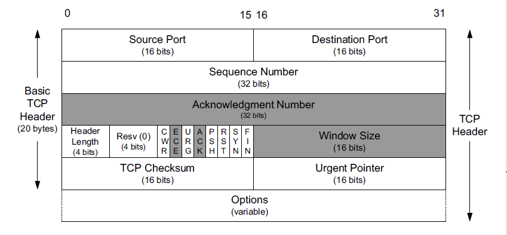
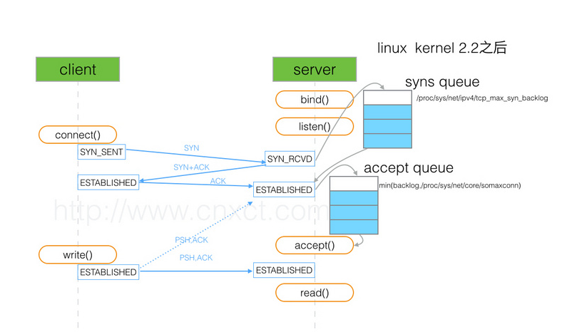

# TCP (transmisstion control protocol)
* TCP provides reliable and sequenced delivery of messages in each direction.  
* 
* 从tcp的包头来看，tcp复杂的协议流程主要是基于SEQ和WIN的
* **connection-oriented**
* two streams、two sequence number in both endpoint、bidirectional

## connecton 
* A connection is defined by a 5-tuple: protocol, local-addr, local-port, remote-addr, remote-port. 

## Nagle算法
* 

## keep alive
* 防止大量无用连接的方法
* 完成对空闲连接的审计
* KeepAlive prevents valid idle connections from being disconnected by firewalls and proxies by maintaining network activity.
*  If either the client or server does not respond to a packet, the connection is considered inactive and is terminated. I
* RFC: Implementors MAY include "keep-alives" in their TCPimplementations, although this practice is not universally accepted.  If keep-alives are included, the application MUST be able to turn them on or off for each TCP connection, and they MUST default to off.
* 实现机制： SEG.SEQ = SND.NXT-1，即TCP保活探测报文序列号将前一个TCP报文序列号减1。SND.NXT = RCV.NXT，即下一次发送正常报文序号等于ACK序列号；总之保活报文不在窗口控制范围内 
* 

## stream
* 

## 3-way handshake
* The protocol is connection-oriented, means before sending any data to the remote peer, TCP client set up a **virtual connection** over a **packet-based underlying IP network**.  
* 情景一：C处于A与B之间流量的路径上C可以捕获到A、B的IP包，伪造是小菜一碟，比如大防火墙reset用户连接情景二：C不在A与B之间流量的路径上C可以在世界的任何角落，伪造一个合法TCP报文，最关键是TCP字段里的sequence number 、acknowledged number，只要这两项位于接收者滑动窗口内，就是合法的，对方可以接收并Reset A、B之间的TCP连接。
* 3次握手以后，我对这条信道的“信心”就建立起来了：起码就目前而言，这条信道是畅通的。当然更多次的握手，会让我对这条信道可靠性的信心越来越强，但3次是建立信心的最低次数。
* 确认几个信息: 双方活跃、窗口、序号
* SYN包其实传递是一个向量，开始值为ISN，长度为WIN的长度
* If the handshake is successful, the TCP user gets the connection identifier. Else and error.  Connection identifier works as a handler for sending/receiving data to/from the server. 

## sequence number
*  TCP needs an identifier for each byte. The TCP sequence number is a four bytes identifier, to identify each byte in a TCP stream. 
* A TCP sequence number is a four bytes value or 32 bits value. Value can be from 0 to 2^32 – 1 (4,294,967,295).   After reaching the largest value, TCP will continue with the value zero. 
* TCP window maximum size is 2^16 – 1. Means if sequence number has reached the limit of 2^32 – 1, means, sequence numbers from 0 to 2^16, has been already acknowledged.
* SEQ是一个循环使用的32-bit整数
* Transmit Sequence Number (TSN) is the SN of the next byte to be transmitted. 
* Ack’d Sequence Number (ASN) is the SN of the next byte that the receiver is expecting.
* 不同连接之间的序列号没有任何关系
### Initial sequence number(ISN)
* TCP ideally sets initial values in a random and unpredictable way. Using pseudo-random values at session initiation helps frustrate replay attacks on the network. 
* 不同的 OS 在选择生成 TCP ISN 时采用不同的方法
* Traditionally, each device chose the ISN by making use of a timed counter, like a clock of sorts, 
that was incremented every 4 microseconds. 
This counter was initialized when TCP started up and then its value increased by 1 every 4 microseconds 
until it reached the largest 32-bit value possible (4,294,967,295) at which point it “wrapped around” to 0 
and resumed incrementing. 
* RFC1948定义的这个算法：ISN = M + F (Sip, Sport, Dip, Dport, <Some Secret>)，M：单调增加的计数器， F：单向散列哈希函数 (例如 MD4 or MD5)

### sequence number synchronization
* As part of the process of connection establishment, each of the two devices in a TCP connection informs the other of the sequence number it plans to use for its first data transmission by putting the preceding sequence number in the Sequence Number field of its SYN message. The other device confirms this by incrementing that value and putting it into the Acknowledgment Number field of its ACK, telling the other device that is the sequence number it is expecting for the first data transmission. This process is called sequence number synchronization.
* SYN包为什么是SYN包，就是要SYN序列号. 三次握手虽然没有传输数据，但是SEQ仍然加一，在后面的传输中，如果没有数据，则不会+1。+1的话，ack的逻辑和滑动窗口的逻辑都可以通用，SYN包、数据包、FIN包一样，他们都是需要和可以ACK的数据（因为都携带了信息），所以SEQ需要累加。因为从协议上看，ACK flag被启用就体现在序列号字段上，否则ACK数据和ACK SYN包是没有区别的。就是SYN包必须ACK，而ACK必须使用滑动窗口机制。
* SYN是建立连接的关键字段，而为了确保对方接收到，使用超时重传机制，TCP规定，只为有数据的TCP报文重传，SYN占据一个序号（可以认为只有一个字节数据的报文），所以TCP会重传SYN报文。

## interface 
* accept: The accept() function shall extract the first connection on the queue of pending connections, create a new socket with the same socket type protocol and address family as the specified socket, and allocate a new file descriptor for that socket. 
* PRODURE: 
*  The call accepts the first connection on its queue of pending connections for the given socket socket. The accept() call creates a new socket descriptor with the same properties as socket and returns it to the caller. （accept的参数socket是用于等待连接的socket，而返回的socket则是用来通信的socket，所以并不是所有的socket都是基于四元组的，或者linux的socket是一种抽象,socket的概念是用户层的概念）

## attack based on tcp 
* 情景一：C处于A与B之间流量的路径上C可以捕获到A、B的IP包，伪造是小菜一碟，比如大防火墙reset用户连接
* 情景二：C不在A与B之间流量的路径上C可以在世界的任何角落，伪造一个合法TCP报文，最关键是TCP字段里的sequence number 、acknowledged number，只要这两项位于接收者滑动窗口内，就是合法的，对方可以接收并Reset A、B之间的TCP连接。
* replay attack: 回放攻击, 这可以由发起者或由拦截数据并重新传输数据的对手来执行，这可能是通过IP数据包替换进行的欺骗攻击的一部分。Man-in-the-middle attack，缩写：MITM, 中间人攻击的一种形式
* dos vs ddos   拒绝服务和分布式拒绝服务
* tcp 会话劫持
* ip 欺骗，因为没有可靠的身份认证