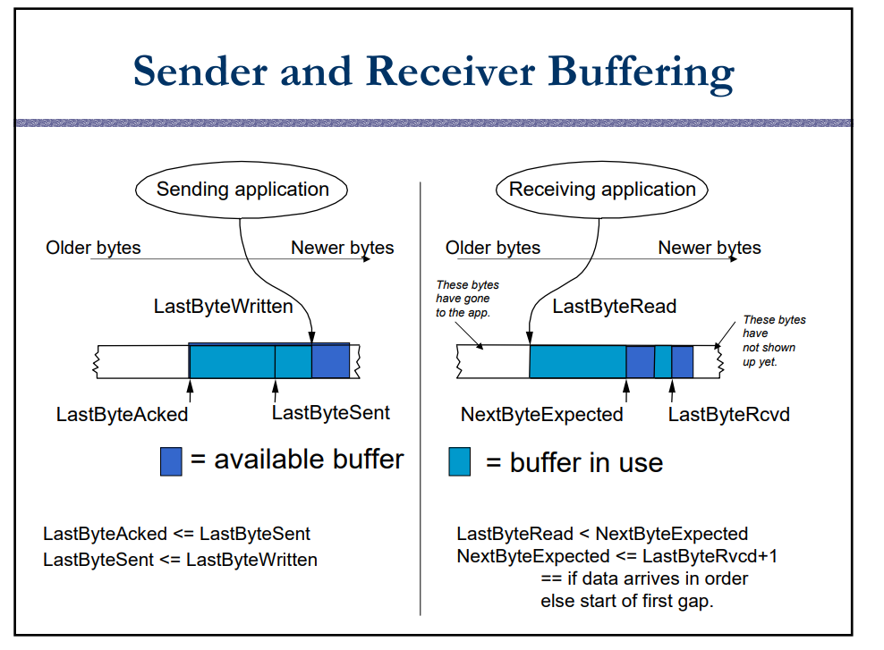
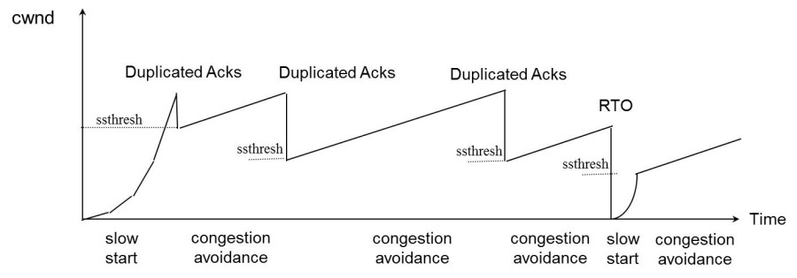
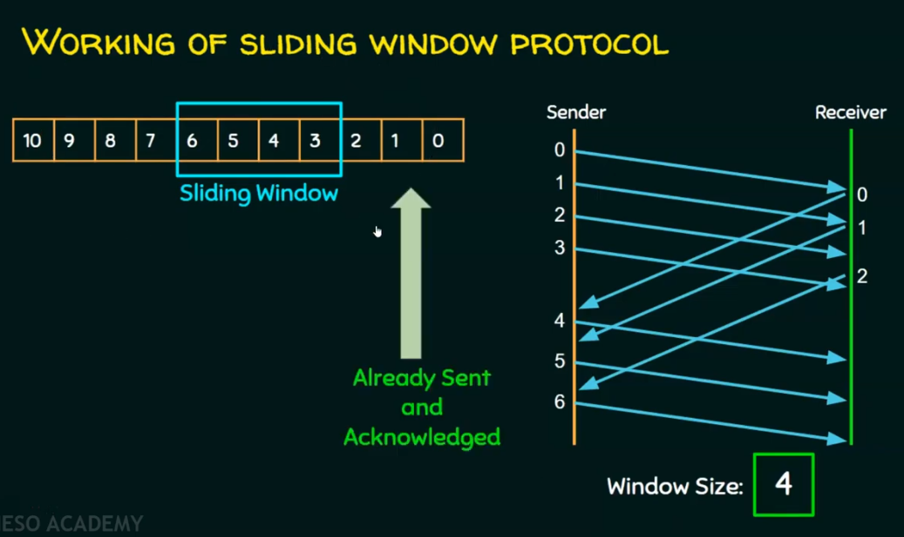
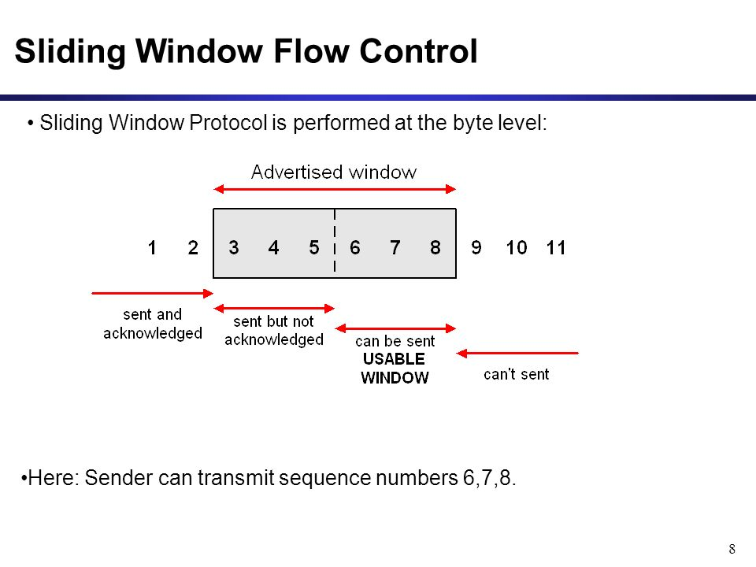
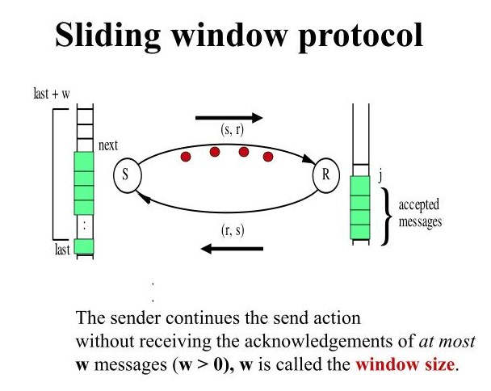
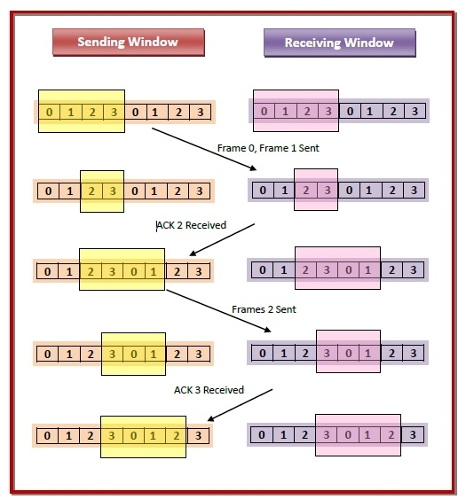
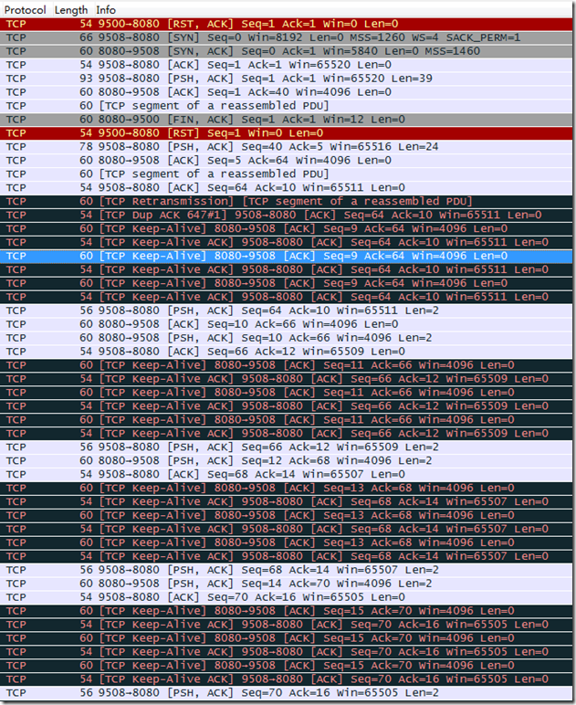

# TCP (transmisstion control protocol)
* TCP provides reliable and sequenced delivery of messages in each direction.  
* 就是说，tcp的事情是要在不可靠的网络环境上建立可靠的信息传输；有点像分布式理论，需要在不可靠的硬件环境下建立可靠的服务
* 将通信的概念分解为信息传输，将信息传输的概念分解为信息的输出与接收；那么比如广告也是一种信息输出与接收，就没有三次握手，也是有效的。关键还是在于基础环境的不稳定才需要这样做。所以本质上讲，tcp层的协议主要是tcp、udp，提供一种可靠的和一种不太可靠的，这样就能满足基本的需求了。
* , 至于option部分，比如SACK是一个TCP的选项，之所以有head-length字段，就是因为选项部分是可变长的，否则直接固定20 byte就行了
* 从tcp的包头来看，tcp复杂的协议流程主要是基于SEQ和WIN的
* TCP必需要解决的可靠传输以及包乱序（reordering）的问题
* **connection-oriented**
* two streams、two sequence number in both endpoint、bidirectional
* A connection is defined by a 5-tuple: protocol, local-addr, local-port, remote-addr, remote-port. 
* 流水线机制，提高传输的效率
* 全双工(full-duplex)传输

## ARQ
* stop-and-wait停止等待协议是最简单但也是最基础的数据链路层协议
* Automatic Repeat Request, ARQ is generic name for protocols based on this strategy
* is an error-control method for data transmission that uses acknowledgements (messages sent by the receiver indicating that it has correctly received a packet) and timeouts (specified periods of time allowed to elapse before an acknowledgment is to be received) to achieve reliable data transmission over an unreliable communication channel. 
* Go-Back-N ARQ，就是一直确认最小的序列号
* 滑动窗口就是pipeline化的ARQ

## MSS（Max Segment Size）
* TCP的RFC定义这个MSS的默认值是536, 这是因为 RFC 791里说了任何一个IP设备都得最少接收576尺寸的大小

## 糊涂窗口综合症(Silly Window Syndrome)
* 如果我们的接收方太忙了，来不及取走Receive Windows里的数据，那么，就会导致发送方越来越小。到最后，如果接收方腾出几个字节并告诉发送方现在有几个字节的window，而我们的发送方会义无反顾地发送这几个字节。(On the receiving system, TCP stores received data in a receive buffer. TCP acknowledges receipt of the data, and advertises (communicates) a new receive window to the sending system. The receive window represents the number of bytes that are available in the receive buffer. ) **所以接收侧滑动窗口管理的buffer和应用读取数据的buffer是同一个(receive buffer)，所以接收方的接收窗口是包括上层未取走的数据的长度;发送侧的滑动窗口管理的buffer和写数据用的也是同一个缓存(send buffer);receive-buffer和send-buff是read、write接口，也就是程序能感受到的与滑动窗口的关系**.
* 
* 在receiver端，如果收到的数据导致window size小于某个值，可以直接ack(0)回sender，这样就把window给关闭了，也阻止了sender再发数据过来，等到receiver端处理了一些数据后windows size 大于等于了MSS，或者，receiver buffer有一半为空，就可以把window打开让send 发送数据过来。

* 如果这个问题是由Sender端引起的，那么就会使用著名的 Nagle’s algorithm。这个算法的思路也是延时处理，他有两个主要的条件：1）要等到 Window Size>=MSS 或是 Data Size >=MSS，2）收到之前发送数据的ack回包，他才会发数据，否则就是在攒数据。
* 如果不处理这两种情况，相当于用巴士每次运送一个乘客
### Nagle算法
* 默认是开启状态，也就是TCP_NODELAY是关闭状态的

## 超时计算
* RTT(Round Trip Time)
* RTO（Retransmission TimeOut），作为数据包超时的计算标准
* 不能针对所有的情况设置固定的超时值，需要动态优化, 利用RTT计算RTO
* 不同的连接，通过循环的采样和计算来不断的更新当前的超时时间
* 这个是一种状态机的不断切换的过程，将最新的数据不断的迭代进去，得到更新后的值
* RTO抖一抖，可能导致很多包的重发
* 每个segment都有一个定时器
* 现行算法 
```
其中的DevRTT是Deviation RTT的意思

SRTT = SRTT + α (RTT – SRTT)  —— 计算平滑RTT

DevRTT = (1-β)*DevRTT + β*(|RTT-SRTT|) ——计算平滑RTT和真实的差距（加权移动平均）

RTO= µ * SRTT + ∂ *DevRTT —— 神一样的公式

（其中：在Linux下，α = 0.125，β = 0.25， μ = 1，∂ = 4 ——这就是算法中的“调得一手好参
```

## 拥塞控制(Congestion Control)
* Algorithms to prevent that the sender overloads the network
* TCP的设计者觉得，一个伟大而牛逼的协议仅仅做到流控并不够，因为流控只是网络模型4层以上的事，TCP的还应该更聪明地知道整个网络上的事。
* TCP不能忽略网络上发生的事情，而无脑地一个劲地重发数据，对网络造成更大的伤害。对此TCP的设计理念是：TCP不是一个自私的协议，当拥塞发生的时候，要做自我牺牲。就像交通阻塞一样，每个车都应该把路让出来，而不要再去抢路了。(只要人人都献出一点爱)
* 流量控制做的总量的控制，而拥塞控制做的则是加速度的控制
* 1）慢启动，2）拥塞避免，3）拥塞发生，4）快速恢复。
* 

## 流量控制(Flow Control)
* Algorithms to prevent that the sender overruns the receiver with information
* tcp的整个流量控制的模型就是滑动窗口，所有的算法都是围绕该机制设计的

## slide window protocol 
* Sliding window protocols are data link layer protocols for reliable and sequential delivery of data frames. 
* In these protocols, the sender has a buffer called the sending window and the receiver has buffer called the receiving window.
* 
* 
* The term sliding window refers to the imaginary boxes to hold frames. 或者： 在序列号形成的轨道上，有一辆小火车在慢慢的走；或者说像一个蒙版在一个长方形的图片上滑动；其实就是像窗口一样，可以调节大小并且可以移动. 
* ，即当有数据被ack的时候，窗口会向右滑动，产生新的可以被send的数据
* 
* ，两个窗口就像两个大小相同的海绵宝宝，可以大小调节，但是最大个头一样
* 重传机制是基于确认机制的

### 重传机制
#### 快速重传(Fast Retransmit )
* 
* 主要是为了优化timeout逻辑

### 确认机制
#### Cumulative acknowledgement(累计确认，延迟确认)
* A process in which the receiver sends a single acknowledgement in response to a finite number of frames received.  It reduces the time and bandwidth wasted for sending 
acknowledgement.
* 所以ACK确认序列号是勇往直前的，不能回头的

#### 选择确认(Selective Acknowledgment, SACK)
* 为了减少不必要的数据传输而引入的
* 这个是tcp协议的扩展功能，是对快速重传和累计确认的优化，在 Linux下，可以通过tcp_sack参数打开这个功能（Linux 2.4后默认打开）。
* 
* Duplicate SACK, D-SACK, 其主要使用了SACK来告诉发送方有哪些数据被重复接收了。
* Reneging: 接收方有权把已经报给发送端SACK里的数据给丢了。所以，发送方也不能完全依赖SACK，还是要依赖ACK，并维护Time-Out，如果后续的ACK没有增长，那么还是要把SACK的东西重传，另外，接收端这边永远不能把SACK的包标记为Ack。


## keep alive
* 防止大量无用连接的方法
* 中间设备如防火墙等，会为经过它的数据报文建立相关的连接信息表，并未其设置一个超时时间的定时器，如果超出预定时间，某连接无任何报文交互的话，中间设备会将该连接信息从表中删除，在删除后，再有应用报文过来时，中间设备将丢弃该报文
* 完成对空闲连接的审计
* KeepAlive prevents valid idle connections from being disconnected by firewalls and proxies by maintaining network activity.
*  If either the client or server does not respond to a packet, the connection is considered inactive and is terminated. I
* RFC: Implementors **MAY include**(RFC并没有规定系统协议栈一定必须实现keepalive) "keep-alives" in their TCPimplementations, although this practice is not universally accepted.  If keep-alives are included, the application MUST be able to turn them on or off for each TCP connection, and **they MUST default to off**.
* 实现机制： SEG.SEQ = SND.NXT-1，即TCP保活探测报文序列号将前一个TCP报文序列号减1。SND.NXT = RCV.NXT，即下一次发送正常报文序号等于ACK序列号；总之保活报文不在窗口控制范围内 


## 3-way handshake
* The protocol is connection-oriented, means before sending any data to the remote peer, TCP client set up a **virtual connection** over a **packet-based underlying IP network**.  
* 3次握手以后，我对这条信道的“信心”就建立起来了：起码就目前而言，这条信道是畅通的。当然更多次的握手，会让我对这条信道可靠性的信心越来越强，但3次是建立信心的最低次数。永远都不能完美的达成协议&世界上不存在完全可靠的通信协议。从通信时间成本空间成本以及可靠度来讲，选择了“三次握手”作为点对点通信的一般规则。
* 确认几个信息: 双方活跃、窗口、序号
* SYN包其实传递是一个向量，开始值为ISN，长度为WIN的长度
* If the handshake is successful, the TCP user gets the connection identifier. Else and error.  Connection identifier works as a handler for sending/receiving data to/from the server. 

## sequence number
*  TCP needs an identifier for each byte. The TCP sequence number is a four bytes identifier, to identify each byte in a TCP stream. 
* A TCP sequence number is a four bytes value or 32 bits value. Value can be from 0 to 2^32 – 1 (4,294,967,295).   After reaching the largest value, TCP will continue with the value zero. 
* TCP window maximum size is 2^16 – 1. Means if sequence number has reached the limit of 2^32 – 1, means, sequence numbers from 0 to 2^16, has been already acknowledged.
* SEQ是一个循环使用的32-bit整数
* Transmit Sequence Number (TSN) is the SN of the next byte to be transmitted. 
* Ack’d Sequence Number (ASN) is the SN of the next byte that the receiver is expecting.
* 不同连接之间的序列号没有任何关系
* 序列号指的是segment中第一个字节的编号

### Initial sequence number(ISN)
* TCP ideally sets initial values in a random and unpredictable way. Using pseudo-random values at session initiation helps frustrate replay attacks on the network. 
* 不同的 OS 在选择生成 TCP ISN 时采用不同的方法
* Traditionally, each device chose the ISN by making use of a timed counter, like a clock of sorts, 
that was incremented every 4 microseconds. 
This counter was initialized when TCP started up and then its value increased by 1 every 4 microseconds 
until it reached the largest 32-bit value possible (4,294,967,295) at which point it “wrapped around” to 0 
and resumed incrementing. 
* RFC1948定义的这个算法：ISN = M + F (Sip, Sport, Dip, Dport, <Some Secret>)，M：单调增加的计数器， F：单向散列哈希函数 (例如 MD4 or MD5)

### sequence number synchronization
* As part of the process of connection establishment, each of the two devices in a TCP connection informs the other of the sequence number it plans to use for its first data transmission by putting the preceding sequence number in the Sequence Number field of its SYN message. The other device confirms this by incrementing that value and putting it into the Acknowledgment Number field of its ACK, telling the other device that is the sequence number it is expecting for the first data transmission. This process is called sequence number synchronization.
* SYN包为什么是SYN包，就是要SYN序列号. 三次握手虽然没有传输数据，但是SEQ仍然加一，在后面的传输中，如果没有数据，则不会+1。+1的话，ack的逻辑和滑动窗口的逻辑都可以通用，SYN包、数据包、FIN包一样，他们都是需要和可以ACK的数据（因为都携带了信息），所以SEQ需要累加。因为从协议上看，ACK flag被启用就体现在序列号字段上，否则ACK数据和ACK SYN包是没有区别的。就是SYN包必须ACK，而ACK必须使用滑动窗口机制。
* SYN是建立连接的关键字段，而为了确保对方接收到，使用超时重传机制，TCP规定，只为有数据的TCP报文重传，SYN占据一个序号（可以认为只有一个字节数据的报文），所以TCP会重传SYN报文。

## interface 
* accept: The accept() function shall extract the first connection on the queue of pending connections, create a new socket with the same socket type protocol and address family as the specified socket, and allocate a new file descriptor for that socket. 
* PRODURE: 
*  The call accepts the first connection on its queue of pending connections for the given socket socket. The accept() call creates a new socket descriptor with the same properties as socket and returns it to the caller. （accept的参数socket是用于等待连接的socket，而返回的socket则是用来通信的socket，所以并不是所有的socket都是基于四元组的，或者linux的socket是一种抽象,socket的概念是用户层的概念）

## attack based on tcp 
* 情景一：C处于A与B之间流量的路径上C可以捕获到A、B的IP包，伪造是小菜一碟，比如大防火墙reset用户连接
* 情景二：C不在A与B之间流量的路径上C可以在世界的任何角落，伪造一个合法TCP报文，最关键是TCP字段里的sequence number 、acknowledged number，只要这两项位于接收者滑动窗口内，就是合法的，对方可以接收并Reset A、B之间的TCP连接。
* replay attack: 回放攻击, 这可以由发起者或由拦截数据并重新传输数据的对手来执行，这可能是通过IP数据包替换进行的欺骗攻击的一部分。Man-in-the-middle attack，缩写：MITM, 中间人攻击的一种形式
* dos vs ddos   拒绝服务和分布式拒绝服务
* tcp 会话劫持
* ip 欺骗，因为没有可靠的身份认证

## 参数
### keep-alive
```
net.ipv4.tcp_keepalive_intvl = 75

net.ipv4.tcp_keepalive_probes = 9

net.ipv4.tcp_keepalive_time = 7200
```