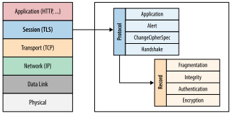
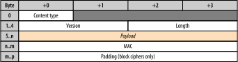

# ssl 
* ssl: Secure Sockets Layer
* tls: Transport Layer Security
* 关于"安全"这件事情的商议过程, 由明文向密文转换的过程

## ssl vs tls
* When the SSL protocol was standardized by the IETF, it was renamed to Transport Layer Security (TLS). 
* tsl其实是ssl的升级版, ssl 发展到ssl3.0就停止了，后面接着是tls, TLS 1.0通常被标示为SSL 3.1，TLS 1.1为SSL 3.2，TLS 1.2为SSL 3.3
* HTTP+SSL = HTTPS
* 由于SSL位于应用层和传输层之间，所以可以为任何基于TCP等可靠连接的应用层协议提供安全性保证。
* timeline 

## tls layer
* 
* 

## https context 
* The extensibility and the success of HTTP created a vibrant ecosystem of various proxies and intermediaries on the Web: cache servers, security gateways, web accelerators, content filters, and many others. In some cases we are aware of their presence (explicit proxies), and in others they are completely transparent to the end user. Due to these behaviors, new protocols and extensions to HTTP, such as WebSocket, HTTP/2, and others, have to rely on establishing an HTTPS tunnel to bypass the intermediate proxies and provide a reliable deployment model: the encrypted tunnel obfuscates the data from all intermediaries. If you have ever wondered why most WebSocket guides will tell you to use HTTPS to deliver data to mobile clients, this is why.(由于http的生态发展生成了很多中间机构，这些机构的行为是没有规范化的，所以对各种协议的支持度是未知的，所以为了绕过他们使用https协议)

## 完成三个通用目标
#### 加密
* 利用对称加密算法
#### 完整
* 利用MAC(message authentication code)，通常是一路加密哈希函数
#### 认证
* 证书

## 子协议
#### 握手协议
* 
##### workflow
* 0 ms: TLS runs over a reliable transport (TCP), which means that we must first complete the TCP three-way handshake, which takes one full roundtrip.

* 56 ms: With the TCP connection in place, the client sends a number of specifications in **plain text**, such as the version of the TLS protocol it is running, the **list** of supported ciphersuites, and other TLS options it may want to use.

* 84 ms: The server picks the TLS protocol version for further communication, decides on a ciphersuite from the list provided by the client, **attaches its certificate**, and sends the response back to the client. Optionally, the server can also send a request for the client’s certificate and parameters for other TLS extensions.

* 112 ms: Assuming both sides are able to negotiate a common version and cipher, and the client is happy with the certificate provided by the server, the client initiates **either the RSA or the Diffie-Hellman key exchange**, which is used to establish the **symmetric key** for the ensuing session.

* 140 ms: The server processes the key exchange parameters sent by the client, checks message integrity by verifying the MAC, and returns an encrypted Finished message back to the client.

* 168 ms: The client decrypts the message with the negotiated symmetric key, verifies the MAC, and if all is well, then the tunnel is established and application data can now be sent.

#### 记录协议
* 
##### workflow
1. Record protocol receives application data.
2. Received data is divided into blocks: maximum of 214 bytes, or 16 KB per record.
3. Message authentication code (MAC) or HMAC is **added to each record**.
4. Data within each record is encrypted using the **negotiated cipher**.

#### 报警协议
* 客户机和服务器发现错误时，向对方发送一个警报消息。

## certificate的作用和意义

## reference
[很详细的英文文档](https://hpbn.co/transport-layer-security-tls/)