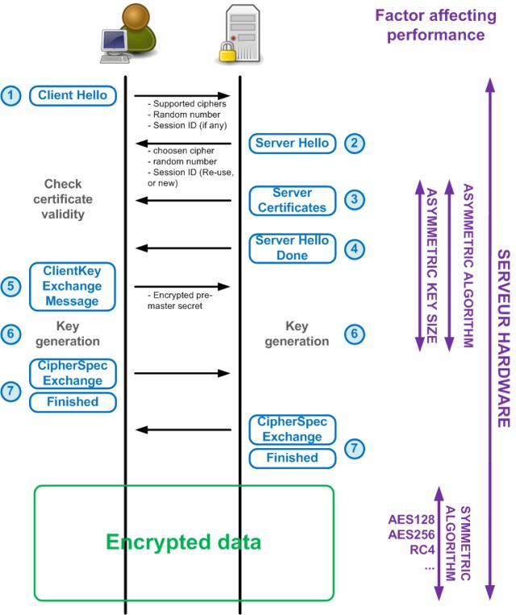

# ssl 
* ssl: Secure Sockets Layer
* tls: Transport Layer Security
* 关于"安全"这件事情的商议过程, 由明文向密文转换的过程

## ssl vs tls
* When the SSL protocol was standardized by the IETF, it was renamed to Transport Layer Security (TLS). 
* tsl其实是ssl的升级版, ssl 发展到ssl3.0就停止了，后面接着是tls, TLS 1.0通常被标示为SSL 3.1，TLS 1.1为SSL 3.2，TLS 1.2为SSL 3.3
* HTTP+SSL = HTTPS
* 由于SSL位于应用层和传输层之间，所以可以为任何基于TCP等可靠连接的应用层协议提供安全性保证。
* timeline 


## tls layer
* 
* 

## https context 
* The extensibility and the success of HTTP created a vibrant ecosystem of various proxies and intermediaries on the Web: cache servers, security gateways, web accelerators, content filters, and many others. In some cases we are aware of their presence (explicit proxies), and in others they are completely transparent to the end user. Due to these behaviors, new protocols and extensions to HTTP, such as WebSocket, HTTP/2, and others, have to rely on establishing an HTTPS tunnel to bypass the intermediate proxies and provide a reliable deployment model: the encrypted tunnel obfuscates the data from all intermediaries. If you have ever wondered why most WebSocket guides will tell you to use HTTPS to deliver data to mobile clients, this is why.(由于http的生态发展生成了很多中间机构，这些机构的行为是没有规范化的，所以对各种协议的支持度是未知的，所以为了绕过他们使用https协议)

## 完成三个通用目标
#### 加密
* 利用对称加密算法
#### 完整
* 利用MAC(message authentication code)，通常是一路加密哈希函数
#### 认证
* 数字证书

## 子协议
#### 握手协议
* 
* 
##### workflow
* 0 ms: TLS runs over a reliable transport (TCP), which means that we must first complete the TCP three-way handshake, which takes one full roundtrip.

* 56 ms: With the TCP connection in place, the client sends a number of specifications in **plain text**, such as the version of the TLS protocol it is running, the **list** of supported ciphersuites, and other TLS options it may want to use.

* 84 ms: The server picks the TLS protocol version for further communication, decides on a ciphersuite from the list provided by the client, **attaches its certificate**, and sends the response back to the client. Optionally, the server can also send a request for the client’s certificate and parameters for other TLS extensions.

* 112 ms: Assuming both sides are able to negotiate a common version and cipher, and the client is happy with the certificate provided by the server, the client initiates **either the RSA or the Diffie-Hellman key exchange**, which is used to establish the **symmetric key** for the ensuing session.

* 140 ms: The server processes the key exchange parameters sent by the client, checks message integrity by verifying the MAC, and returns an encrypted Finished message back to the client.

* 168 ms: The client decrypts the message with the negotiated symmetric key, verifies the MAC, and if all is well, then the tunnel is established and application data can now be sent.
```
另一种直观的描述(三个火枪手的版本):
第一步：爱丽丝给出支持SSL协议版本号，一个客户端随机数(Client random，请注意这是第一个随机数)，客户端支持的加密方法等信息；
第二步：鲍勃收到信息后，确认双方使用的加密方法，并返回数字证书，一个服务器生成的随机数(Server random，注意这是第二个随机数)等信息；
第三步：爱丽丝确认数字证书的有效性，然后生成一个新的随机数(Premaster secret)，然后使用数字证书中的公钥，加密这个随机数，发给鲍勃。
第四步：鲍勃使用自己的私钥，获取爱丽丝发来的随机数(即Premaster secret)；(第三、四步就是非对称加密的过程了)
第五步：爱丽丝和鲍勃通过约定的加密方法(通常是AES算法)，使用前面三个随机数，生成对话密钥，
```
#### 记录协议
* 
##### workflow
1. Record protocol receives application data.
2. Received data is divided into blocks: maximum of 214 bytes, or 16 KB per record.
3. Message authentication code (MAC) or HMAC is **added to each record**.
4. Data within each record is encrypted using the **negotiated cipher**.

#### 报警协议
* 客户机和服务器发现错误时，向对方发送一个警报消息。

#### 总结
* 每一次对话（session），客户端和服务器端都生成一个"对话密钥"（session key），用它来加密信息。由于"对话密钥"是对称加密，所以运算速度非常快，而服务器公钥只用于加密"对话密钥"本身，这样就减少了加密运算的消耗时间。
* 先握手加密算法，才能用加密算法来生成对称密钥
* 安全的依赖关系: 对称加密 => 非对称加密 => 随机值 + 从证书获得的公钥 => Chain of Trust


## 非对称加密
#### Chain of Trust 

* Alice和Bob建立信任关系
* Alice与Charlie的信任关系是建立在Charlie发送给Alice的消息中包含Bob的私钥加密过的Charlie的公钥，然后Alice可以获取Charlie的公钥用于解密Charlie发送的信息
* 通过这种信任关系的传递，就可以建立一个链式的网络结构
#### 使用方式
* 用于加密解密的时候，使用公钥加密，使用私钥解密(这样才能保证信息不被别人知道)
* 用于认证的时候，使用私钥加密(这样才能肯定是你在加密)，公钥解密
* 但是原则上，私钥和公钥是可以互相加密的时候，但是在使用的时候，我们只在特定的场景使用某个加密方向

## ssh 

## vpn

## certificate
* 公钥证书(Public-Key Certificate，PKC)记录着个人信息(姓名、组织、邮箱地址等个人信息)和个人公钥，并由认证机构(Certification Authority、Certifying Authority，CA)施加数字签名。公钥证书也简称为证书(certificate)。
* 使用流程: 


#### 浏览器内置certificate
* 浏览器会内置信任的根证书机构 

* 当客户端接收到了服务端提供的证书之后,会通过浏览器内置的证书提供的公钥对签名进行解密.
* 根证书库包含浏览器信任的证书颁发机构CA的根证书，有的浏览器会自建根证书库，比如Mozilla Firefox，有的浏览器会使用其他浏览器的根证书库。
* 浏览器需要从证书库中找到一个公钥对私钥加密的签名进行处理
* 当浏览器收到一个网站的证书的时候(通常在tls的握手阶段)，认证过程如下:
    1. 首先浏览器会从内置的证书列表中索引，找到服务器下发证书对应的机构，如果没有找到，此时就会提示用户该证书是不是由权威机构颁发，是不可信任的。如果查到了对应的机构，则取出该机构颁发的公钥。
    2. 用机构的**证书公钥解密得到证书的内容和证书签名**，内容包括网站的网址、网站的公钥、证书的有效期等。浏览器会先验证证书签名的合法性（验证过程类似上面 Bob 和 Susan 的通信）。签名通过后，浏览器验证证书记录的网址是否和当前网址是一致的，不一致会提示用户。如果网址一致会检查证书有效期，证书过期了也会提示用户。这些都通过认证时，浏览器就可以安全使用证书中的**网站公钥**了。
* 理解： 1. 网站下发的证书是加密过的，需要使用CA的公钥解密
#### 操作系统内置certificate
* centos自带的证书信息在/etc/[pki](#PKI)目录下 

#### PKI
* pki(Public Key Infrastructure，公钥基础设施)
* 组成要素
```
1. 用户——使用 PKI 的人
2. 认证机构——颁发证书的人
3. 仓库——保存证书的数据库
```
* 通过PKI完成了互联网上的信任基础，就是实现了认证过程


#### usage of "Chain of Trust"
* 
* 信任传递: 用户证书 => 中间证书(ICA) => 根证书(CA) => [WebTrust](#WebTrust)
* 通过公钥衔接在一起
* 认证中心CA负责维护和发布证书废除列表CRL（certificate revocation lists，又称为证书黑名单）。 当一个证书，特别是其中的公钥因为其他原因无效时（不是因为到期），CRL提供了一种通知用户和其他应用的中心管理方式。CA系统生成CRL以后，放到LDAP服务器中或Web服务器的合适位置，供用户查询或下载(所以可知浏览器或者OS对失去信任的网站的更新有一定的延迟性)。
* 


#### WebTrust
* WebTrust是由两大著名注册会计师协会AICPA（美国注册会计师协会）和CICA（加拿大注册会计师协会）共同制定的安全审计标准，主要对互联网服务商的系统及业务运作逻辑安全性、保密性等共计七项内容进行近乎严苛的审查和鉴证。 只有通过WebTrust国际安全审计认证，根证书才能预装到主流的浏览器而成为一个可信的认证机构。


## 自己生成的公钥密钥和CA颁发的有什么不同

## 密钥的几种格式和转化方式

## 信息的处理方式
* 签名
* 加密


## reference
[很详细的英文文档](https://hpbn.co/transport-layer-security-tls/)