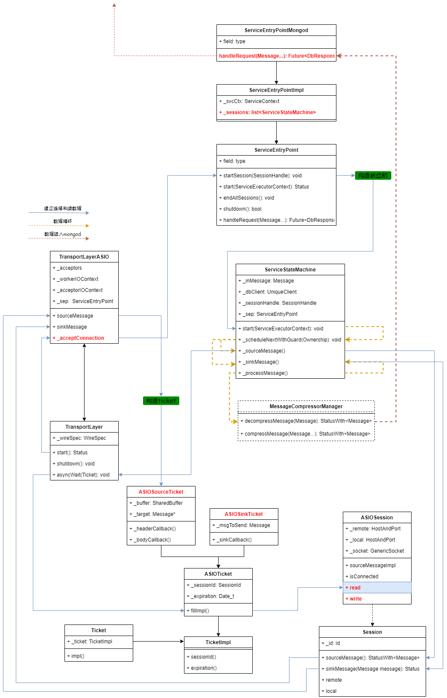
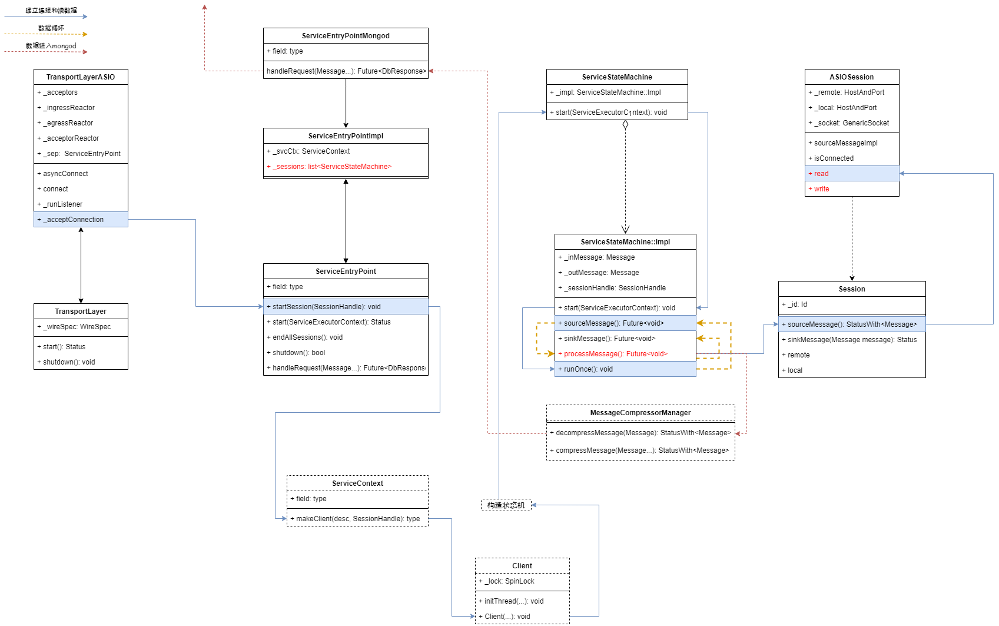
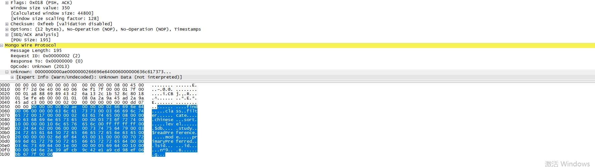
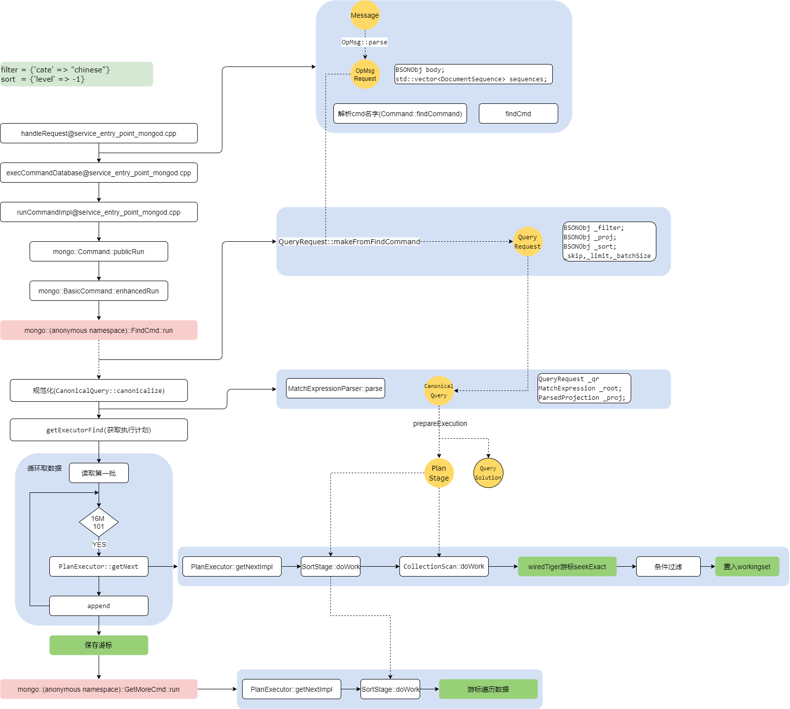

# mongo代码阅读
* version: v3.6

## requirement 
* gcc version 5.4 (GCC) 
* python2.7
* scons 3.0.1
* 机器有4G+的内存

## compile 
* 调试模式编译mongod
```
python2 buildscripts/scons.py --gdbserver=GDBSERVER -j 2  mongod
```

## 网络模块
### 基本流程<br/>
* mongodb-3.6版本的网络结构<br/>


* mongodb-4.4版本的网络结构<br/>


* 对比3.6和4.4版本，一个明显的变化就是ticket被移除了 

### gdb 
#### breakpoints
* b  mongo::ServiceEntryPointMongod::handleRequest
* b find.cpp:564
* b mongo::launchServiceWorkerThread 

#### gdb insight 
* 查看连接使用的线程的backStrace： 从下文的引用中可以看出，每个连接占用了2个线程，并且有"conn1"和"conn2"已经退出
```
info threads
  Id   Target Id         Frame 
* 32   Thread 0x7ffff7fdb700 (LWP 8401) "conn4" mongo::ServiceEntryPointMongod::handleRequest (this=0x555558fea980, opCtx=0x55555cc56680, m=...)
    at src/mongo/db/service_entry_point_mongod.cpp:1105
  31   Thread 0x7fffeb123700 (LWP 8391) "conn3" 0x00007ffff6d16c4d in recvmsg () from /lib64/libpthread.so.0
  28   Thread 0x7fffeb924700 (LWP 8376) "listener" 0x00007ffff6a3a183 in epoll_wait () from /lib64/libc.so.6
  27   Thread 0x7fffec125700 (LWP 8375) "Logical.cheReap" 0x00007ffff6d13d42 in pthread_cond_timedwait@@GLIBC_2.3.2 () from /lib64/libpthread.so.0
  26   Thread 0x7fffec926700 (LWP 8374) "Logical.Refresh" 0x00007ffff6d13d42 in pthread_cond_timedwait@@GLIBC_2.3.2 () from /lib64/libpthread.so.0
  25   Thread 0x7fffed127700 (LWP 8373) "mongod" 0x00007ffff6d13995 in pthread_cond_wait@@GLIBC_2.3.2 () from /lib64/libpthread.so.0
  24   Thread 0x7fffed928700 (LWP 8372) "Periodi.kRunner" 0x00007ffff6d13d42 in pthread_cond_timedwait@@GLIBC_2.3.2 () from /lib64/libpthread.so.0
  23   Thread 0x7fffee129700 (LWP 8371) "clientcursormon" 0x00007ffff6d16f3d in nanosleep () from /lib64/libpthread.so.0
  22   Thread 0x7fffee92a700 (LWP 8370) "TTLMonitor" 0x00007ffff6d16f3d in nanosleep () from /lib64/libpthread.so.0
  21   Thread 0x7fffef12b700 (LWP 8369) "ftdc" 0x00007ffff6d13d42 in pthread_cond_timedwait@@GLIBC_2.3.2 () from /lib64/libpthread.so.0
  20   Thread 0x7fffef92c700 (LWP 8368) "Network.cutor-0" 0x00007ffff6d13995 in pthread_cond_wait@@GLIBC_2.3.2 () from /lib64/libpthread.so.0
  19   Thread 0x7ffff012d700 (LWP 8367) "DeadlineMonitor" 0x00007ffff6d13d42 in pthread_cond_timedwait@@GLIBC_2.3.2 () from /lib64/libpthread.so.0
  18   Thread 0x7ffff092e700 (LWP 8366) "WTCheck.tThread" 0x00007ffff6d13d42 in pthread_cond_timedwait@@GLIBC_2.3.2 () from /lib64/libpthread.so.0
  17   Thread 0x7ffff112f700 (LWP 8365) "WTJourn.Flusher" 0x00007ffff6d16f3d in nanosleep () from /lib64/libpthread.so.0
  16   Thread 0x7ffff1930700 (LWP 8364) "WTIdleS.Sweeper" 0x00007ffff6d13d42 in pthread_cond_timedwait@@GLIBC_2.3.2 () from /lib64/libpthread.so.0
  15   Thread 0x7ffff2131700 (LWP 8363) "mongod" 0x00007ffff6d13d42 in pthread_cond_timedwait@@GLIBC_2.3.2 () from /lib64/libpthread.so.0
  14   Thread 0x7ffff2932700 (LWP 8362) "mongod" 0x00007ffff6d13d42 in pthread_cond_timedwait@@GLIBC_2.3.2 () from /lib64/libpthread.so.0
  13   Thread 0x7ffff3133700 (LWP 8361) "mongod" 0x00007ffff6d13d42 in pthread_cond_timedwait@@GLIBC_2.3.2 () from /lib64/libpthread.so.0
  12   Thread 0x7ffff3934700 (LWP 8360) "mongod" 0x00007ffff6d13d42 in pthread_cond_timedwait@@GLIBC_2.3.2 () from /lib64/libpthread.so.0
  11   Thread 0x7ffff4135700 (LWP 8359) "mongod" 0x00007ffff6d13d42 in pthread_cond_timedwait@@GLIBC_2.3.2 () from /lib64/libpthread.so.0
  10   Thread 0x7ffff4936700 (LWP 8358) "mongod" 0x00007ffff6d13d42 in pthread_cond_timedwait@@GLIBC_2.3.2 () from /lib64/libpthread.so.0
  9    Thread 0x7ffff5137700 (LWP 8357) "mongod" 0x00007ffff6d13d42 in pthread_cond_timedwait@@GLIBC_2.3.2 () from /lib64/libpthread.so.0
  8    Thread 0x7ffff5938700 (LWP 8356) "mongod" 0x00007ffff6d13d42 in pthread_cond_timedwait@@GLIBC_2.3.2 () from /lib64/libpthread.so.0
  3    Thread 0x7ffff6139700 (LWP 8350) "Backgro.kSource" 0x00007ffff6d13995 in pthread_cond_wait@@GLIBC_2.3.2 () from /lib64/libpthread.so.0
  2    Thread 0x7ffff693a700 (LWP 8349) "signalP.gThread" 0x00007ffff6d17461 in sigwait () from /lib64/libpthread.so.0
  1    Thread 0x7ffff7fdea40 (LWP 8348) "mongod" 0x00007ffff6d13995 in pthread_cond_wait@@GLIBC_2.3.2 () from /lib64/libpthread.so.0
```
* 查看处理请求线程的backStrace <br/>
```
> bt
#0  mongo::ServiceEntryPointMongod::handleRequest (this=0x555558fea980, opCtx=0x55555cc56680, m=...) at src/mongo/db/service_entry_point_mongod.cpp:1105
#1  0x000055555613810a in mongo::ServiceStateMachine::_processMessage (this=0x55555cbc2190, guard=...) at src/mongo/transport/service_state_machine.cpp:370
#2  0x0000555556132b17 in mongo::ServiceStateMachine::_runNextInGuard (this=0x55555cbc2190, guard=...) at src/mongo/transport/service_state_machine.cpp:431
#3  0x0000555556136f01 in operator() (__closure=0x55555cf025a0) at src/mongo/transport/service_state_machine.cpp:475
#4  std::_Function_handler<void(), mongo::ServiceStateMachine::_scheduleNextWithGuard(mongo::ServiceStateMachine::ThreadGuard, mongo::transport::ServiceExecutor::ScheduleFlags, mongo::transport::ServiceExecutorTaskName, mongo::ServiceStateMachine::Ownership)::<lambda()> >::_M_invoke(const std::_Any_data &) (__functor=...)
    at /usr/local/include/c++/5.4.0/functional:1871
#5  0x000055555708f4b2 in operator() (this=0x7ffff7fda4f0) at /usr/local/include/c++/5.4.0/functional:2267
#6  mongo::transport::ServiceExecutorSynchronous::schedule(std::function<void ()>, mongo::transport::ServiceExecutor::ScheduleFlags, mongo::transport::ServiceExecutorTaskName) (this=0x555558db4580, task=..., flags=flags@entry=mongo::transport::ServiceExecutor::kMayRecurse, taskName=taskName@entry=mongo::transport::kSSMProcessMessage)
    at src/mongo/transport/service_executor_synchronous.cpp:117
#7  0x0000555556131950 in mongo::ServiceStateMachine::_scheduleNextWithGuard (this=this@entry=0x55555cbc2190, guard=..., 
    flags=flags@entry=mongo::transport::ServiceExecutor::kMayRecurse, taskName=taskName@entry=mongo::transport::kSSMProcessMessage, 
    ownershipModel=ownershipModel@entry=mongo::ServiceStateMachine::kOwned) at src/mongo/transport/service_state_machine.cpp:478
#8  0x0000555556134254 in mongo::ServiceStateMachine::_sourceCallback (this=this@entry=0x55555cbc2190, status=...) at src/mongo/transport/service_state_machine.cpp:297
#9  0x0000555556134fd1 in mongo::ServiceStateMachine::_sourceMessage (this=this@entry=0x55555cbc2190, guard=...) at src/mongo/transport/service_state_machine.cpp:254
#10 0x0000555556132b9d in mongo::ServiceStateMachine::_runNextInGuard (this=0x55555cbc2190, guard=...) at src/mongo/transport/service_state_machine.cpp:428
#11 0x0000555556136f01 in operator() (__closure=0x55555cf023c0) at src/mongo/transport/service_state_machine.cpp:475
#12 std::_Function_handler<void(), mongo::ServiceStateMachine::_scheduleNextWithGuard(mongo::ServiceStateMachine::ThreadGuard, mongo::transport::ServiceExecutor::ScheduleFlags, mongo::transport::ServiceExecutorTaskName, mongo::ServiceStateMachine::Ownership)::<lambda()> >::_M_invoke(const std::_Any_data &) (__functor=...)
    at /usr/local/include/c++/5.4.0/functional:1871
#13 0x000055555708fa15 in operator() (this=<optimized out>) at /usr/local/include/c++/5.4.0/functional:2267
#14 operator() (__closure=0x555558fa3f30) at src/mongo/transport/service_executor_synchronous.cpp:134
#15 std::_Function_handler<void(), mongo::transport::ServiceExecutorSynchronous::schedule(mongo::transport::ServiceExecutor::Task, mongo::transport::ServiceExecutor::ScheduleFlags, mongo::transport::ServiceExecutorTaskName)::<lambda()> >::_M_invoke(const std::_Any_data &) (__functor=...) at /usr/local/include/c++/5.4.0/functional:1871
#16 0x000055555763d664 in operator() (this=<optimized out>) at /usr/local/include/c++/5.4.0/functional:2267
#17 mongo::(anonymous namespace)::runFunc (ctx=0x55555cf02620) at src/mongo/transport/service_entry_point_utils.cpp:57
#18 0x00007ffff6d0fe25 in start_thread () from /lib64/libpthread.so.0
#19 0x00007ffff6a39bad in clone () from /lib64/libc.so.6
```
* 查看建立连接线程的过程<br/>
```
 bt
#0  mongo::launchServiceWorkerThread(std::function<void ()>) (task=...) at src/mongo/transport/service_entry_point_utils.cpp:70
#1  0x000055555708f60f in mongo::transport::ServiceExecutorSynchronous::schedule(std::function<void ()>, mongo::transport::ServiceExecutor::ScheduleFlags, mongo::transport::ServiceExecutorTaskName) (this=0x555558db4580, task=..., flags=flags@entry=mongo::transport::ServiceExecutor::kEmptyFlags, 
    taskName=taskName@entry=mongo::transport::kSSMStartSession) at src/mongo/transport/service_executor_synchronous.cpp:141
#2  0x0000555556131950 in mongo::ServiceStateMachine::_scheduleNextWithGuard (this=this@entry=0x55555cbc1d30, guard=..., 
    flags=flags@entry=mongo::transport::ServiceExecutor::kEmptyFlags, taskName=taskName@entry=mongo::transport::kSSMStartSession, 
    ownershipModel=ownershipModel@entry=mongo::ServiceStateMachine::kStatic) at src/mongo/transport/service_state_machine.cpp:478
#3  0x000055555613215a in mongo::ServiceStateMachine::start (this=0x55555cbc1d30, ownershipModel=mongo::ServiceStateMachine::kStatic)
    at src/mongo/transport/service_state_machine.cpp:460
#4  0x000055555612e581 in mongo::ServiceEntryPointImpl::startSession (this=<optimized out>, session=...) at src/mongo/transport/service_entry_point_impl.cpp:192
#5  0x000055555729e1d8 in operator() (peerSocket=..., ec=..., __closure=0x7fffeb923130, this=<optimized out>) at src/mongo/transport/transport_layer_asio.cpp:334
#6  operator() (this=0x7fffeb923130) at src/third_party/asio-master/asio/include/asio/detail/bind_handler.hpp:308
#7  asio_handler_invoke<asio::detail::move_binder2<mongo::transport::TransportLayerASIO::_acceptConnection(mongo::transport::TransportLayerASIO::GenericAcceptor&)::<lambda(const std::error_code&, mongo::transport::GenericSocket)>, std::error_code, asio::basic_stream_socket<asio::generic::stream_protocol> > > (function=...)
    at src/third_party/asio-master/asio/include/asio/handler_invoke_hook.hpp:68
#8  invoke<asio::detail::move_binder2<mongo::transport::TransportLayerASIO::_acceptConnection(mongo::transport::TransportLayerASIO::GenericAcceptor&)::<lambda(const std::error_code&, mongo::transport::GenericSocket)>, std::error_code, asio::basic_stream_socket<asio::generic::stream_protocol> >, mongo::transport::TransportLayerASIO::_acceptConnection(mongo::transport::TransportLayerASIO::GenericAcceptor&)::<lambda(const std::error_code&, mongo::transport::GenericSocket)> > (context=..., function=...)
    at src/third_party/asio-master/asio/include/asio/detail/handler_invoke_helpers.hpp:37
#9  complete<asio::detail::move_binder2<mongo::transport::TransportLayerASIO::_acceptConnection(mongo::transport::TransportLayerASIO::GenericAcceptor&)::<lambda(const std::error_code&, mongo::transport::GenericSocket)>, std::error_code, asio::basic_stream_socket<asio::generic::stream_protocol> > > (this=<synthetic pointer>, handler=..., 
    function=...) at src/third_party/asio-master/asio/include/asio/detail/handler_work.hpp:81
#10 asio::detail::reactive_socket_move_accept_op<asio::generic::stream_protocol, mongo::transport::TransportLayerASIO::_acceptConnection(mongo::transport::TransportLayerASIO::GenericAcceptor&)::<lambda(const std::error_code&, mongo::transport::GenericSocket)> >::do_complete(void *, asio::detail::operation *, const asio::error_code &, std::size_t) (owner=<optimized out>, base=<optimized out>) at src/third_party/asio-master/asio/include/asio/detail/reactive_socket_accept_op.hpp:201
#11 0x00005555572aa309 in complete (bytes_transferred=<optimized out>, ec=..., owner=0x5555591ad200, this=<optimized out>)
    at src/third_party/asio-master/asio/include/asio/detail/scheduler_operation.hpp:39
#12 asio::detail::scheduler::do_run_one (this=this@entry=0x5555591ad200, lock=..., this_thread=..., ec=...)
    at src/third_party/asio-master/asio/include/asio/detail/impl/scheduler.ipp:400
#13 0x00005555572aa551 in asio::detail::scheduler::run (this=0x5555591ad200, ec=...) at src/third_party/asio-master/asio/include/asio/detail/impl/scheduler.ipp:153
#14 0x00005555572b479e in asio::io_context::run (this=0x5555591a32f0) at src/third_party/asio-master/asio/include/asio/impl/io_context.ipp:61
#15 0x000055555729bc7e in operator() (__closure=0x555558e90228) at src/mongo/transport/transport_layer_asio.cpp:253
#16 _M_invoke<> (this=0x555558e90228) at /usr/local/include/c++/5.4.0/functional:1531
#17 operator() (this=0x555558e90228) at /usr/local/include/c++/5.4.0/functional:1520
#18 std::thread::_Impl<std::_Bind_simple<mongo::transport::TransportLayerASIO::start()::<lambda()>()> >::_M_run(void) (this=0x555558e90210)
    at /usr/local/include/c++/5.4.0/thread:115
#19 0x00007ffff74f2670 in std::execute_native_thread_routine (__p=<optimized out>) at ../../../../../gcc-5.4.0/libstdc++-v3/src/c++11/thread.cc:84
#20 0x00007ffff6d0fe25 in start_thread () from /lib64/libpthread.so.0
#21 0x00007ffff6a39bad in clone () from /lib64/libc.so.6

--------------------------------------------------------------------------------------------------------------------------------------------------------
连接线程从listener线程中创建出来
info threads
  Id   Target Id         Frame 
* 28   Thread 0x7fffeb924700 (LWP 8680) "listener" mongo::launchServiceWorkerThread(std::function<void ()>) (task=...)
    at src/mongo/transport/service_entry_point_utils.cpp:70
  27   Thread 0x7fffec125700 (LWP 8679) "Logical.cheReap" 0x00007ffff6d13d42 in pthread_cond_timedwait@@GLIBC_2.3.2 () from /lib64/libpthread.so.0
  26   Thread 0x7fffec926700 (LWP 8678) "Logical.Refresh" 0x00007ffff6d13d42 in pthread_cond_timedwait@@GLIBC_2.3.2 () from /lib64/libpthread.so.0
  25   Thread 0x7fffed127700 (LWP 8677) "mongod" 0x00007ffff6d13995 in pthread_cond_wait@@GLIBC_2.3.2 () from /lib64/libpthread.so.0
  24   Thread 0x7fffed928700 (LWP 8676) "Periodi.kRunner" 0x00007ffff6d13d42 in pthread_cond_timedwait@@GLIBC_2.3.2 () from /lib64/libpthread.so.0
  23   Thread 0x7fffee129700 (LWP 8675) "clientcursormon" 0x00007ffff6d16f3d in nanosleep () from /lib64/libpthread.so.0
  22   Thread 0x7fffee92a700 (LWP 8674) "TTLMonitor" 0x00007ffff6d16f3d in nanosleep () from /lib64/libpthread.so.0
  21   Thread 0x7fffef12b700 (LWP 8673) "ftdc" 0x00007ffff6d13d42 in pthread_cond_timedwait@@GLIBC_2.3.2 () from /lib64/libpthread.so.0
  20   Thread 0x7fffef92c700 (LWP 8672) "Network.cutor-0" 0x00007ffff6d13995 in pthread_cond_wait@@GLIBC_2.3.2 () from /lib64/libpthread.so.0
  19   Thread 0x7ffff012d700 (LWP 8671) "DeadlineMonitor" 0x00007ffff6d13d42 in pthread_cond_timedwait@@GLIBC_2.3.2 () from /lib64/libpthread.so.0
  18   Thread 0x7ffff092e700 (LWP 8670) "WTCheck.tThread" 0x00007ffff6d13d42 in pthread_cond_timedwait@@GLIBC_2.3.2 () from /lib64/libpthread.so.0
  17   Thread 0x7ffff112f700 (LWP 8669) "WTJourn.Flusher" 0x00007ffff6d16f3d in nanosleep () from /lib64/libpthread.so.0
  16   Thread 0x7ffff1930700 (LWP 8668) "WTIdleS.Sweeper" 0x00007ffff6d13d42 in pthread_cond_timedwait@@GLIBC_2.3.2 () from /lib64/libpthread.so.0
  15   Thread 0x7ffff2131700 (LWP 8667) "mongod" 0x00007ffff6d13d42 in pthread_cond_timedwait@@GLIBC_2.3.2 () from /lib64/libpthread.so.0
  14   Thread 0x7ffff2932700 (LWP 8666) "mongod" 0x00007ffff6d13d42 in pthread_cond_timedwait@@GLIBC_2.3.2 () from /lib64/libpthread.so.0
  13   Thread 0x7ffff3133700 (LWP 8665) "mongod" 0x00007ffff6d13d42 in pthread_cond_timedwait@@GLIBC_2.3.2 () from /lib64/libpthread.so.0
  12   Thread 0x7ffff3934700 (LWP 8664) "mongod" 0x00007ffff6d13d42 in pthread_cond_timedwait@@GLIBC_2.3.2 () from /lib64/libpthread.so.0
  11   Thread 0x7ffff4135700 (LWP 8663) "mongod" 0x00007ffff6d13d42 in pthread_cond_timedwait@@GLIBC_2.3.2 () from /lib64/libpthread.so.0
  10   Thread 0x7ffff4936700 (LWP 8662) "mongod" 0x00007ffff6d13d42 in pthread_cond_timedwait@@GLIBC_2.3.2 () from /lib64/libpthread.so.0
  9    Thread 0x7ffff5137700 (LWP 8661) "mongod" 0x00007ffff6d13d42 in pthread_cond_timedwait@@GLIBC_2.3.2 () from /lib64/libpthread.so.0
  8    Thread 0x7ffff5938700 (LWP 8660) "mongod" 0x00007ffff6d13d42 in pthread_cond_timedwait@@GLIBC_2.3.2 () from /lib64/libpthread.so.0
  3    Thread 0x7ffff6139700 (LWP 8655) "Backgro.kSource" 0x00007ffff6d13995 in pthread_cond_wait@@GLIBC_2.3.2 () from /lib64/libpthread.so.0
  2    Thread 0x7ffff693a700 (LWP 8654) "signalP.gThread" 0x00007ffff6d17461 in sigwait () from /lib64/libpthread.so.0
  1    Thread 0x7ffff7fdea40 (LWP 8653) "mongod" 0x00007ffff6d13995 in pthread_cond_wait@@GLIBC_2.3.2 () from /lib64/libpthread.so.0
```

## 查询请求
* find请求的数据抓包<br/>

* 数据处理的简单流程，包括findCmd、getMoreCmd，规范化，生成查询计划，数据的获取与使用，查询信息的生命周期等<br/>


## 创建数据库
* 堆栈<br/>
```
> use study;
> db.teacher.insert({"name":"jack", "age":30});
-------------------------------------------------------------------------------------------------------------------------------------
ns: study.teacher
ident: collection-3-2344499213559005060(最终落地的文件名)
-------------------------------------------------------------------------------------------------------------------------------------
#0  mongo::WiredTigerKVEngine::createGroupedRecordStore (this=0x5555591a76c0, opCtx=0x55555cc44b40, ns=..., ident=..., options=..., prefix=...)
    at src/mongo/db/storage/wiredtiger/wiredtiger_kv_engine.cpp:768
#1  0x00005555560ad97f in mongo::KVDatabaseCatalogEntryBase::createCollection (this=0x555558e4df60, opCtx=0x55555cc44b40, ns=..., options=..., allocateDefaultSpace=true)
    at src/mongo/db/storage/kv/kv_database_catalog_entry_base.cpp:221
#2  0x000055555622ff35 in mongo::DatabaseImpl::createCollection (this=0x555558fc6180, opCtx=0x55555cc44b40, ns=..., options=..., createIdIndex=<optimized out>, 
    idIndex=...) at src/mongo/db/catalog/database_impl.cpp:824
#3  0x000055555622a9df in createCollection (idIndex=..., createDefaultIndexes=true, options=..., ns=..., opCtx=0x55555cc44b40, this=0x555558dbffd0)
    at src/mongo/db/catalog/database.h:293
#4  mongo::userCreateNSImpl (opCtx=0x55555cc44b40, db=0x555558dbffd0, ns=..., options=..., parseKind=mongo::CollectionOptions::parseForCommand, 
    createDefaultIndexes=true, idIndex=...) at src/mongo/db/catalog/database_impl.cpp:1122
#5  0x000055555623214f in std::_Function_handler<mongo::Status (mongo::OperationContext*, mongo::Database*, mongo::StringData, mongo::BSONObj, mongo::CollectionOptions::ParseKind, bool, mongo::BSONObj const&), mongo::Status (*)(mongo::OperationContext*, mongo::Database*, mongo::StringData, mongo::BSONObj, mongo::CollectionOptions::ParseKind, bool, mongo::BSONObj const&)>::_M_invoke(std::_Any_data const&, mongo::OperationContext*&&, mongo::Database*&&, mongo::StringData&&, mongo::BSONObj&&, mongo::CollectionOptions::ParseKind&&, bool&&, mongo::BSONObj const&) (__functor=..., __args#0=<optimized out>, __args#1=<optimized out>, __args#2=<optimized out>, 
    __args#3=<optimized out>, __args#4=<unknown type in /home/sandstone/workpath/github/mongo-3.6-reading/mongod, CU 0x76848c7, DIE 0x77e67b5>, 
    __args#5=<unknown type in /home/sandstone/workpath/github/mongo-3.6-reading/mongod, CU 0x76848c7, DIE 0x77e67ba>, __args#6=...)
    at /usr/local/include/c++/5.4.0/functional:1857
#6  0x000055555751e5fe in operator() (__args#6=..., __args#5=true, __args#4=mongo::CollectionOptions::parseForCommand, 
    __args#3=<error reading variable: access outside bounds of object referenced via synthetic pointer>, __args#2=..., __args#1=0x555558dbffd0, __args#0=0x55555cc44b40, 
    this=0x55555851ec60 <mongo::(anonymous namespace)::userCreateNSImpl>) at /usr/local/include/c++/5.4.0/functional:2267
#7  mongo::userCreateNS (opCtx=<optimized out>, db=<optimized out>, ns=..., options=..., parseKind=mongo::CollectionOptions::parseForCommand, createDefaultIndexes=true, 
    idIndex=...) at src/mongo/db/catalog/database.cpp:83
#8  0x0000555556200f07 in mongo::(anonymous namespace)::<lambda()>::operator()(void) const (__closure=__closure@entry=0x7ffff7fd66d0)
    at src/mongo/db/ops/write_ops_exec.cpp:199
#9  0x00005555562010cc in writeConflictRetry<mongo::(anonymous namespace)::makeCollection(mongo::OperationContext*, const mongo::NamespaceString&)::<lambda()> > (
    f=<unknown type in /home/sandstone/workpath/github/mongo-3.6-reading/mongod, CU 0x6f59372, DIE 0x70cab53>, ns=..., opStr=..., opCtx=0x55555cc44b40)
    at src/mongo/db/concurrency/write_conflict_exception.h:93
#10 mongo::(anonymous namespace)::makeCollection (opCtx=0x55555cc44b40, ns=...) at src/mongo/db/ops/write_ops_exec.cpp:202
#11 0x00005555562012a6 in mongo::(anonymous namespace)::<lambda()>::operator()(void) const (__closure=0x7ffff7fd6940) at src/mongo/db/ops/write_ops_exec.cpp:376
#12 0x00005555562012a6 in mongo::performInserts (opCtx=<optimized out>, wholeOp=..., fromMigrate=<optimized out>)
#13 0x0000555556205bcf in insertBatchAndHandleErrors (fromMigrate=false, out=0x7ffff7fd6920, lastOpFixer=0x7ffff7fd6900, batch=..., wholeOp=..., opCtx=0x55555cc44b40)
    at src/mongo/db/ops/write_ops_exec.cpp:386
#14 mongo::performInserts (opCtx=opCtx@entry=0x55555cc44b40, wholeOp=..., fromMigrate=fromMigrate@entry=false) at src/mongo/db/ops/write_ops_exec.cpp:540
#15 0x00005555561ec120 in mongo::(anonymous namespace)::CmdInsert::runImpl (this=<optimized out>, opCtx=0x55555cc44b40, request=..., result=...)
    at src/mongo/db/commands/write_commands/write_commands.cpp:257
#16 0x00005555561e5e08 in mongo::(anonymous namespace)::WriteCommand::enhancedRun (this=<optimized out>, opCtx=0x55555cc44b40, request=..., result=...)
    at src/mongo/db/commands/write_commands/write_commands.cpp:223
#17 0x00005555570b81af in mongo::Command::publicRun (this=0x5555584feda0 <mongo::(anonymous namespace)::cmdInsert>, opCtx=0x55555cc44b40, request=..., result=...)
    at src/mongo/db/commands.cpp:366
#18 0x0000555556125d79 in runCommandImpl (startOperationTime=..., replyBuilder=0x555558fb4f50, request=..., 
    command=0x5555584feda0 <mongo::(anonymous namespace)::cmdInsert>, opCtx=0x55555cc44b40, this=<optimized out>) at src/mongo/db/service_entry_point_mongod.cpp:511
#19 mongo::(anonymous namespace)::execCommandDatabase (opCtx=<optimized out>, command=command@entry=0x5555584feda0 <mongo::(anonymous namespace)::cmdInsert>, 
    request=..., replyBuilder=<optimized out>, this=<optimized out>, this=<optimized out>) at src/mongo/db/service_entry_point_mongod.cpp:768
#20 0x000055555612703c in mongo::(anonymous namespace)::<lambda()>::operator()(void) const (__closure=__closure@entry=0x7ffff7fd6ab0)
    at src/mongo/db/service_entry_point_mongod.cpp:882
#21 0x000055555612703c in mongo::ServiceEntryPointMongod::handleRequest (this=<optimized out>, opCtx=<optimized out>, m=...)
#22 0x0000555556128060 in runCommands (message=..., opCtx=0x55555cc44b40) at src/mongo/db/service_entry_point_mongod.cpp:895
#23 mongo::ServiceEntryPointMongod::handleRequest (this=<optimized out>, opCtx=0x55555cc44b40, m=...) at src/mongo/db/service_entry_point_mongod.cpp:1150
#24 0x000055555613810a in mongo::ServiceStateMachine::_processMessage (this=0x55555cbd9d30, guard=...) at src/mongo/transport/service_state_machine.cpp:370
#25 0x0000555556132b17 in mongo::ServiceStateMachine::_runNextInGuard (this=0x55555cbd9d30, guard=...) at src/mongo/transport/service_state_machine.cpp:431
#26 0x0000555556136f01 in operator() (__closure=0x55555cc6cac0) at src/mongo/transport/service_state_machine.cpp:475
#27 std::_Function_handler<void(), mongo::ServiceStateMachine::_scheduleNextWithGuard(mongo::ServiceStateMachine::ThreadGuard, mongo::transport::ServiceExecutor::ScheduleFlags, mongo::transport::ServiceExecutorTaskName, mongo::ServiceStateMachine::Ownership)::<lambda()> >::_M_invoke(const std::_Any_data &) (__functor=...)
    at /usr/local/include/c++/5.4.0/functional:1871
#28 0x000055555708f4b2 in operator() (this=0x7ffff7fd94f0) at /usr/local/include/c++/5.4.0/functional:2267
#29 mongo::transport::ServiceExecutorSynchronous::schedule(std::function<void ()>, mongo::transport::ServiceExecutor::ScheduleFlags, mongo::transport::ServiceExecutorTaskName) (this=0x555558db4580, task=..., flags=flags@entry=mongo::transport::ServiceExecutor::kMayRecurse, taskName=taskName@entry=mongo::transport::kSSMProcessMessage)
    at src/mongo/transport/service_executor_synchronous.cpp:117
#30 0x0000555556131950 in mongo::ServiceStateMachine::_scheduleNextWithGuard (this=this@entry=0x55555cbd9d30, guard=..., 
    flags=flags@entry=mongo::transport::ServiceExecutor::kMayRecurse, taskName=taskName@entry=mongo::transport::kSSMProcessMessage, 
    ownershipModel=ownershipModel@entry=mongo::ServiceStateMachine::kOwned) at src/mongo/transport/service_state_machine.cpp:478
#31 0x0000555556134254 in mongo::ServiceStateMachine::_sourceCallback (this=this@entry=0x55555cbd9d30, status=...) at src/mongo/transport/service_state_machine.cpp:297
#32 0x0000555556134fd1 in mongo::ServiceStateMachine::_sourceMessage (this=this@entry=0x55555cbd9d30, guard=...) at src/mongo/transport/service_state_machine.cpp:254
#33 0x0000555556132b9d in mongo::ServiceStateMachine::_runNextInGuard (this=0x55555cbd9d30, guard=...) at src/mongo/transport/service_state_machine.cpp:428
#34 0x0000555556136f01 in operator() (__closure=0x55555cc6b0c0) at src/mongo/transport/service_state_machine.cpp:475
#35 std::_Function_handler<void(), mongo::ServiceStateMachine::_scheduleNextWithGuard(mongo::ServiceStateMachine::ThreadGuard, mongo::transport::ServiceExecutor::ScheduleFlags, mongo::transport::ServiceExecutorTaskName, mongo::ServiceStateMachine::Ownership)::<lambda()> >::_M_invoke(const std::_Any_data &) (__functor=...)
    at /usr/local/include/c++/5.4.0/functional:1871
#36 0x000055555708fa15 in operator() (this=<optimized out>) at /usr/local/include/c++/5.4.0/functional:2267
#37 operator() (__closure=0x555558fa3480) at src/mongo/transport/service_executor_synchronous.cpp:134
#38 std::_Function_handler<void(), mongo::transport::ServiceExecutorSynchronous::schedule(mongo::transport::ServiceExecutor::Task, mongo::transport::ServiceExecutor::ScheduleFlags, mongo::transport::ServiceExecutorTaskName)::<lambda()> >::_M_invoke(const std::_Any_data &) (__functor=...) at /usr/local/include/c++/5.4.0/functional:1871
#39 0x000055555763d664 in operator() (this=<optimized out>) at /usr/local/include/c++/5.4.0/functional:2267
#40 mongo::(anonymous namespace)::runFunc (ctx=0x55555cc4f4a0) at src/mongo/transport/service_entry_point_utils.cpp:57
#41 0x00007ffff6d0fe25 in start_thread () from /lib64/libpthread.so.0
#42 0x00007ffff6a39bad in clone () from /lib64/libc.so.6
```

### 索引
* 启动索引后的执行流程
```
#0  mongo::IndexScan::doWork (this=0x55555cc38200, out=0x7fffeb11f130) at src/mongo/db/exec/index_scan.cpp:138
#1  0x000055555675923b in mongo::PlanStage::work (this=0x55555cc38200, out=0x7fffeb11f130) at src/mongo/db/exec/plan_stage.cpp:48
#2  0x0000555556734116 in mongo::FetchStage::doWork (this=0x55555cbda340, out=0x7fffeb11f300) at src/mongo/db/exec/fetch.cpp:88
#3  0x000055555675923b in mongo::PlanStage::work (this=0x55555cbda340, out=out@entry=0x7fffeb11f300) at src/mongo/db/exec/plan_stage.cpp:48
#4  0x000055555676b07f in mongo::SortKeyGeneratorStage::doWork (this=0x55555d478300, out=0x7fffeb11f300) at src/mongo/db/exec/sort_key_generator.cpp:73
#5  0x000055555675923b in mongo::PlanStage::work (this=0x55555d478300, out=out@entry=0x7fffeb11f300) at src/mongo/db/exec/plan_stage.cpp:48
#6  0x0000555556767b1e in mongo::SortStage::doWork (this=0x55555d469300, out=0x7fffeb11f410) at src/mongo/db/exec/sort.cpp:123
#7  0x000055555675923b in mongo::PlanStage::work (this=0x55555d469300, out=out@entry=0x7fffeb11f410) at src/mongo/db/exec/plan_stage.cpp:48
#8  0x000055555651a3fe in mongo::PlanExecutor::getNextImpl (this=0x55555cc47100, objOut=objOut@entry=0x7fffeb11f510, dlOut=dlOut@entry=0x0)
    at src/mongo/db/query/plan_executor.cpp:568
#9  0x000055555651af2b in mongo::PlanExecutor::getNext (this=<optimized out>, objOut=objOut@entry=0x7fffeb11f620, dlOut=dlOut@entry=0x0)
    at src/mongo/db/query/plan_executor.cpp:411
#10 0x0000555556180183 in mongo::(anonymous namespace)::FindCmd::run (this=this@entry=0x5555584fbba0 <mongo::(anonymous namespace)::findCmd>,
....
```

### 游标
* mongod和driver之间共享一个cursorId，通过该id进行数据传递
* 数据在getMore之前被全部从存储引擎中取出放入到缓存中，getMore直接取数据
### gdb breakpoints
* b receivedQuery
* b mongo::(anonymous namespace)::execCommandDatabase，匿名空间的断点
* b mongo::BasicCommand::enhancedRun 
* b mongo::FetchStage::doWork 
* b mongo::SortStage::doWork
* b mongo::ServiceEntryPointMongod::handleRequest
* b mongo::WiredTigerRecordStoreCursorBase::seekExact 
* b __wt_cursor_get_keyv  
* b mongo::(anonymous namespace)::FindCmd::run
* b mongo::CollectionScan::doWork
* b mongo::PlanExecutor::getNextImpl


## gossip
* fts: full text search 
* ftdc: full-time diagnostic data capture
* wsm: working set memeber


## problem

## gdb 配置
* [mongo-gdb-file](./assets/mongodb/mongo.py)
* [stl-gdb-file](./assets/mongodb/stl-views.py)
* [.gdbinit-file-info](./assets/mongodb/gdbinit)

## 出现的问题
* [libstdc++的问题](https://www.cnblogs.com/muahao/p/9078611.html)
* pip install -U [jira, dnspython]各种升级
* pyyaml 重复问题，注释一个
* set scheduler-locking on|off|step，在gdb某个线程时候的调度禁止
* 删除所有的test文件 find . -name "*test*" -type f |grep -v yml | xargs rm -rf