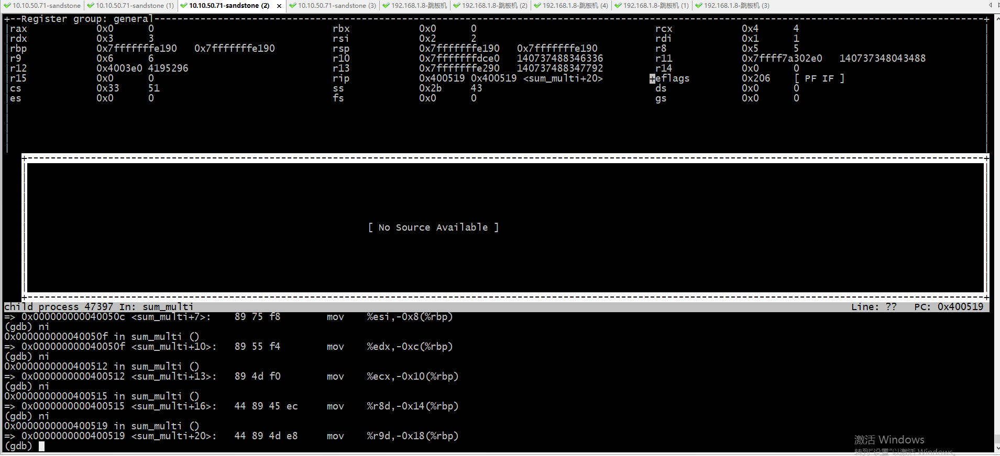
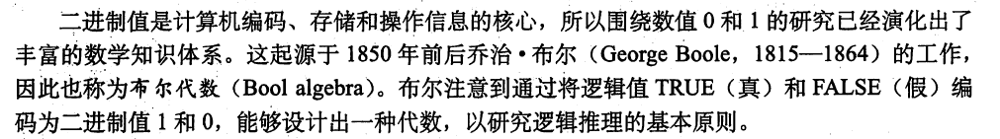

## 深入理解计算机系统
### 前言
* 硬件结构 
* 总线的长度，即WORD的宽度，这个相当于是一个计算机内部的一个交通标准，4个字节，8个字节，相当于是四车道还是八车道
* 主印刷电路板简称主板
* IO设备都是通过控制器或者适配器与IO总线相连，相当于村庄与公路相连一样
* 寄存器文件就是寄存器堆CPU中多个寄存器组成的阵列
* ALU 计算逻辑器的计算过程：  
* 简单处理过程：
* DMA：不使用中断直接拷贝数据;在实现DMA传输时，是由DMA控制器直接掌管总线，因此，存在着一个总线控制权转移问题；相当于DMA临时获取了交通使用权。
* 体系架构设计的一个主要目标就是将数据复制工作加速，由于数据的可复制性，所有让缓存成为一种可能，而不像现实中的高速路设置。
* 存储体系 ，主要思想就是上一层是下一个层的高速缓存，比如内存是硬盘的高速缓存，L1是L2的高速缓存，L3是主存的高速缓存。
* 操作系统作为硬件和程序（人类意志）的中间层，是作为使用计算资源而进行处理的中间层，本质上是为了调度各种硬件资源，比如进程是为了控制CPU或者是对CPU的抽象，文件是对IO设备的抽象，虚拟存储器是对磁盘IO设备和主存的抽象。
* 文件就是字节序列而已。每个IO设备，包括磁盘、键盘、显示器、网络等都可以抽象为文件。就是所有的输出与输入都可以抽象为文件。
* 虚拟存储器的作用：(1)作为磁盘的高速缓存 (2) 将内容存储到磁盘上
* 超线程： 可以让一个CPU同时执行两个控制流，因为ALU是一个，但是寄存器文件和PC是多个，可以在一个tick中决定执行哪个控制流。(超线程的概念打破了一个CPU同时只能执行一个线程的认知)，其实是一种快速的线程切换
* L3被加入到CPU Die中，它在逻辑上是共享模式。而L2则被每个Core单独占据。这时L2也常被指做MLC（Middle Level Cache），而L3也被叫做LLC（Last Level Cache）
* 并发技术：多进程、多线程、超线程
* 并行技术： 多核，指令级并行(同时处理多条指令)，单指令多数据并行(SIMD, single instruction multi data)
### 信息的表示与处理
* 通过'位'的组合，加上合适的解释，就能表示有限集合的元素
* 最小寻址单元为byte
* 位向量
```
a=[01101001]表示{0，3，5，6}
b=[01010101]表示{0，2，4，6}
最终a&b={01000001}={0，6}
```
* 0x0f39d3  345197u
* 尽量减少无符号整数的使用，避免不必要的麻烦。java就不支持无符号整数，并且不支持long long
* 位向量与坐标系 
* 无符号整数的溢出是模运算，有符号整数的溢出可能是变为负数，这个都是因为计算的有限性引起的
* 有符号整数的二进制计算基于，无符号整数的运算基于
* 模数加法形成一种数学结构，成为阿贝尔群，这是以丹麦数学家Niels Henrik Abel的名字命名的。它有一个单位元，并且每个元素有一个加法逆元。
* 在大多数机器上，乘法都是比较耗时的操作，需要10个或者更多的时钟周期进行计算，然而其他整数运算（加、减、位级运算、移位）都只需要一个时钟。因此编译器尝试使用一种优化，使用移位和加减法来代替乘法。，大多数编译器只在少量移位、加法、减法就足够的时候才会使用这种优化。
* 在大多数机器上，除法比乘法都更慢，需要30个或者更多的时钟周期进行计算。对于除以2的幂的运算，我们可以使用右移进行优化。
* 浮点数的表示方法，s为sign符号；M为尾数(significand)，决定了精度； E为阶码(exponent),可能为负数，决定了范围，对于阶码的表示，不能使用有符号或者无符号整数的想法来解析，因为它们是同一个层级的概念，使用偏移的方法来解决的（将正数、负数右移2^(k-1)-1），其实这个是计算机计算的的基础。
* 浮点数的规格化，除了0的情况（两种表示0的方法，符号位为0或1，其他位全是0），其他的情况尾数的小数点左侧默认有个1,相当于将所有的小数都normalize为1.xyz...的形式
```
0的两种方法
符号位（sign） = 0或1
有偏指数（biased exponent） = 0
小数（fraction）= 0
0 00000000 00000000000000000000002
1 00000000 00000000000000000000002
```
* 当阶码大于阶码能表示的最大值时，即表示走向了∞，为特殊值留下了位置
* IEEE浮点格式规定了4中舍入的算法，
* 浮点数表示中的e与自然指数的e不同
```
#include "stdio.h"
int main(){
    float u = 1.234e2;
    printf("%.2f\n", u);
    printf("%e\n", u);
}
--------------------------
123.40
1.234000e+02
```
* 整数&小数转为浮点数的算法
```
首先我们要搞清楚下面两个问题：
 (1)  十进制整数如何转化为二进制数
       算法很简单。举个例子，11表示成二进制数：
       11/2=5   余   1
       5/2=2   余   1
       2/2=1   余   0
       1/2=0   余   1
       0结束         11二进制表示为(从下往上):1011
      这里提一点：只要遇到除以后的结果为0了就结束了，大家想一想，所有的整数除以2是不是一定能够最终得到0。换句话说，所有的整数转变为二进制数的算法会不会无限循环下去呢？绝对不会，整数永远可以用二进制精确表示 ，但小数就不一定了。
  (2) 十进制小数如何转化为二进制数
       算法是乘以2直到没有了小数为止。举个例子，0.9表示成二进制数
         0.9*2=1.8   取整数部分  1
         0.8(1.8的小数部分)*2=1.6    取整数部分  1
         0.6*2=1.2   取整数部分  1
         0.2*2=0.4   取整数部分  0
         0.4*2=0.8   取整数部分  0
         0.8*2=1.6   取整数部分  1
         0.6*2=1.2   取整数部分  0
        .........      0.9二进制表示为(从上往下): 1100100100100......
```
### 程序的机器级表示
* IA32, Intel Architecture 32-bit, intel64是IA32的64位扩展，也就是x86-64，最常用的是x86
* 最早提出64位指令集的是AMD公司
* 机器代码是二进制代码，汇编代码非常接近机器代码，它提供了可读性。
* 标量数据类型、聚合数据类型(数组、结构体)
* assembly language 汇编语言
* 在汇编语言中，所有以.开头的字符串都是指导编译器和链接器的命令，相当于提示，我们在平时学习中可以暂时忽略。
* 寄存器取值 ， 主要使用(), %, $符号作为特殊符号来表达。
* movl传送双字, movb传送字节, movw传送字，因为名字是沿袭了16-bit的习惯，所以此处的称呼相对于32-bit系统都要%2来想；所以汇编语言的命名沿袭了16-bit的字长。从最近的学习中，可以看到一些历史对现在的痕迹。
* stack存储在RAM中，cpu使用esp、ebp来遥控获取和设置stack中的值
* 条件码(condition code): CF(carry 进位标记)、OF(overflow 移除标记)、ZF(零标记)、SF(符号标记，最近的操作得出了负数), SET指令(可以将条件码的值设置到某个寄存器中)、CMP指令(可以将比较的结果存入到条件码中)；条件码是作为隐性条件出现的，在汇编语言中没有直接可以操作的条件码，即不存在 mov %CF,%eax，使用相关的命令的时候，实时想着有这几个条件码在背后
* jmp *%eax; jmp *(%eax); jmp .L1（直接跳转到某个Label）;   间接跳转使用*号
* 异或：^, ⊕, xor(exclusive or，就是排除了相等情况的或，也就是当两者为1的时候也为0)
* 操作码的source和destination ；可以看出，如果是一元操作码，则唯一的为D；如果二元操作，则后一个为D，也就是操作结果存放在后面的参数
* switch-case实现多重分支，multi-way branching，编译器可能使用jump table这种比较高效的数据结构
* 为单个过程分配的那部分栈成为stack frame
* push、pop指令会自动调整esp的值(相当于是esp会自动游走),call和ret也会操作esp
* gdb中查看寄存器
```
gdb> b main
> info registers
> p/x $pc
> p/x $eax

gdb prog -tui > layout regs
> set disassemble-next-line on (set di显示汇编代码)
> ni/si (执行下一步汇编指令)
> info proc mappings 查看内存布局或者shell下cat /proc/pid/maps
> info frame
> disass main
> set *addr=20
```

* 寄存器中存储的也是虚拟地址,比如ESP、EBP中的值
* 所有的指令都是面向寄存器的操作，比如leave指令可能是若各个pop指令的组合效果
* C语言中的数组是将标量数据聚集成更大数据类型的方式。
* 结构体是使用不同类型的对象来创建数据类型的机制
* 异质的数据结构：结构体 联合体
* 许多计算机系统都对基本数据类型合法地址做了一些限制，要求某种类型对象的地址必须是某个值K（通常是2,4,8）的倍数，也就是要求地址的后若干位为0，这种对齐限制简化了处理器与存储器之间的硬件设计。
* 虽然不管是否对齐，IA32指令集都可以正常运行，但是Intel还是建议对齐数据以提高存储器的性能
* Linux的对齐策略是2字节数据类型的地址必须是2的倍数，而较大数据类型需要是4的倍数
* IA32下，栈帧的长度是16byte的倍数；并且每种数据类型都需要有对应的对齐限制，保证对每种类型都能实现对齐，所以结构体的每个字段也需要有对齐
* 编译器的默认对齐方式是4
* 指针权利之大 + 栈信息在用户空间中（保存着关键的跳转信息）结合出来 buffer overflow
* 由于防止栈的地址能够被预测，所以每次启动的时候栈的起始地址都是不同的，这就是栈随机化，所以我们观察一个程序反复启动时候变量在栈空间上地址是变化的
* 栈随机化已成为Linux系统的标准行为，她是ASLR(Address-Space Location Randomization),这项技术就是将存储空间上的所有段(segment)打乱，对应进化的攻击技术为nop sled（空操作雪橇）
* stack protector机制，用来检测缓冲区越界。在局部缓冲状态和栈状态之间加入一只金丝雀(canary)，也成为哨兵值，在该栈帧返回之前会检测金丝雀的值，如果变化就报错。因为金丝雀的值是随机产生的，攻击者无法简单的知道它是什么
* 随机化、栈保护机制、限制哪部分可以存储可执行代码都是buffer overflow的代价非常低的办法
```
sh ./checksec.sh  --file ./main
RELRO           STACK CANARY      NX            PIE             RPATH      RUNPATH      FILE
Partial RELRO   No canary found(没有金丝雀)   NX enabled(栈不可执行启用)    No PIE(栈地址随机化)          No RPATH   No RUNPATH   ./main

gcc -m32 -g -mpreferred-stack-boundary=2 -no-pie -fno-stack-protector -Wl,-z,norelro -z execstack ./program.c
-no-pie: disable PIE (position independent executable)
-z execstack: to disable NX (making stack executable)
-Wl,-z,norelro: disable RELRO (readonly relocations)
-fno-stack-protector: remove stack protection (stack overflow security checks)
```
* 亲测实例：如果gdb强制将栈中的指令返回值篡改，os会将值ip的值设为0,【摊手】
* 例子：
* ESP指向所指数据的低地址为，也就是栈的实际最底部（最小值在最下面），ESP是先减4，再存储
* J指令是判断条件码来进行的，条件码不管是针对bit或者word都是一样的，word的时候作为整体看待。
* CALL指令本身与参数没有关系，参数是放在栈中的辅助值，CALL本身的作用就是将下一条指令压栈，然后切换PC, RET指令则为相反操作
* word是总线执行元，bit是硬件执行元，byte则是访问顺序元
* 我们印象中的栈的参数是从右向左的，因为这是从存储器的地址顺序来看，如果从stack来看，则刚好是从左向右的

### 处理器体系结构
* 不管是大端还是小端，都是以字节为最小单位的
* 指令集的一个重要性质就是字节编码必须有唯一的解释。任何一个字节序列要么是一个唯一的指令序列的编码，要么就是非法编码。只从第一个字节就能唯一确定指令序列。也就是说，如果不知道指令序列的起始位置，是无法确切划分指令序列的。就像TCP的数据流的二进制解析一个道理。
* CISC(sisk), RISC(risk), CISK是一种向复杂化发展的执行(这就是CPU发展的一种内卷)，RISC则是大道至简。CISC竟然包含存储上的数据指令能信么
* 多路复用器mux就是按位比较思想的模型，从硬件到软件过渡的概念
* 两类存储设备：时钟寄存器（简称寄存器），时序新号控制寄存器加载输入值；随机访问存储器(简称存储器) 。不管是那种存储器，其实都是对逻辑门组合的一种抽象，是比较靠上的概念。由于寄存器和存储器有内部存储，所有他们不是组合电路。寄存器文件之所以叫文件是因为它是面向读写的
* 寄存器这层的读写并没有锁的互斥，只不过读是组合电路逻辑，而写则是时序电路逻辑，需要在时钟的驱动下进行
* 我们来理解周期的概念：将计算机的执行频率控制在什么程度也许在历史也存在正义，就想为什么一周工作5天似的。其实计算机可以按照执行很短一段代码来作为节奏周期，但是这样对于面向多任务、多用户的操作系统来讲是不可取的。但是如果粒度过细，则对不起cpu的调度成本，所以要取一个中和。
*  cpu的执行指令，就像网络中处理消息流，不过消息是基于内存的，而cpu的指令的数据编码是基于寄存器的
* 汇编的每条指令中都隐藏了对寄存器的默认操作，比如PC寄存器，状态寄存器等
* HCL就是对电路的抽象表达，就像数字2是对两个苹果的抽象，只不过运算的数据都是0、1，不是按照word进行运算的
* 组合逻辑不需要任何时序或者控制，只要输入变化了，值就会通过逻辑门网络传播。所以**组合逻辑是用来传播的，时钟是用来更新的** 
* 重要原则 **处理器从来不需要为了完成一条指令的执行而去读由该指令更新了的状态**，意思就是说，如果需要读更新过的状态，则应该再来一条
* 管线的基础：状态（[状态码，存储器，寄存器]）通过组合电路连接起来，通过时钟驱动变化，而组合逻辑运算则是实时的，根据状态立刻计算出来结果，但是如果没有时钟新号则无法更新状态；状态机名副其实
* 计算机的电路是一个布尔表达式有向无环图
* 不管指令是几个字节组成的，执行指令的时候都统一从PC所指向的位置读出6个字节做统一处理，因为某种类型的指令的长度是不变的
* 对于3GHz，也就是3GIPS(G instruction per second )的处理器来讲，每条指令的延迟为1/3G，是微微秒级别的，也就是10<sup>-12<sup>，picosecond，简称ps， 毫微纳皮
* 

### 边走变想
* 除了CPU，其他都是IO
* 漫游模式写书
* 计算加速技术： 多机器、多核、多进程、多线程、超线程、指令并行、单指令多数据并行；计算机发展的一个重要方向，怎样更快。
* 抽象的重要性，进程、文件、虚拟存储器，抽象的重要意义就是只要根据API，那么使用者无需担心结果的稳定性。‘
* 虚拟机是对整个计算机资源的抽象
* 数据会溢出，是因为我们忽视了计算机只能表示有限集合
* 最小的计算单元是bit，最小的寻址单元为byte，最小的传输单元为word(对于人类的语言的一个最小单元)
* 虚拟存储器的空间就像房子的空间分配，有各种区域
* 无符号整数的所有运算都集中在一个模空间中，只要溢出就是求模；有符号整数是一个循环，比如以signed char为例子， - 128 - 1 => 127, 127 + 1 => -128，也是一种模的形式。
```
  signed char u = -123;
    signed char v = -5;
    signed char r = u +v;
    printf("%d", r );
---------------------------
127
```
* 计算机执行的整数运算实际是一种模运算形式，只不过在一个很大的空间中，日常感觉不到而已。就像蚂蚁生活在自己的洞中，看不到森林一样。
* 浮点的浮的意思是，点会走
* 总线就是大家都能走的路，而CPU的CMOS的连接线都是私有的线路
* 链接器相当于将预制板放在了指定的楼层
* 虚拟内存布局，程序开始代码在最下（方便读取）=> code区域=>数据区域（初始化和未初始化两种）=>堆=>static code => stack => os。这里面os是老大，肯定在最少，然后程序猿可操作的部分被链接库隔开，有明显的界限，像蔗糖一样一截一截很合理。
* stack就是一个数组，里面被分为了很多的frame，数据的操纵考的是esp或者ebp的偏移进行计算
* CPU好可怜，需要在如此局促的环境下完成如此复杂的运算，CPU的所有活动都是面向寄存器的，寄存器就是它的私有空间，就像高级语言是面向内存的，所有内存是程序和cpu的中间商。
* 

### 趣闻
* 大小端问题来自于《格列夫游记》中无法对从哪端（大端还是小端）打开一个半熟的鸡蛋达成一致 
* 布尔代数 
* IEEE的读法 

### 引用
* GNU
```
The recursive acronym of GNU "GNU's Not Unix!" was chosen because, while GNU's design is Unix-like, it differs from it by being free software.
The original Unix was closed-source, so all of the GNU code has been entirely rewritten and does not contain any of the original Unix code.
```
* GCC: GNU compiler collection， GNU编译套装
* 标量: 标量只有大小概念，没有方向的概念。通过一个具体的数值就能表达完整。比如：重量、温度、长度、提及、时间、热量等都数据标量。
```
标量、向量、矩阵、张量的关系
这4个概念是维度不断上升的，我们用点线面体的概念来比喻解释会更加容易理解：
点——标量（scalar）
线——向量（vector）
面——矩阵（matrix）
体——张量（tensor）

```
* 线性空间又叫向量空间，向量是线性空间中的一个元素
* 线性方程组、行列式、集合（应该是一种行列式）有神秘的关系，
* 虚拟内存中的堆栈布局  
* 段式内存管理
* 堆和栈是迎面而来的关系，但是中间有隔离带。
* BSS段block started by symbol，属于静态内存分配，包含（1）所有未被显示地初始化的全局变量和静态变量 （2）所有被显示地初始化为0的全局变量和静态变量。BSS区域只是一堆符号，并不占用obj文件的磁盘空间。因为都是0，所以为了优化占用空间没有意义。
* Local C variables are maintained at run time on the stack, and do not appear in either the .data or .bss sections.
* 寄存器的名称和作用

| 缩写   | 名称         | 作用                                         |
|------|------------|--------------------------------------------|
| EAX  | 累加寄存器      | 存储函数的返回值，执行计算的操作                           |
| EBX  | 没有特殊用途的寄存器 | 作为额外的数据储存器                                  |
| EDX  | 数据寄存器      | 本质上来说是EAX 寄存器的延伸， 它辅助EAX 完成更多复杂的计算操作像乘法和除法 |
| ECX  | 计数寄存器      | 用于循环操作，比如重复的字符存储操作，或者数字统计                  |
| ESI  | 源操作数指针     | 存储着输入的数据流的位置                               |
| EDI  | 目的操作数指针    | 存储了计算结果存储的位置                               |
| ESP  | 栈指针        | 指着最上面一个栈的栈顶                                       |
| EBP  | 基指针        | 指着最上面一个栈的底端                                     |
| EIP  |            | 总是指向马上要执行的指令                               |

E[A-D]X, E[Source, Destination]I(index), E[stack, base]P(pointer), EIP(instruction pointer)

ESI、EDI成为变址寄存器，用于存放存储单元在段内的偏移量，段内寻址使用

64-bit系统的寄存器名称以R开头，32-bit以E开头。

E代表extend， The X-suffixed registers are the 16-bit extended versions of the 8-bit registers. For 8-bit registers, the L suffix means "low", and the H suffix means "high".

extend代表的意思是对16-bit的一种补充。

栈空间的最大地址是不需要写入寄存器的，所以ESP、EBP只需要记录最少面一个栈就行了
* 在x86-64平台上有16个通用寄存器
* i386指的是IA32的指令集平台
