# 计算机系统概论


## 引言

* 计算机是非常“确定”的一个系统，即在任何时候，在相同的方法，相同的状态下（当然包括相同的起始条件）， 同样的问题必然获得相同的结果。
* 在本书中，有两个理念将反复出现并反复强调，一是“抽象”， 而是“在脑子里不要对硬件和软件做任何区分”。
* 学会抽象是重要的进步，它让我们学会站在更高的层次看问题，从而将事物的本质表现出来，而将其中的细节隐藏起来。抽象能提高我们的思考效率，换句话说，忽略抽象之下的细节，会让我们更有效率。
* 处理器的设计者如果懂得运行在处理器之上的程序需求，那么多设计的处理器必然比那些不懂的人所设计的处理器更快。如Intel为此剔除的MMX指令集及MMX专用执行硬件，而Motorola和Apple也做了类似的工作，如果AltaVec指令集及其硬件。
* 懂硬件特性的软件设计师所设计的程序，其运行性能远高于那些不懂硬件的人所涉及的程序。
* 所有的计算机（不管是小的、大的、贵的、便宜的）只要给与足够多的时间和内存，他们能完成的计算任务是相同的。
* 在现代计算机出现之前，曾出现过很多能够计算的机器，比如模拟机(机械手表)，算盘，称和电子称，加法器等，用于特定场合的计算；而图灵的伟大之处在于他想要去寻找一种设备能做所有的计算（寻找计算领域的上帝，也就是计算的可定义【可约束】），那么他就需要了解人类历史上所有的计算行为与方法来进行抽象和总结。
* 图灵指出,任何计算都可以通过某种图灵机来完成。这也就是IO模型的原型吧, 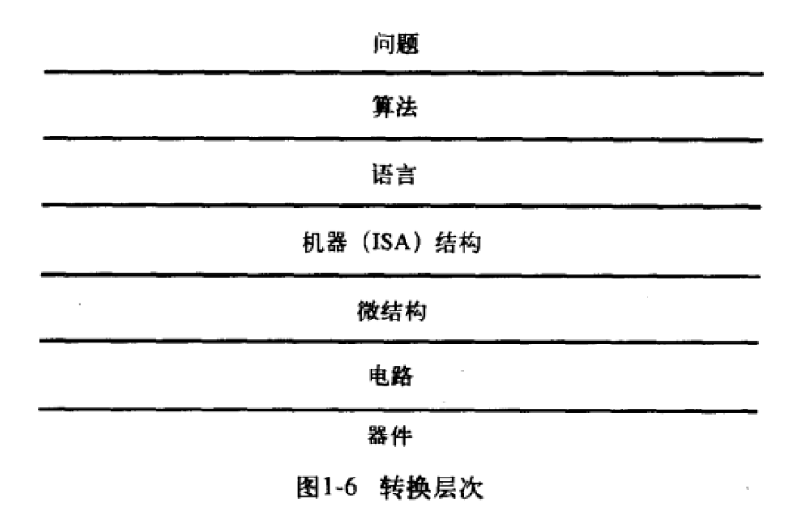
* 自然语言中含有太多的二义性，不同的音调和场合，上下文不同，同样一句话会有不同的含义和理解，这对计算机而言是不可接受的
* 计算机算法的三个特性：确定性，可计算性，有限性
* 指令集结构(ISA, instruction set architecture)是计算机硬件和程序之间的一个完整定义。

### 数据类型&运算

* ISA首先定义支持的数据类型，然后再定义这些类型支持的操作方法
* 位值法(positional notation)，位置代表了权重
* 浮点数： 科学计数法、大数，比如π这种无限不循环小数，无理数计算机是无法表示完全的吧【？此处有疑问】, IEEE浮点数的radix为2，科学计数法的radix为10
* 该章介绍的是信息在计算机中的表示方式

## 数字逻辑

* MOS: 金属氧化物半导体(Metal-oxide semiconductor)
* n-Mos + p-Mos = CMOS(互补金属氧化物半导体)
* 基本逻辑门：And Gate, Or Gate, Not Gate(反相器)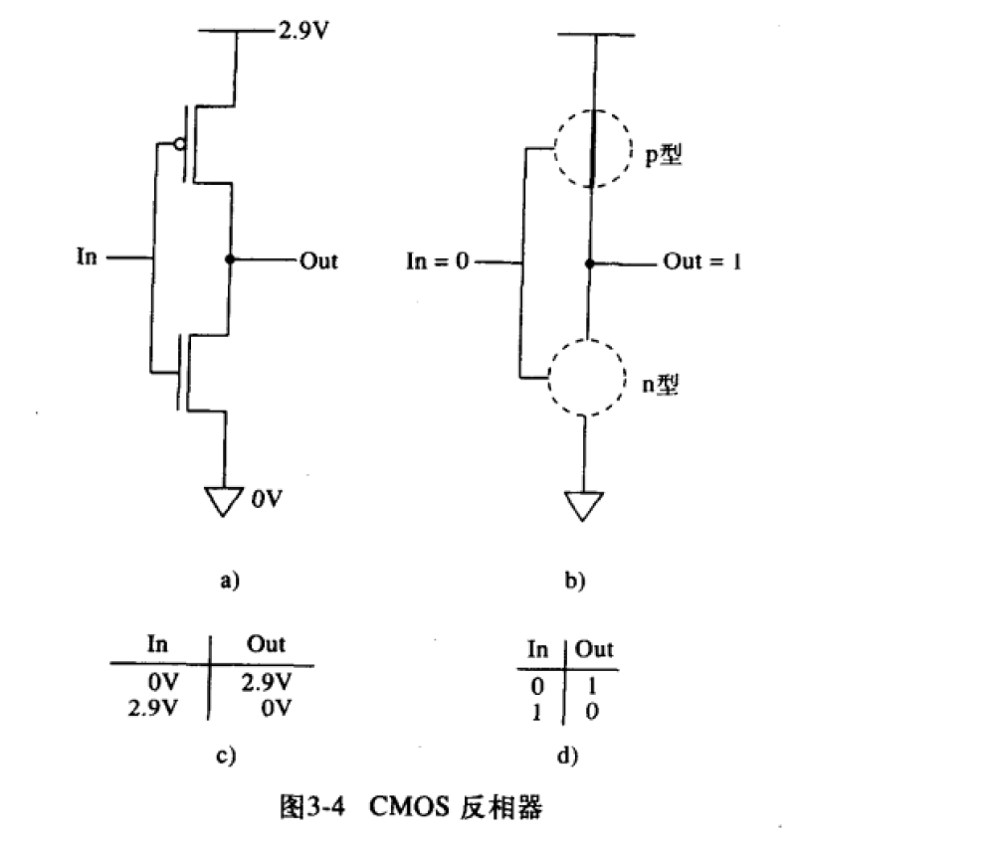 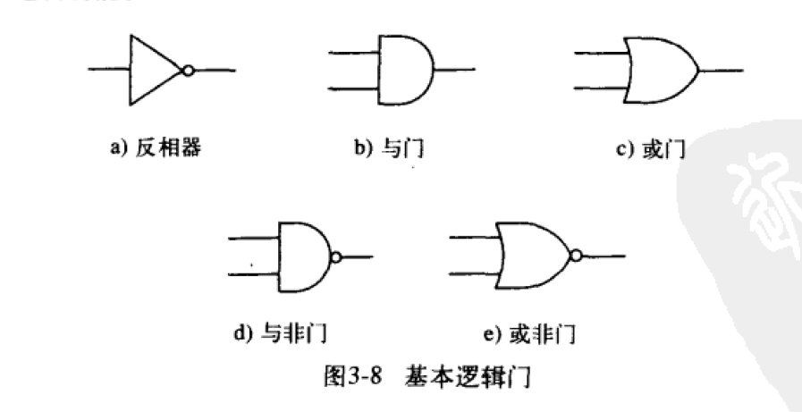 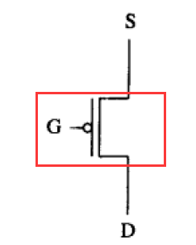 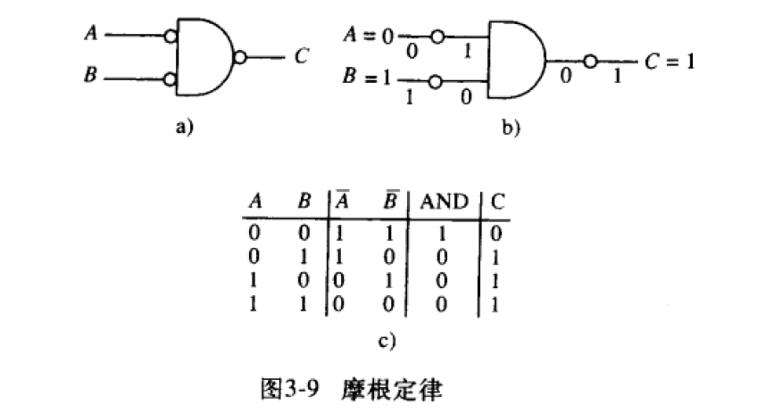, 只要有足够的AND、OR、NOT门，我们就可以实现任何逻辑函数，因此我们成{AND、OR，NOT}逻辑门是“逻辑完备的”，这意味着，不需要任何其他门电路，通过不同数量的AND、OR、NOT就可以实现任何真值表，这就是所谓的"完备性"。
* 栅极（gate），源极（source），漏极（drain）
* 组合逻辑结构: 译码器(decoder)、多路复用器(mux)、全加器(full adder)
* 译码器主要用于解释一个二进制数，比如指令的操作码（opcode）的二进制，是一个4-bit的数值，是指令的一部分。识别每条指令的4-16译码器，是个非常简单的组合逻辑。其实就是经过分析后从哪个口出就是哪个身份。
* 多路复用器是通过改变一个信号的量来决定谁能够占用该通道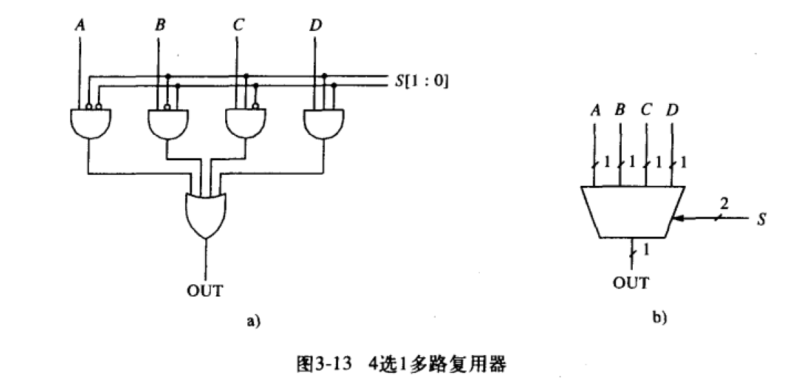
* 加法器

```
半加器只能对单个二进制数进行加法操作，只有两个输入，无法接受低位的进位，因此称为半加器。
全加器则解决了这个问题，全加器有三个输入（包括来自低位的进位），两个输出。
```

* CPU

```
ALU在CPU内部无论是面积占比还是晶体管数量占比都是很低的，各种cache和各种reorder buffer之类的东西面积占得比ALU大太多了，但是它们能尽可能保证ALU满载。GPU才是堆ALU。
```

* NAND与非门，只有最少有一个为低电平时才输出高电平，两个都是高电平才输出低电平。

* 存储单元：latch(锁存器)， trigger（触发器）， register（寄存器）有相同的含义和特性，他们之间没有本质的区别，区别是latch强调的是工作特性，trigger强调的是工作机制，register强调的是作用。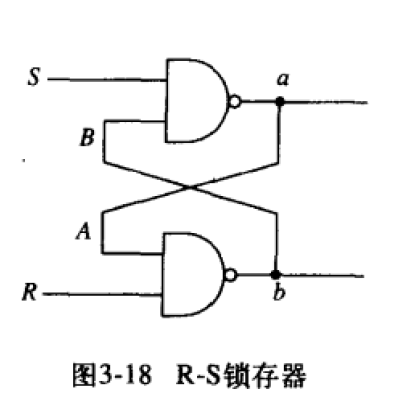 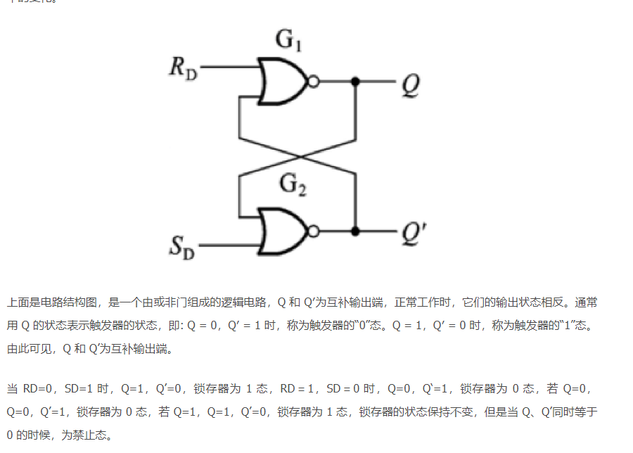

```
所谓锁存器，就是输出端的状态不会随输入端的状态变化而变化，仅在有锁存信号时输入的状态被保存到输出，直到下一个锁存信号到来时才改变。
```

* 内存寻址能力，按照一个字节寻址，这是一个历史问题，原先的计算机在数据处理或接受键盘信息的时候，都会将其转化为8-bit的ASCII码。，如果内存是字节寻址的，那么每个ASCII码刚好占用一个存储位置。需要专用于科学计算的大型计算机采用64-bit寻址，这是因为在科学计算中，数据大都是64-bit浮点数。 A[20:2]常用的表示一个范围的数组的方式 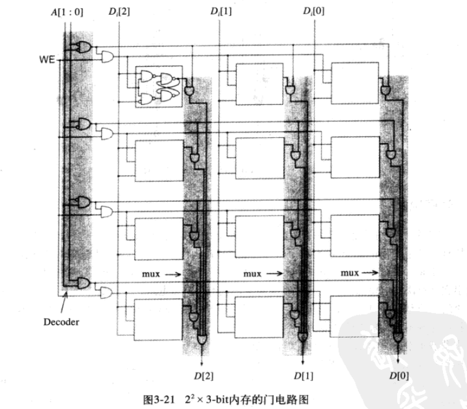
* word line，字线，表示寻找一个"字"的线
* 组合逻辑电路不关心电路以前的状态，电路当前的状态完全取决于当前的输入；而时序逻辑电路则可以跟踪电路以前的状态，而这是有限状态控制器的基础，将是计算机的心脏。一个时序结构的锁，一个组合结构的锁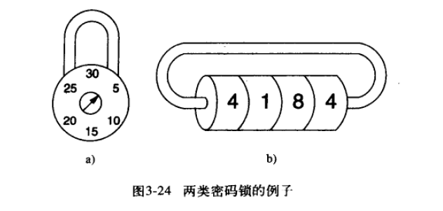
* 系统的状态是系统中所有组成要素在拍照时刻的一个"快照"，就像人的精气神，状态图是表示集中状态的循环
* 状态机转移的触发机制是时钟，所谓时钟，是这样一个信号，低电平和高电平交替变换。而时钟周期是指时钟新号不断变换的间隔时间，就像人的心跳，是驱动人生存的周期。像我国交流电的50Hz的频率一样，白炽灯一秒闪100次
* 状态机的实现：需要存储(存储单元)、有输入（决策单元），然后时钟驱动变化，这貌似也是这个世界的运行逻辑，就像日夜交替，沧海桑田。


## 冯诺依曼模型

* 1946年提出的计算机处理或程序执行的基础模型 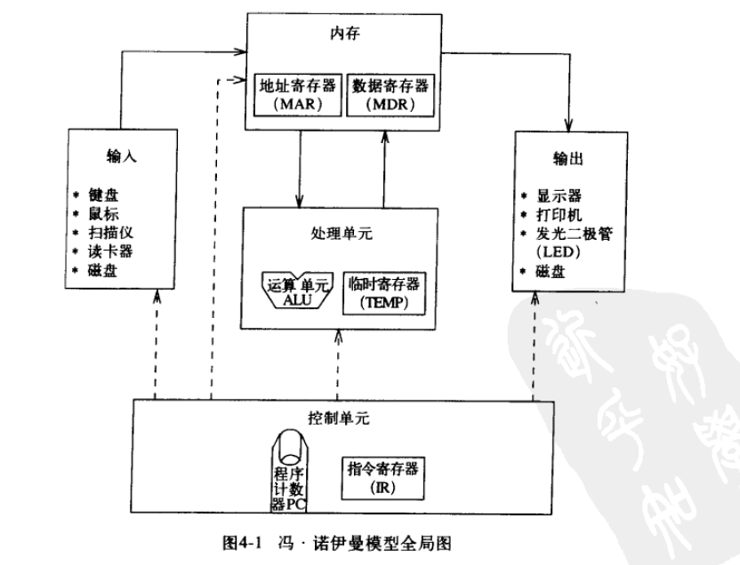
* 2<sup>28</sup>-by-8-bit，表示寻址能力为2<sup>28</sup>，每个地址单元包含8-bit信息，字节是8-bit的另一种简称，就想加仑是4夸脱的简称，一打是12的简称（一种十二进制）
* ALU是CPU最简单的功能单元，包括加减和与或非。而现代计算机以非常复杂，由很多功能单元组成，比如除法操作、平方根等
* 加入没有寄存器（临时存储空间），那么数学计算的中间结果就需要放入到内存中，这就增加了很大的成本，所以就需要在CPU附近支摊
* IO设备就像耳朵、鼻子、眼睛等部件。但是从计算机的世界观来看(是面向cpu或者说面向计算的)，这些都是外围设备(peripheral)，或者说附属设备(accessory)
* PC寄存器，(program counter)，其实合适的称呼应该是“指令指针”（instruction pointer），但是由于历史原因被命名了PC了。 
* 核心思想：程序和数据都是以bit流的方式存放在计算机内存中，程序在控制单元的控制下，依次完成指令的读取与执行。
* 计算机控制单元：时钟、IR指令寄存器、PC程序计数器
* 指令是计算机执行的最小单位，包括操作码和操作数两部分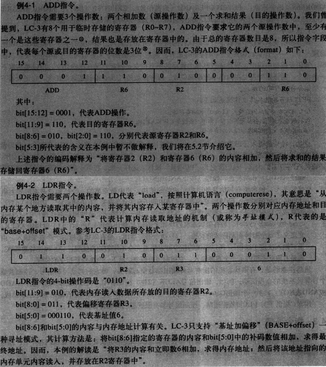
* 指令的处理过程是在控制单元的控制下，精确地，一步一步完成的。一个指令周期(instruction cycle)包括6个节拍(phase)，即：fetch、decode、evaluate address、fetch operand、excute、store result，而每个节拍又分为若各子步骤（step）， 如fetch可以分为三step, 一是将PC内容装入到MAR寄存器，二是读内存，三是将MDR寄存器内容装入IR寄存器。而所有这些节拍的子步骤，受控于控制单元中的有限状态机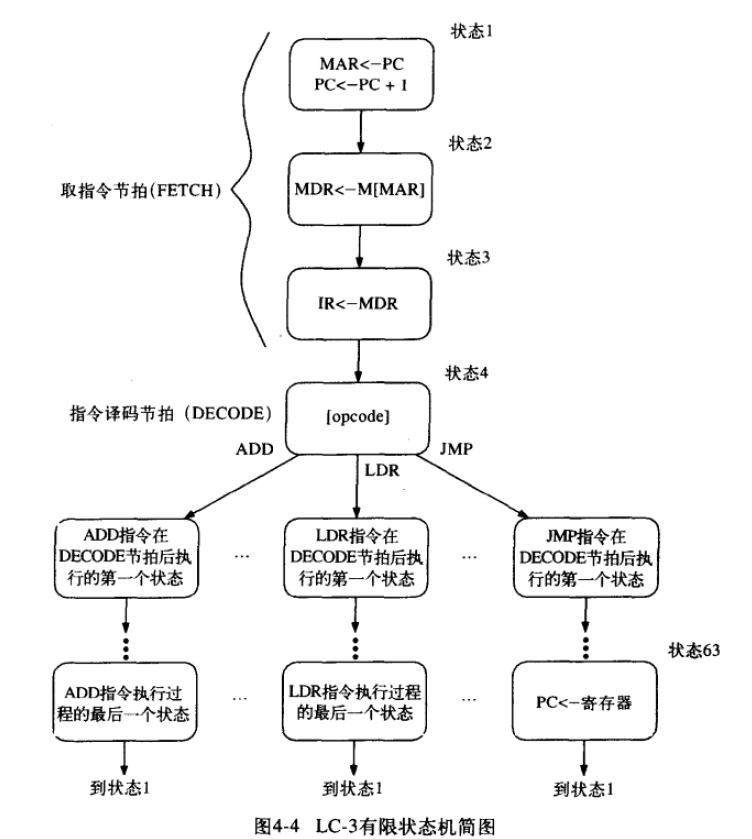
* 指令周期包含多个(机器周期=时钟周期)
* 计算机的执行方式是顺序执行，如此执行直到该顺序流被打断，在顺序流的模式下，指令的类型只有两种，运算指令（operate instruction）和数据转移指令（date movement instruction）
* 任意的指令周期都是从将PC的内容装在到MAR(memory address register)开始的
* JMP指令 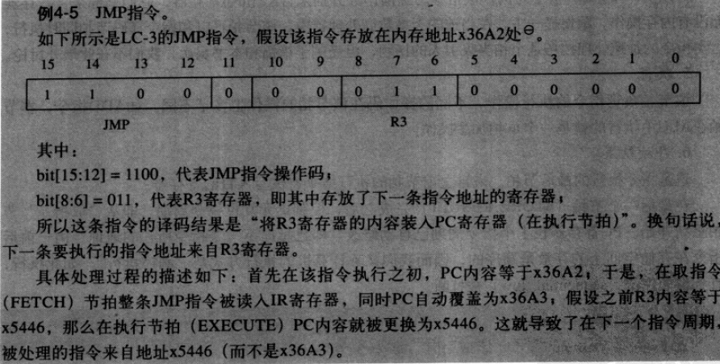
* 停机操作：将晶体震荡器（crystal oscillator，晶振）的RUN状态清零，即停止时钟信号
* 装配线assembly line, 流水线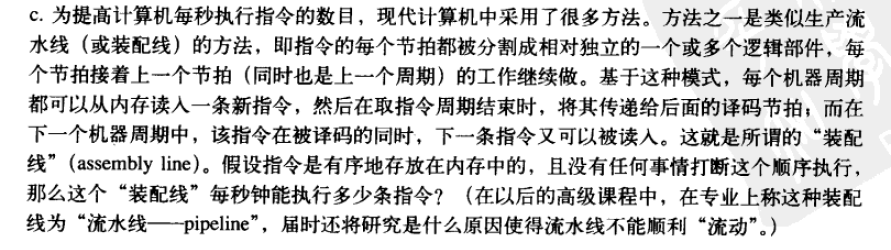


## 边走边想

* 软件与CPU的接口是指令集（软件与CPU之间的协议，编译器就是把高级语言翻译为指令集的形式）
* 硬件与软件有点像物质与精神，精神是基于大脑的神经系统才能存在的。
* 测量也是一种计算
* 计算无处不在，关键在于计算的精度与规模，所以计算机是一件关于“计算”的事情
* 本书是打算从人的实际问题到底层计算的运转打通
* 数字化是一种数学抽象，电子表，电子称，机械表
* 任何抽象化的信息需要指明抽象对应的信息类型，比如int float在内存中的布局的解释，协议传输过程中的信息解释
* CPU的晶体管就像人类的脑细胞，需要处理大量的数据，但是CPU的处理是以晶体管为基础的，只能表现0&1两个值，来模拟出来大千世界。
* 指令，redis指令
* 计算机的计算理论基础是布尔运算，这是建立在二进制基础上的运算；实现布尔运算的算盘的是n-Mos和p-Mo实现的与或非门。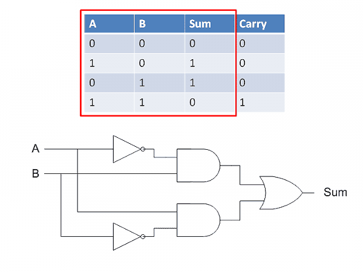 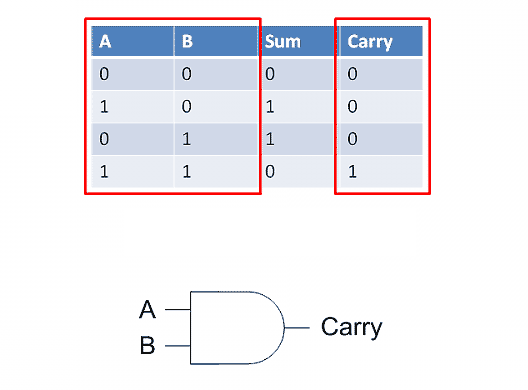 ，"
* 计算机就是根据CMOS的原理，里面有各种根据条件而起效的闸口，在那种情况下有水通过，那种情况没有水通过。
* 冯诺依曼计算模型的伟大之处在于发现了状态的有限性和循环模式。
* addressable 什么东西不可寻址呢，反正计算机内部包括信息和硬件都是需要可寻址的。
* 世间万物皆有频率，有循环就有时间周期，有周期就有频率


## 引用

* 晶体管

```
半导体说的是硅单质，工厂把硅提纯以后变成一个圆盘，称为晶元（wafer）；

晶体管：transistor, 晶体管（transistor）是使用半导体材料制造的通过一个量（电流或者电压，也就是场效应）控制另外一个量（电流或者电压）的元件，晶体管和电阻电容电感等无源（passive）器件的区别在于其通过一个端口控制另外一个端口，所以输入输出时分开的（二极管diode和无源器件都是同一个端口上的两个量之间相互相关）。工厂通过各种离子注入到晶元wafer里面，就可以在晶片上形成一个MOS管。晶体管可独立包装或在一个非常小的的区域，可容纳一亿或更多的晶体管集成电路的一部分

芯片（chip）是在一块半导体晶圆（wafer）上集成了很多晶体管，二极管以及其他无源器件的元件;
在晶圆上在进行封装就是常看到的黑黑的塑料芯片。

cpu里执行指令计算的是最基本的功能，在这里面，复杂指令机不同的指令分解开了就是一系列微命令，精简指令大多都是直接电路执行。这些不仅仅是执行存回这么简单的过程，而是执行步骤每一步都有不同功能电路配合，例如：取指、执行、发射、回写。就单单一步里，例如取指，就要涉及IR、DR、AR、PC模块。
一般CPU有上千条指令，有些指令，如浮点数运算等还是挺复杂的。这些指令的存储，读取，编译，执行，以及所需控制逻辑要消耗大量晶体管。另外cache也占了很大一部分晶体管。即使不考虑多核，CPU也在更新换代，人们会设计新的，更优化的体系架构，如增加并行化，一次处理多条指令；增加预测功能，如分支预测，指令预测/预取；乱序执行；更好的调度系统。虽然都是CPU，但你看看CPU的频率，处理能力是越来越强，这些都是靠大量晶体管堆积起来的。

```

* 摩尔定律

```

摩尔定律，即当价格不变时，集成电路上可容纳的晶体管数目，约每隔18个月便会增加一倍，性能也将提升一倍。
```

* 灯的分类

```

白炽灯就是电灯泡，它的工作原理是电流通过灯丝（钨丝，熔点达3000多摄氏度）时产生热量，螺旋状的灯丝不断将热量聚集，使得灯丝的温度达2000摄氏度以上，灯丝在处于白炽状态时，就象烧红了的铁能发光一样而发出光来。灯丝的温度越高，发出的光就越亮。故称之为白炽灯。白炽灯发光时，大量的电能将转化为热能，只有极少一部分（可能不到1%，没计算过）可以转化为有用的光能。
荧光灯又叫做日光灯，它的工作原理：日光灯管简单的说是个密闭的气体放电管。管內主要气体为氩(argon)气(另包含氖neon或氪krypton)气压约大气的0.3%。另外包含几滴水銀——形成微量的水银蒸汽。水银原子约佔所有气体原子的千分之一的比例。效率是白炽灯的2倍
节能灯又叫紧凑型荧光灯
LED灯（Light Emitting Diode）又叫发光二极管，它是一种固态的半导体器件，可以直接把电转化为光。
```