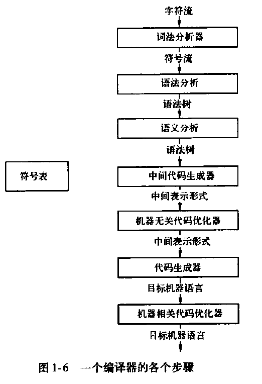
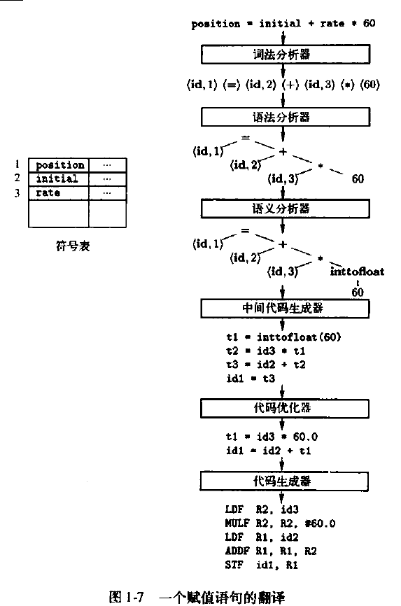

# 编译器原理

## 引论
* 可以把编译器想象为一个黑盒子，可以将源程序映射为在语义上等价的目标程序，可以分为两部分： 分析部分(编译器的前端front end)、综合部分(编译器的后端back end，根据分析部分生成的中间表示和符号表中的信息来构建用户期待的目标程序)
* phase
            
    词法分析(lexical analysis, sacnning): 生成词素(lexem)<token-name, attibute-value>，词素是最小的有意义的字符串组合
    语法分析(snatax analysis, parsing): 生成语法树(syntax tree)
    语义分析(semantic analysis) 合法性检查&类型转化
    中间代码生成
    代码优化(让目标代码执行的更倾向于计算机的计算特征，人语=>机语的加速)
    代码生成

* 大致过程 \
### 静态&动态
* 就是编译器能够对一个程序作出哪些判定；如果一个语言使用的策略支持编译器静态决定某个问题，那么我们说这个语言使用了静态策略(static policy)，或者说这个问题是在编译时刻决定的；另一方面，一个只允许在运行程序的时候作出决定的策略成为动态策略(dynamic policy),或被认为需要在运行时刻(run time)作出决定
* 过程 函数 方法: 方法是类里面的函数，而C只有函数，过程对于C而言则是没有返回值(void)的函数

### 作用域
* 静态作用域与块结构

    C语言是由顶层的变量和函数声明的序列组成，这句话就鸟瞰了C语言的结构
* 显示访问控制，抛弃了块的方式

    C++是混合了块和显示访问控制
    Java则完全抛弃了块的方式
* 动态作用域

### 参数传递
* 值调用
* 引用调用
* 名调用

### 理解
* 词法解析就是分词
* 语法解析就是解析词素之间的关联，语法树是一种不同语言表达同样语义的一致性描述
* 作用域: 局部、全局、类、文件、命名空间，反正能有一种类型对应

## 心得
* 代码的层级，工程 -> package(namespace) -> file -> class -> method(variable) -> expression -> (行、元素、字符)
* 所有的文本组合总有一种算法可以将他们进行分析处理，或者说总会有一个数学模型进行对应
* 当我们面对复杂问题的时候，总是可以将事情进行分析然后综合；这个过程中可能会用到分解、迭代等方法
* 做事情的流水线模型