# HTTPS的那些事
本文先介绍了一下网络上的风险，然后一点一点分析如果将内容安全的包裹起来，结合抓包和TLS协议分析一下SSL协议的执行过程。后面又根据SSL中涉及的内容延伸介绍了证书使用、中间人攻击发生的情形、MD5、SHA1、DES、AES、RSA等算法

## 网络是安全的么
* 随意列举网络相关的攻击方式
  * ARP欺骗: 谎报IP的MAC地址，有可能造成A的所有数据都被B机器接收了
  * DNS劫持: 谎报域名的IP地址，将用户的请求指向了一个非法部署的机器上
  * MITM(Man-in-the-Middle Attack)中间人攻击: 劫持并伪造会话
  * 重放攻击: 获取到曾经的合法数据，然后发送给系统
  * XSS (Cross-Site Scripting，为了区分CSS): 跨站执行脚本
  * CSRF(Cross-site request forgery)：跨站请求伪造
* 这里列举的仅仅是一部分，可以说在整个计算机体系大厦的各个角落都隐藏着想干坏事的狗蛋，我们今天呢，主要是分析HTTP协议的安全问题。HTTP协议如果只是传输一些文章、视频，那安全的意义并不大，或者说实施安全不划算，但是一旦涉及到敏感信息，比如账户信息、金钱信息，或者说交易场景，这个过程就需要进行特殊化处理，避免信息泄露或者恶意代码造成的损失。如何在一个不安全的环境中建立一个安全的通道用于数据传输呢？

## 一步一步加固
1. 最简单的办法就是对称加密(后面的"对称加密"小节)，但是这个有个问题，两端必须`预知密码`，这个在很多场景下是做不到的。
2. 如果密码在网络上传输，如果密码被截获，有内容泄露的危险，怎么破???
3. 使用非对称加密(见后面的"非对称加密"小节)，将对称加密的密码通过非对称传输过去。那为什么不直接使用非对称传输呢，看看算法就知道了，非对称算法的计算量比对称加密多太多了，RSA的加解密是幂运算，而对称加解密基本都是最简单的亦或和偏移。
4. 问题又来了，如何保证公钥私钥的合法性呢？这里面可能有中间人攻击

5. 如何保证公钥传输的安全性呢，找个`第三方机构`保存公钥，这就是所谓的`CA(Certificate Authority)`，数字证书认证机构生成并颁发认证,如何防止证书传输过程中被篡改呢，比如以下情形
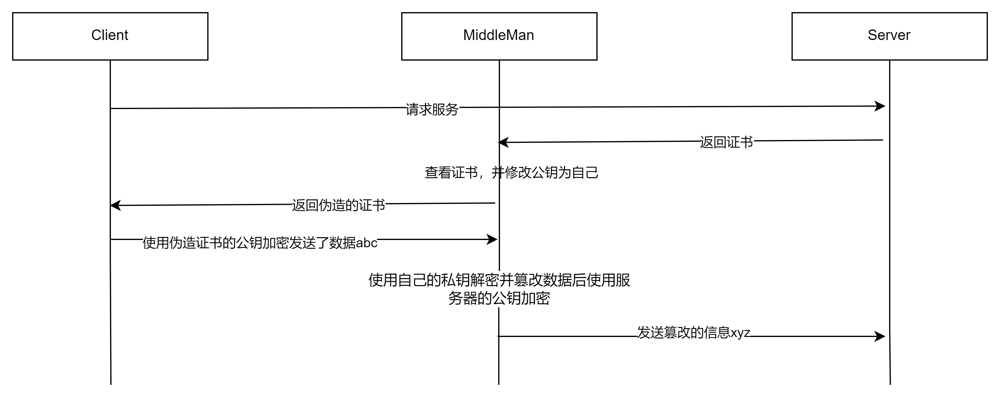
6. 加数字签名，防止中间人篡改，万无一失，最终证书的使用如下图所示
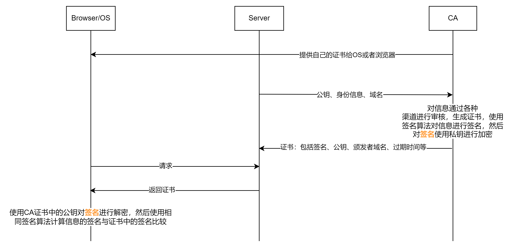
## 对上述的流程的实现就是SSL(Secure Sockets Layer)/TLS(Transport Layer Security)协议
* When the SSL protocol was standardized by the IETF, it was renamed to Transport Layer Security (TLS). 
* tsl其实是ssl的升级版, ssl 发展到ssl3.0就停止了，后面接着是tls, TLS 1.0通常被标示为SSL 3.1，TLS 1.1为SSL 3.2，TLS 1.2为SSL 3.3
* 由于SSL位于应用层和传输层之间，所以可以为任何基于TCP等可靠连接的应用层协议提供安全性保证。
### TLS协议的细节(基于TLS1.2)
* 本文以ECDHE(Elliptic Curve Diffie–Hellman key Exchange)密钥交换算法为例，也可以使用RSA进行交换密钥
#### 通信步骤
1. 客户端发送`ClientHello`到服务器 
```
struct {
    ProtocolVersion client_version;
    Random random;
    SessionID session_id;
    CipherSuite cipher_suites<2..2^16-2>;
    CompressionMethod compression_methods<1..2^8-1>;
    select (extensions_present) {
        case false:
            struct {};
        case true:
            Extension extensions<0..2^16-1>;
    };
} ClientHello;

struct {
    uint32 gmt_unix_time;
    opaque random_bytes[28];
} Random;
```
random: 长度32bytes，由安全随机数字生成器生成；
cipher_suites: 降序排列的客户端支持的对称加密选项
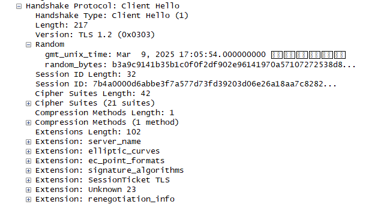

2. 服务器发送`ServerHello`到客户端
```
struct {
    ProtocolVersion server_version;
    Random random;
    SessionID session_id;
    CipherSuite cipher_suite;
    CompressionMethod compression_method;
    select (extensions_present) {
        case false:
            struct {};
        case true:
            Extension extensions<0..2^16-1>;
    };
} ServerHello
```
random: 也是一个32bytes的随机值，不同的是，这个是服务器端独立生成的
cipher_suite: 服务器从客户端发送的列表中选出的一个
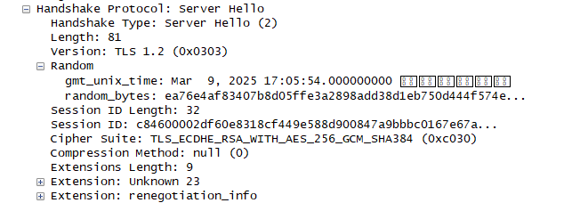
从图中看到，服务器选择了`TLS_ECDHE_RSA_WITH_AES_256_GCM_SHA384`， 信息包括:
   * 对称加密使用AES256
   * 密钥使用ECDHE进行交换
   * 签名使用SHA384

3. 服务器发送`Server Certificate`
`
struct {
    ASN.1Cert certificate_list<0..2^24-1>;
} Certificate;
`
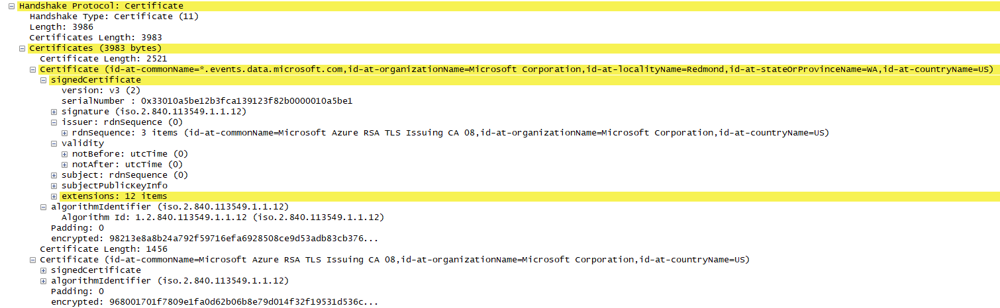
可以看出几点: 数组形式发送, 证书是明文传输的、签名是加密过的

4. 服务器发送`ServerKeyExchange`
```
struct {
    select (KeyExchangeAlgorithm) {
        case dh_anon:
            ServerDHParams params;
        case dhe_dss:
        case dhe_rsa:
            ServerDHParams params;
            digitally-signed struct {
                opaque client_random[32];
                opaque server_random[32];
                ServerDHParams params;
            } signed_params;
        case rsa:
        case dh_dss:
        case dh_rsa:
            struct {} ;
            /* message is omitted for rsa, dh_dss, and dh_rsa */
        /* may be extended, e.g., for ECDH -- see [TLSECC] */
    };
} ServerKeyExchange;
```
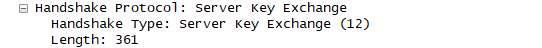

5. 服务器发送`ServerHelloDone`
```
struct { } ServerHelloDone
```
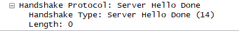

6. 客户端发送`ClientKeyExchange`
```
struct {
  select (KeyExchangeAlgorithm) {
      case rsa:
          EncryptedPreMasterSecret;
      case dhe_dss:
      case dhe_rsa:
      case dh_dss:
      case dh_rsa:
      case dh_anon:
          ClientDiffieHellmanPublic;
  } exchange_keys;
} ClientKeyExchange;
```
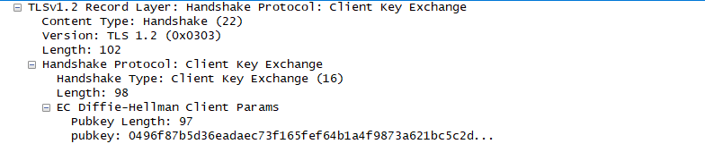

7. 客户端发送`ChangeCipherSpec`
```
struct {
    enum { change_cipher_spec(1), (255) } type;
} ChangeCipherSpec;
```
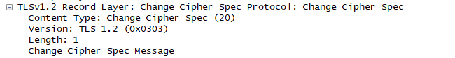

8. 服务器发送`ChangeCipherSpec`
#### 补充
* 客户端和服务器发送`ChangeCipherSpec`后，CS就可以使用对称密钥进行通信了
* 在ECDHE交换中，最终的会话密钥是ClientHello中的随机值和ServerHello的随机值，以及ServerKeyExchange和ClientKeyExchange算出的共享密钥，三个值计算而来的。在用RSA来交换共享密钥的时候，机制有所不同。但是最终的会话密钥都是以三个随机值共同计算而得的。

### 证书的格式、处理、使用方式
* 主要包括三个信息：颁发者的公钥、颁发者的基本信息到期时间等、签名
#### 最常见的信息格式X509
下文为Github网站的证书信息
```
Certificate:
    Data:
        Version: 3 (0x2)
        Serial Number:
            06:3d:49:17:40:4d:39:e5:13:cb:3f:ee:cd:1b:2e:1b
    Signature Algorithm: sha256WithRSAEncryption
        Issuer: C=US, O=DigiCert Inc, CN=DigiCert Global G2 TLS RSA SHA256 2020 CA1
        Validity
            Not Before: Mar 15 00:00:00 2024 GMT
            Not After : Mar 14 23:59:59 2025 GMT
        Subject: C=US, ST=California, L=San Francisco, O=GitHub, Inc., CN=*.github.io
        Subject Public Key Info:
            Public Key Algorithm: rsaEncryption
                Public-Key: (2048 bit)
                Modulus:
                    00:ad:2b:14:a5:3a:4c:41:af:b8:b0:98:dd:93:ae:
                    5e:51:be:de:37:ab:0f:a1:0f:d6:07:35:a9:ed:f9:
                    ...
                Exponent: 65537 (0x10001)
        X509v3 extensions:
            X509v3 Authority Key Identifier: 
                keyid:74:85:80:C0:66:C7:DF:37:DE:CF:BD:29:37:AA:03:1D:BE:ED:CD:17

            X509v3 Subject Key Identifier: 
                E8:6F:57:EB:86:51:98:EB:9F:A5:BE:53:DA:DB:94:AC:28:2E:FB:ED
            X509v3 Subject Alternative Name: 
                DNS:*.github.io, DNS:github.io, DNS:githubusercontent.com, DNS:www.github.com, DNS:*.github.com, DNS:*.githubusercontent.com, DNS:github.com
            X509v3 Certificate Policies: 
                Policy: 2.23.140.1.2.2
                  CPS: http://www.digicert.com/CPS

            X509v3 Key Usage: critical
                Digital Signature, Key Encipherment
            X509v3 Extended Key Usage: 
                TLS Web Server Authentication, TLS Web Client Authentication
            X509v3 CRL Distribution Points: 

                Full Name:
                  URI:http://crl3.digicert.com/DigiCertGlobalG2TLSRSASHA2562020CA1-1.crl

                Full Name:
                  URI:http://crl4.digicert.com/DigiCertGlobalG2TLSRSASHA2562020CA1-1.crl

            Authority Information Access: 
                OCSP - URI:http://ocsp.digicert.com
                CA Issuers - URI:http://cacerts.digicert.com/DigiCertGlobalG2TLSRSASHA2562020CA1-1.crt

            X509v3 Basic Constraints: critical
                CA:FALSE
            CT Precertificate SCTs: 
                Signed Certificate Timestamp:
                    Version   : v1(0)
                    Log ID    : 4E:75:A3:27:5C:9A:10:C3:38:5B:6C:D4:DF:3F:52:EB:
                                1D:F0:E0:8E:1B:8D:69:C0:B1:FA:64:B1:62:9A:39:DF
                    Timestamp : Mar 15 19:00:46.848 2024 GMT
                    Extensions: none
                    Signature : ecdsa-with-SHA256
                                30:45:02:20:53:F3:39:DB:B5:9C:C7:42:90:DC:82:3B:
                                90:2B:86:E5:63:2E:38:74:52:C4:A9:1F:D7:10:23:26:
                                E4:A4:C8:F0:02:21:00:95:5F:4B:AE:AD:C2:00:D9:48:
                                3B:8A:93:4D:D9:2D:59:CA:0B:A4:5A:A2:42:87:B8:63:
                                20:7D:17:B2:B5:E1:F1
                Signed Certificate Timestamp:
                    Version   : v1(0)
                    Log ID    : 7D:59:1E:12:E1:78:2A:7B:1C:61:67:7C:5E:FD:F8:D0:
                                87:5C:14:A0:4E:95:9E:B9:03:2F:D9:0E:8C:2E:79:B8
                    Timestamp : Mar 15 19:00:46.849 2024 GMT
                    Extensions: none
                    Signature : ecdsa-with-SHA256
                                30:45:02:20:0B:1A:4B:04:36:A4:F9:35:8A:6A:BA:C2:
                                1E:56:67:E0:39:6A:C0:47:C0:37:79:6F:96:04:A8:DB:
                                51:D0:B9:4F:02:21:00:E2:72:B6:FB:D9:CD:25:03:6B:
                                2E:31:63:D6:4F:DD:8F:14:B6:91:BC:5A:C5:9F:D1:D5:
                                CC:8E:95:87:9D:18:66
                Signed Certificate Timestamp:
                    Version   : v1(0)
                    Log ID    : E6:D2:31:63:40:77:8C:C1:10:41:06:D7:71:B9:CE:C1:
                                D2:40:F6:96:84:86:FB:BA:87:32:1D:FD:1E:37:8E:50
                    Timestamp : Mar 15 19:00:46.868 2024 GMT
                    Extensions: none
                    Signature : ecdsa-with-SHA256
                                30:46:02:21:00:F2:50:5F:84:00:AC:50:A3:33:4B:0A:
                                2B:3B:16:2E:6A:A6:99:4F:25:32:12:84:61:1D:93:81:
                                EB:35:01:0C:90:02:21:00:D9:8D:D5:84:FE:51:1B:E7:
                                5A:A5:C6:F0:62:05:5B:AD:39:60:5B:33:BB:28:4F:E5:
                                83:5C:75:D4:25:5C:CF:74
    Signature Algorithm: sha256WithRSAEncryption
         72:a5:bf:33:9b:24:1c:71:83:22:da:50:d0:84:15:fd:fb:98:
         d1:6c:52:d5:e6:69:6b:e4:99:c7:c8:b7:d5:7e:4d:9e:d0:9a:
         ...
```
可以看到`Signature Algorithm`签名信息位于最后
* 证书常见的存储编码格式
  * PEM（Privacy-Enhanced Mail）是一种基于文本的编码格式，用于存储和传输加密数据，示例如下
```
-----BEGIN CERTIFICATE-----
MII...（Base64 编码的数据）...
-----END CERTIFICATE-----
```
  * CSR(Certificate Signing Request)格式
```
-----BEGIN CERTIFICATE REQUEST-----
MII...（Base64 编码的数据）...
-----END CERTIFICATE REQUEST-----
```
  * DER(Distinguished Encoding Rules)，二进制存储
* 从PEM文件中查看证书的详细信息
```
 openssl x509 -in github.io.crt -noout -text
```
* 使用openssl在格式之间进行转换
```
将PEM的证书转为DER格式
openssl x509 -in github.io.crt -outform der -out cert.der
```

#### 浏览器内置certificate的使用
* 浏览器会内置信任的根证书机构 

* 当浏览器收到一个网站的证书的时候(通常在tls的握手阶段)，认证过程如下:
  1. 首先浏览器会从内置的证书列表中索引，找到服务器下发证书对应的机构，如果没有找到，此时就会提示用户该证书是不是由权威机构颁发，是不可信任的。如果查到了对应的机构，则取出该机构颁发的公钥。
  2. 用机构的公钥解密签名，然后验证证书签名的合法性。签名通过后，浏览器验证证书记录的网址是否和当前网址是一致的，不一致会提示用户。如果网址一致会检查证书有效期，证书过期了也会提示用户。这些都通过认证时，浏览器就可以安全使用证书中的网站公钥了。
#### 操作系统内置certificate
* centos自带的证书信息在/etc/pki目录下 

## 中间人攻击的几种类型
### Wi-Fi仿冒
* 这种攻击是最简单、常用的一种中间人攻击方式。攻击者创建恶意Wi-Fi接入点，接入点名称一般与当前环境相关，例如某某餐厅，具有极大迷惑性，而且没有加密保护。当用户不小心接入恶意Wi-Fi后，用户后续所有的通信流量都将被攻击者截获，进而个人信息被窃取。
### ARP欺骗
* 发生在同一个局域网中，攻击者冒充网关对用户的ARP请求进行回应，当用户把数据都发给攻击者的机器后，用户所有的流量都到了攻击者的主机上。
### DNS欺骗
* 通过在用户主机上安装恶意软件，该软件能够截获用户的DNS请求，并将攻击者的机器IP返回给用户，然后所有的流量都到了攻击者的主机上
### SSL劫持
* 在访问中间提供给用户非法的证书，然后用户在浏览器会`提示不安全`，如果安全意识不高的话，点了确认就中招了。

## 签名算法

* 散列值长度固定
* 抗碰撞性，相同消息的结果一定相同，不相同消息的结果一定不同
* 使用单向函数，计算结果不可逆
* 计算速度不会因为消息长度而明显增长
### MD5(Message Digest Algorithm 5)
* 生成的是一个`128bit`的签名
```
echo "test" | md5sum 
d8e8fca2dc0f896fd7cb4cb0031ba249  -
```
* 已经宣布被破解，但是不是根据散列值推到原文，而是找到了两个相同散列值的消息
#### 算法步骤
* 参考依据为[wiki中的MD5伪代码](https://en.wikipedia.org/wiki/MD5)
* 根据算法有下图 
##### 填充
* 内容的长度必须为512bit(64B)的整数倍
* 填充的第一个字节为1000,接着是多个0000，最后为64bit的原始内容长度
##### 分块
* 分块单位512bit(64B)
##### 循环压缩
* 每块都要如图所示进行64次的循环,不同的循环批次使用的公式不同
  * 即`i 从0-63`
  * i: 0-15
```
f := (b and c) or ((not b) and d)
g := i
```
  * i: 16-31
```
f := (d and b) or ((not d) and c)
g := (5×i + 1) mod 16
```
  * i: 32-47
```
f := b xor c xor d
g := (3×i + 5) mod 16
```
  * i: 48-63
```
f := c xor (b or (not d))
g := (7×i) mod 16
```
* 每块循环的结果都会累加到最终结果上
##### 得出结果
* 将128bit的值转为16进制的字符串，即图中的ABCD输出为字符串

### SHA1(Secure Hash Algorithm 1)
* 算法相对MD5来说更简单一些
* SHA-1可以生成一个被称为消息摘要的`160bit`（20字节）散列值，散列值通常的呈现形式为40个十六进制数。
```
echo "test" | sha1sum 
4e1243bd22c66e76c2ba9eddc1f91394e57f9f83
```
* 2017年2月23日，Google公司宣布，他们与CWI Amsterdam合作创建了两个有着相同SHA-1值但内容不同的PDF文件，这代表SHA-1算法已被正式攻破。
* 在安全证书，目前基本采用了SHA-256的签名，生成一个`256bit`的签名，比SHA1的160bit要安全很多
```
echo "test" | sha256sum 
f2ca1bb6c7e907d06dafe4687e579fce76b37e4e93b7605022da52e6ccc26fd2
```
#### 算法步骤
* 参考依据为[wiki中的SHA1伪代码](https://en.wikipedia.org/wiki/SHA-1)

##### 填充
* 这一步和MD5使用的方式一样，填充的第一个字节为1000,接着是多个0000，最后为64bit的原始内容长度
* 产生512bit整数倍的内容
##### 分块
* 按照512bit分块
###### 针对每块的循环
1. 512bit先分为16个子块，每块32bit，记为`M`数组
2. 原地`变胖`扩展为80个字块，每块32bit，存储在`W`数组
```
当0≤i≤15, W[i] = M[i] , 
当16≤i≤79, W[i] = (W[i-3] ⊕ W[i-8]⊕ W[i-14]⊕ W[i-16]) << 1, 
```
* 进行80次循环
  * 0-19次
```
f = (b and c) or ((not b) and d)
k = 0x5A827999
```
  * 20-39次
```
f = b xor c xor d
k = 0x6ED9EBA1
```
* 40-59次
```
f = (b and c) or (b and d) or (c and d) 
k = 0x8F1BBCDC
```
  * 60-79次
```
f = b xor c xor d
k = 0xCA62C1D6
```
  * 每块循环的结果都会累加到最终结果上
##### 得出结果
* 将160bit的值转为16进制的字符串，即图中的ABCDE输出为字符串

## 对称加密算法
* 最简单的对称加密 ` A xor B xor B = A`
### DES(Data Encryption Standard)
  * 分组长度64bit，所以算法是以64bit为单位进行的
  * 密钥长度56bit
  * 执行同一个算法16遍，每次使用不同的密钥
  * 轮钥的生成过程如下
  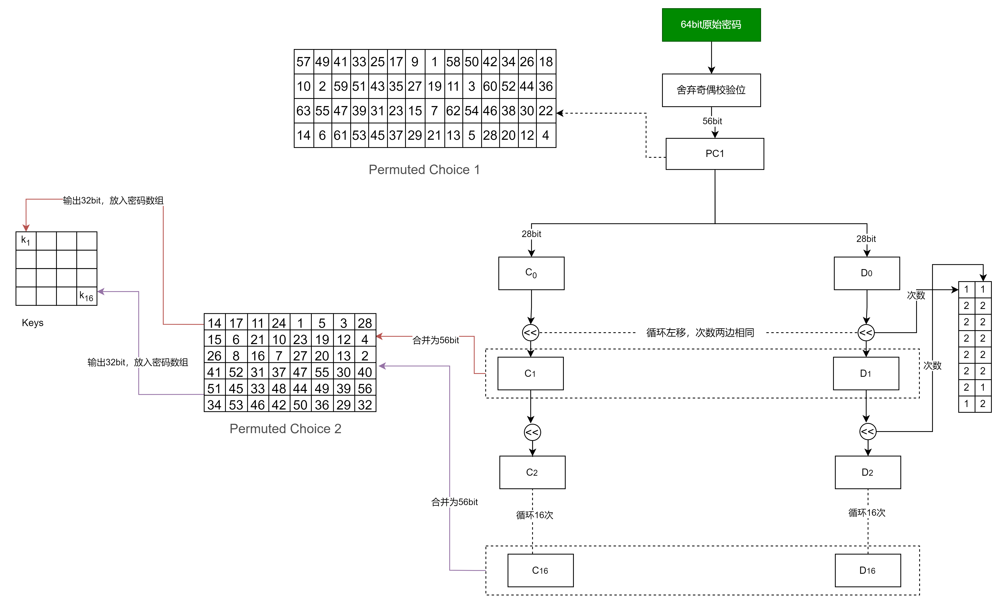
  * S盒子置换如下
  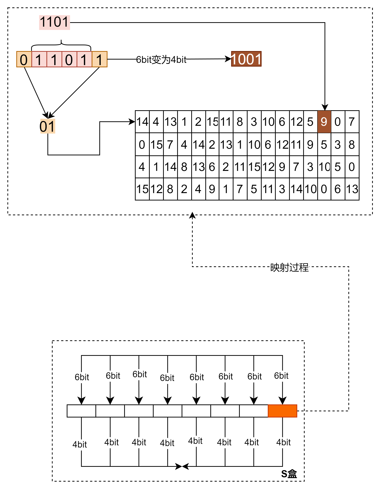
  * 循环过程如下
   
### 3DES(Triple Data Encryption Algorithm)
  * 执行三遍DES
#### AES(Advanced Encryption Standard)
  * 根据密钥长度不同分为 AES-128,AES-192,AES-256，加密轮数分别为10,12,14
  * 目前`事实上的对称加密标准`
  * 量子计算机解码256位AES密码所需的时间仍然与传统计算机解码128位AES密码所需的时间相同。因此，AES-256被认为是`抗量子（英语：quantum resistant）`的。
  * 下面以AES-128为例进行分析
    * 对明文以128bit进行分组，加密算法以128bit为单位
    * 循环执行加密过程10次，每次使用不同的密钥
    * 初始密钥长度也是128bit，4个32bit
    * 

## 非对称加密算法
### RSA(Rivest–Shamir–Adleman) 
* 对极大整数做因数分解的难度决定了 RSA 算法的可靠性
* 欧拉函数: 是小于等于n的正整数中与n互质的数的数目，又称φ函数
#### 生成步骤
1. 选择任意两个素数P, Q
2. 算得N=P * Q
3. 根据欧拉函数，算得 T = (P - 1) * (Q - 1)
4. 得到一个比T小且与T互斥的数 E
5. 求 (E * D) mod T = 1 中D的值
6. 得到公钥对为 (N, E)，私钥对为(N, D)
7. 加密明文M: C = Math.Pow(M, E) % N
8. 解密密文C: M = Math.Pow(M, D) % N
```
Math.Pow()方法只是示意，实际计算请使用BigInteger对应的方法
```
#### 用到的知识点
* 最大公约数，欧几里得算法(辗转相除法)
```
 long GCD(long a, long b) => b == 0 ? a : GCD(b, a % b);
```
* 欧拉函数
```
获得的是： 小于等于n的正整数中与n互质的数的数目，如果是两个素数P,Q的乘积，它的欧拉函数的值为(P-1)*(Q-1)
```
* 拓展欧几里得算法，用来求出第5步的D值
```
    public static int ExtendedGCD(int a, int b, out int x, out int y)
    {
        int t, d;
        if (b == 0) { x = 1; y = 0; return a; }
        d = ExtendedGCD(b, a % b, out x, out y);
        t = x;
        x = y;
        y = t - a / b * y;
        return d;
    }
    D = ExtendedGCD(E, T, out int x, out int y);
    if (x < 0)
    {
        int i = 1;
        while (true)
        {
            if (((1 + i * T) % E) == 0)
            {
                D = (1 + i * T) / E;
                y = i * (-1);
                break;
            }
            ++i;
        }
    }
```

`微信公众号为“吹风的坚果”，欢迎关注，定期更新优质的计算机文章。`

## reference
* [很详细的英文文档](https://hpbn.co/transport-layer-security-tls/)
* [CSRF防范](https://tech.meituan.com/2018/10/11/fe-security-csrf.html)
* [signature](https://www.youdzone.com/signature.html)
* [RSA](https://cse.hkust.edu.hk/~raywong/comp170/notes/6-TheRSAAlgorithm.ppt)
* [TLS WIKI](https://en.wikipedia.org/wiki/Transport_Layer_Security)
* [TLS 1.2](https://datatracker.ietf.org/doc/html/rfc5246#page-47)
* [TSL 1.3](https://datatracker.ietf.org/doc/html/rfc8446)