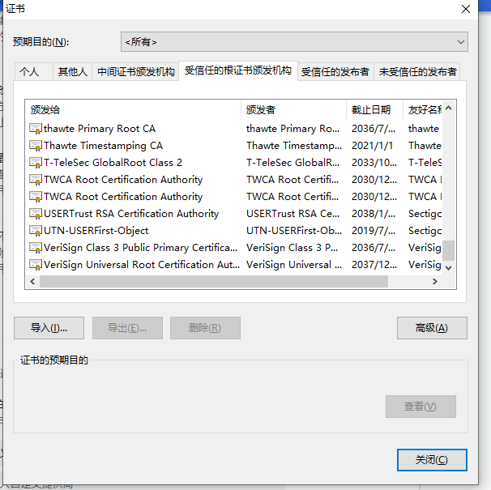

# 安全传输

安全问题是一个很大的领域，我们此处只着眼于网络通信中的安全传输问题。

如何在一个不安全的环境中建立一个安全的通道用于数据传输

## 首先抛出一个问题，网络是安全的么？ 为什么？
* 随意列举网络相关的攻击方式
  * ARP欺骗: 谎报IP的MAC地址，有可能造成A的所有数据都被B机器接收了
  * DNS劫持: 谎报域名的IP地址，将用户的请求指向了一个非法部署的机器上
  * MITM(Man-in-the-Middle Attack)中间人攻击: 劫持并伪造会话
  * 重放攻击: 获取到曾经的合法数据，然后发送给系统
  * XSS (Cross-Site Scripting，为了区分CSS): 跨站执行脚本
  * CSRF(Cross-site request forgery)：跨站请求伪造
* 这里列举的仅仅是一部分，可以说在整个计算机体系大厦的各个角落都隐藏着想干坏事的狗蛋，我们今天呢，主要是分析HTTP协议的安全问题。HTTP协议如果只是传输一些文章、视频，那安全的意义并不大，或者说实施安全不划算，但是一旦涉及到敏感信息，比如账户信息、金钱信息，或者说交易场景，这个过程就需要进行特殊化处理，避免信息泄露或者恶意代码造成的损失。
### 为什么必须加功能，TCP干不了么？
* TCP协议的职责是
  * 确保数据完整性（无丢失、无重复、按序到达）
  * 提供可靠的连接（三次握手、流量控制、拥塞控制）
  * 无法确认数据的可信性，也就是对端可能是你的朋友也可能是狗蛋在给你发信息，在传输的过程中可能被篡改，或者伪装为你的朋友进行通信
  
## 保密性
1. 措施就是加密，最简单的办法就是对称加密(后面的"对称加密"小节)，见，但是这个有个问题，两端必须`预知密码`，这个在很多场景下是做不到的。
2. 如果密码在网络上传输，如果密码被截获，有内容泄露的危险，怎么破???
3. 使用非对称加密(见后面的"非对称加密"小节)，将对称加密的密码通过非对称传输过去。那为什么不直接使用非对称传输呢，看看算法就知道了，非对称算法的计算量比对称加密多太多了，RSA的加解密是幂运算，而对称加解密基本都是最简单的亦或和偏移。
4. 问题又来了，如何保证公钥私钥的合法性呢？这里面可能有中间人攻击

怎么办呢
5. 找个`第三方机构`认证公钥的合法性，这就是所谓的`CA(Certificate Authority)`，数字证书认证机构，聊到这里，涉及到一个`信任链`的概念

#### 信任链

#### 浏览器内置certificate
* 浏览器会内置信任的根证书机构 

* 当客户端接收到了服务端提供的证书之后,会通过浏览器内置的证书提供的公钥对签名进行解密.
* 根证书库包含浏览器信任的证书颁发机构CA的根证书，有的浏览器会自建根证书库，比如Mozilla Firefox，有的浏览器会使用其他浏览器的根证书库。
* 浏览器需要从证书库中找到一个公钥对私钥加密的签名进行处理
* 当浏览器收到一个网站的证书的时候(通常在tls的握手阶段)，认证过程如下:
    1. 首先浏览器会从内置的证书列表中索引，找到服务器下发证书对应的机构，如果没有找到，此时就会提示用户该证书是不是由权威机构颁发，是不可信任的。如果查到了对应的机构，则取出该机构颁发的公钥。
    2. 用机构的**证书公钥解密得到证书的内容和证书签名**，内容包括网站的网址、网站的公钥、证书的有效期等。浏览器会先验证证书签名的合法性（验证过程类似上面 Bob 和 Susan 的通信）。签名通过后，浏览器验证证书记录的网址是否和当前网址是一致的，不一致会提示用户。如果网址一致会检查证书有效期，证书过期了也会提示用户。这些都通过认证时，浏览器就可以安全使用证书中的**网站公钥**了。
* 理解： 1. 网站下发的证书是加密过的，需要使用CA的公钥解密
#### 操作系统内置certificate
* centos自带的证书信息在/etc/pki目录下 

### 完整性
### 可用性
### SSL(Secure Sockets Layer)/TLS(Transport Layer Security)
* When the SSL protocol was standardized by the IETF, it was renamed to Transport Layer Security (TLS). 
* tsl其实是ssl的升级版, ssl 发展到ssl3.0就停止了，后面接着是tls, TLS 1.0通常被标示为SSL 3.1，TLS 1.1为SSL 3.2，TLS 1.2为SSL 3.3
* 由于SSL位于应用层和传输层之间，所以可以为任何基于TCP等可靠连接的应用层协议提供安全性保证。


## 完成三个通用目标
#### 加密
* 利用对称加密算法
#### 完整
* 利用MAC(message authentication code)，通常是一路加密哈希函数
#### 认证
* 数字证书


## 数字签名 
为什么需要数字签名？
* 确认身份，防止抵赖，将现实世界的`人、机构`与虚拟世界的`消息`建立强关联
* 防止发送的内容被篡改
* 

## 中间人攻击的几种类型
### Wi-Fi仿冒
* 这种攻击是最简单、常用的一种中间人攻击方式。攻击者创建恶意Wi-Fi接入点，接入点名称一般与当前环境相关，例如某某餐厅，具有极大迷惑性，而且没有加密保护。当用户不小心接入恶意Wi-Fi后，用户后续所有的通信流量都将被攻击者截获，进而个人信息被窃取。
### ARP欺骗
* 发生在同一个局域网中，攻击者冒充网关对用户的ARP请求进行回应，当用户把数据都发给攻击者的机器后，用户所有的流量都到了攻击者的主机上。
### DNS欺骗
* 通过在用户主机上安装恶意软件，该软件能够截获用户的DNS请求，并将攻击者的机器IP返回给用户，然后所有的流量都到了攻击者的主机上
### SSL劫持
* 在访问中间提供给用户非法的证书，然后用户在浏览器会`提示不安全`，如果安全意识不高的话，点了确认就中招了。

## 签名算法

* 散列值长度固定
* 抗碰撞性，相同消息的结果一定相同，不相同消息的结果一定不同
* 使用单向函数，计算结果不可逆
* 计算速度不会因为消息长度而明显增长
### MD5(Message Digest Algorithm 5)
* 生成的是一个`128bit`的签名
```
echo "test" | md5sum 
d8e8fca2dc0f896fd7cb4cb0031ba249  -
```
* 已经宣布被破解，但是不是根据散列值推到原文，而是找到了两个相同散列值的消息
#### 算法步骤
* 参考依据为[wiki中的MD5伪代码](https://en.wikipedia.org/wiki/MD5)
* 根据算法有下图 
##### 填充
* 内容的长度必须为512bit(64B)的整数倍
* 填充的第一个字节为1000,接着是多个0000，最后为64bit的原始内容长度
##### 分块
* 分块单位512bit(64B)
##### 循环压缩
* 每块都要如图所示进行64次的循环,不同的循环批次使用的公式不同
  * 即`i 从0-63`
  * i: 0-15
```
f := (b and c) or ((not b) and d)
g := i
```
  * i: 16-31
```
f := (d and b) or ((not d) and c)
g := (5×i + 1) mod 16
```
  * i: 32-47
```
f := b xor c xor d
g := (3×i + 5) mod 16
```
  * i: 48-63
```
f := c xor (b or (not d))
g := (7×i) mod 16
```
* 每块循环的结果都会累加到最终结果上
##### 得出结果
* 将128bit的值转为16进制的字符串，即图中的ABCD输出为字符串

### SHA1(Secure Hash Algorithm 1)
* 算法相对MD5来说更简单一些
* SHA-1可以生成一个被称为消息摘要的`160bit`（20字节）散列值，散列值通常的呈现形式为40个十六进制数。
```
echo "test" | sha1sum 
4e1243bd22c66e76c2ba9eddc1f91394e57f9f83
```
* 2017年2月23日，Google公司宣布，他们与CWI Amsterdam合作创建了两个有着相同SHA-1值但内容不同的PDF文件，这代表SHA-1算法已被正式攻破。
* 在安全证书，目前基本采用了SHA-256的签名，生成一个`256bit`的签名，比SHA1的160bit要安全很多
```
echo "test" | sha256sum 
f2ca1bb6c7e907d06dafe4687e579fce76b37e4e93b7605022da52e6ccc26fd2
```
#### 算法步骤
* 参考依据为[wiki中的SHA1伪代码](https://en.wikipedia.org/wiki/SHA-1)

##### 填充
* 这一步和MD5使用的方式一样，填充的第一个字节为1000,接着是多个0000，最后为64bit的原始内容长度
* 产生512bit整数倍的内容
##### 分块
* 按照512bit分块
###### 针对每块的循环
1. 512bit先分为16个子块，每块32bit，记为`M`数组
2. 原地`变胖`扩展为80个字块，每块32bit，存储在`W`数组
```
当0≤i≤15, W[i] = M[i] , 
当16≤i≤79, W[i] = (W[i-3] ⊕ W[i-8]⊕ W[i-14]⊕ W[i-16]) << 1, 
```
* 进行80次循环
  * 0-19次
```
f = (b and c) or ((not b) and d)
k = 0x5A827999
```
  * 20-39次
```
f = b xor c xor d
k = 0x6ED9EBA1
```
* 40-59次
```
f = (b and c) or (b and d) or (c and d) 
k = 0x8F1BBCDC
```
  * 60-79次
```
f = b xor c xor d
k = 0xCA62C1D6
```
  * 每块循环的结果都会累加到最终结果上
##### 得出结果
* 将160bit的值转为16进制的字符串，即图中的ABCDE输出为字符串


#### 总结
* 每一次对话（session），客户端和服务器端都生成一个"对话密钥"（session key），用它来加密信息。由于"对话密钥"是对称加密，所以运算速度非常快，而服务器公钥只用于加密"对话密钥"本身，这样就减少了加密运算的消耗时间。
* 先握手加密算法，才能用加密算法来生成对称密钥
* 安全的依赖关系: 对称加密 => 非对称加密 => 随机值 + 从证书获得的公钥 => Chain of Trust


## 对称加密算法
* 最简单的对称加密 ` A xor B xor B = A`
### DES(Data Encryption Standard)
  * 分组长度64bit，所以算法是以64bit为单位进行的
  * 密钥长度56bit
  * 执行同一个算法16遍，每次使用不同的密钥
  * 
### 3DES(Triple Data Encryption Algorithm)
  * 执行三遍DES
#### AES(Advanced Encryption Standard)
  * 根据密钥长度不同分为 AES-128,AES-192,AES-256，加密轮数分别为10,12,14
  * 目前`事实上的对称加密标准`
  * 量子计算机解码256位AES密码所需的时间仍然与传统计算机解码128位AES密码所需的时间相同。因此，AES-256被认为是`抗量子（英语：quantum resistant）`的。
  * 下面以AES-128为例进行分析
    * 对明文以128bit进行分组，加密算法以128bit为单位
    * 循环执行加密过程10次，每次使用不同的密钥
    * 初始密钥长度也是128bit，4个32bit
    * 

## 非对称加密算法
### RSA(Rivest–Shamir–Adleman) 
* 对极大整数做因数分解的难度决定了 RSA 算法的可靠性
* 欧拉函数: 是小于等于n的正整数中与n互质的数的数目，又称φ函数
#### 生成步骤
1. 选择任意两个素数P, Q
2. 算得N=P * Q
3. 根据欧拉函数，算得 T = (P - 1) * (Q - 1)
4. 得到一个比T小且与T互斥的数 E
5. 求 (E * D) mod T = 1 中D的值
6. 得到公钥对为 (N, E)，私钥对为(N, D)
7. 加密明文M: C = Math.Pow(M, E) % N
8. 解密密文C: M = Math.Pow(M, D) % N
```
Math.Pow()方法只是示意，实际计算请使用BigInteger对应的方法
```
#### 用到的知识点
* 最大公约数，欧几里得算法(辗转相除法)
```
 long GCD(long a, long b) => b == 0 ? a : GCD(b, a % b);
```
* 欧拉函数
```
获得的是： 小于等于n的正整数中与n互质的数的数目，如果是两个素数P,Q的乘积，它的欧拉函数的值为(P-1)*(Q-1)
```
* 拓展欧几里得算法，用来求出第5步的D值
```
    public static int ExtendedGCD(int a, int b, out int x, out int y)
    {
        int t, d;
        if (b == 0) { x = 1; y = 0; return a; }
        d = ExtendedGCD(b, a % b, out x, out y);
        t = x;
        x = y;
        y = t - a / b * y;
        return d;
    }
    D = ExtendedGCD(E, T, out int x, out int y);
    if (x < 0)
    {
        int i = 1;
        while (true)
        {
            if (((1 + i * T) % E) == 0)
            {
                D = (1 + i * T) / E;
                y = i * (-1);
                break;
            }
            ++i;
        }
    }
```

## certificate
* 公钥证书(Public-Key Certificate，PKC)记录着个人信息(姓名、组织、邮箱地址等个人信息)和个人公钥，并由认证机构(Certification Authority、Certifying Authority，CA)施加数字签名。公钥证书也简称为证书(certificate)。
* 使用流程: 


#### PKI
* pki(Public Key Infrastructure，公钥基础设施)
* 组成要素
```
1. 用户——使用 PKI 的人
2. 认证机构——颁发证书的人
3. 仓库——保存证书的数据库
```
* 通过PKI完成了互联网上的信任基础，就是实现了认证过程

### (Chain of Trust)信任链
* 
* 信任传递: 用户证书 => 中间证书(ICA) => 根证书(CA) => [WebTrust](#WebTrust)
* 通过公钥衔接在一起
* 认证中心CA负责维护和发布证书废除列表CRL（certificate revocation lists，又称为证书黑名单）。 当一个证书，特别是其中的公钥因为其他原因无效时（不是因为到期），CRL提供了一种通知用户和其他应用的中心管理方式。CA系统生成CRL以后，放到LDAP服务器中或Web服务器的合适位置，供用户查询或下载(所以可知浏览器或者OS对失去信任的网站的更新有一定的延迟性)。

#### WebTrust
* WebTrust是由两大著名注册会计师协会AICPA（美国注册会计师协会）和CICA（加拿大注册会计师协会）共同制定的安全审计标准，主要对互联网服务商的系统及业务运作逻辑安全性、保密性等共计七项内容进行近乎严苛的审查和鉴证。 只有通过WebTrust国际安全审计认证，根证书才能预装到主流的浏览器而成为一个可信的认证机构。

Cross-Site Scripting（跨站脚本攻击）简称 XSS，是一种代码注入攻击。攻击者通过在目标网站上注入恶意脚本，使之在用户的浏览器上运行。利用这些恶意脚本，攻击者可获取用户的敏感信息如 Cookie、SessionID 等，进而危害数据安全。

## reference
* [很详细的英文文档](https://hpbn.co/transport-layer-security-tls/)
* [CSRF防范](https://tech.meituan.com/2018/10/11/fe-security-csrf.html)
* [signature](https://www.youdzone.com/signature.html)
* [RSA](https://cse.hkust.edu.hk/~raywong/comp170/notes/6-TheRSAAlgorithm.ppt)