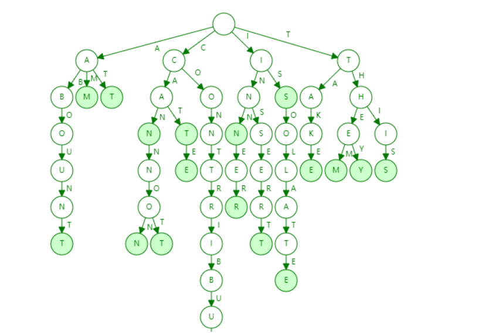

# trie
* Trie这个术语来自于retrieval(检索，可以想象该算法最初的应用场景)。trie的发明者Edward Fredkin把它读作/ˈtriː/ "tree"。但是，其他作者把它读作/ˈtraɪ/ "try"。
* 别名： 前缀树(prefix tree)、字典树, N叉树的特殊形式，如果是因为的匹配，则是26叉树
* 它的核心思想就是通过最大限度地减少无谓的字符串比较，使得查询高效率，即「用空间换时间」，再利用共同前缀来提高查询效率。
* trie中的键通常是字符串，但也可以是其它的结构。trie的算法可以很容易地修改为处理其它结构的有序序列，比如一串数字或者形状的排列

## 基本Trie树
* 
* 时间复杂度O(K)， K为字符串的长度
* 特点
```
1. 根节点不包含字符，除根节点外每一个节点都只包含一个字符。
2. 从根节点到某一节点，路径上经过的字符连接起来，为该节点对应的字符串。
3. 每个节点的所有子节点包含的字符都不相同。
```
#### 操作过程
##### 插入
* 将单词的每个字母逐一插入Trie树。插入前先看字母对应的节点是否存在，存在则共享该节点，不存在则创建对应的节点。
##### 查找
* 从根节点开始，沿着某条路径来匹配
##### 删除
* 

## 应用场景
* 输入法自动补全功能、IDE代码编辑器自动补全功能、浏览器网址输入的自动补全功能
* 拼写检查
* 搜索引擎的文本词频统计
* 自然语言处理(NPL, Natural Language Processing)中的中文分词算法

## 基数树(radix tree)
* 压缩前缀树(Compressed Trie), 更节省空间的Trie（前缀树）
#### 应用场景
* linux的page cache

## bitwise trie
* 键是一串比特，可以用于表示整数或者内存地址


## 实现方式
* 三数组Trie(Triple-Array Trie), 包括三个数组：base,next和check
* 二数组Trie(Double-Array Trie), 包含base和check两个数组。base数组的每个元素表示一个Trie节点，即一个状态；check数组表示某个状态的前驱状态。


## reference
* [python的trie库](https://github.com/pytries/marisa-trie)