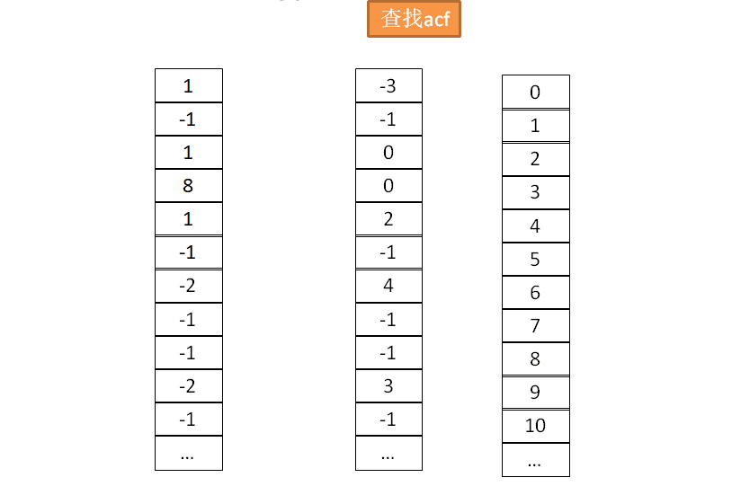

# trie
* Trie这个术语来自于retrieval(检索，可以想象该算法最初的应用场景)。trie的发明者Edward Fredkin把它读作/ˈtriː/ "tree"。但是，其他作者把它读作/ˈtraɪ/ "try"。
* 别名： 前缀树(prefix tree)、字典树, N叉树的特殊形式，如果是因为的匹配，则是26叉树
* 它的核心思想就是通过最大限度地减少无谓的字符串比较，使得查询高效率，即「用空间换时间」，再利用共同前缀来提高查询效率。
* trie中的键通常是字符串，但也可以是其它的结构。trie的算法可以很容易地修改为处理其它结构的有序序列，比如一串数字或者形状的排列

## 应用场景
* 输入法自动补全功能、IDE代码编辑器自动补全功能、浏览器网址输入的自动补全功能
* 拼写检查
* 搜索引擎的文本词频统计
* 自然语言处理(NPL, Natural Language Processing)中的中文分词算法

## 基本Trie树
* 
* 时间复杂度O(K)， K为字符串的长度
* 特点
```
1. 根节点不包含字符，除根节点外每一个节点都只包含一个字符。
2. 从根节点到某一节点，路径上经过的字符连接起来，为该节点对应的字符串。
3. 每个节点的所有子节点包含的字符都不相同。
```
#### 操作过程
##### 插入
* 将单词的每个字母逐一插入Trie树。插入前先看字母对应的节点是否存在，存在则共享该节点，不存在则创建对应的节点。

##### 查找
* 从根节点开始，沿着某条路径来匹配，查找'cate'的过程如下：

##### 删除
* 删除整个单词

* 删除前缀单词,留意颜色的变化，代表该点的"单词"属性的消失

* 删除分支单词


#### 实现方式
* 简单实现
```
简单且直观，但是空间闲置较多，利用率低下
type TrieNode struct{
	Char	 rune
	Children [27]*TrieNode
}
```


```
可变数组Trie树, 减少了闲置指针，但是只能通过遍历来获取下一状态，降低了查询效率
type TrieNode struct {
	Char rune
	Children []*TrieNode
}
```


* 二数组Trie(Double-Array Trie), 是由三个日本人提出的一种字典树的高效实现，兼顾了查询效率与空间存储。DAT极大地节省了内存占用。包含base和check两个数组。base数组的每个元素表示一个Trie节点，即一个状态；check数组表示某个状态的前驱状态。**双数组 Trie 树是目前 Trie 树各种实现中性能和存储空间均达到很好效果的实现,应用于字符区间大的语言（如中文、日文等）分词领域。** [实现方式](#dat实现)

* 三数组Trie(Triple-Array Trie), 包括三个数组：base,next和check

## dat实现
* 基本结构
```
type TrieNode struct {
	Base  []int
	Check []int
----------------------------------------------------------------------------------------------------------------------------------
1. base数组的索引用来表示状态
2. base数组的内容为状态跳转的基地址
3. 输入字符为跳转的offset
4. check与base大小相同，一一对应，用于保存父状态，以及解决冲突
```
* 自动机转移方程：
```
base[r] + c = s
check[s] = r
```
* 示意图: 

```
* base数组的索引为0，1，…, base[s], …, S, …, T，均表示trie树的状态
* 从S状态接收到c跳转到T, 则表示为base数组索引为S的内容base[S]为基地址，加上跳转偏移c，得到下一个T状态在base的索引T=base[S] + C
* check数组对应T的内容check[T]为跳转过来的父状态即S
```
#### 生成过程实例
* 字典{a:1,b:2,c:3,d:4}
* 用-1代表数组元素为空，-2代表叶子节点, -3代表根节点


#### 查找过程
* 过程
1. 从base数组索引0开始，初始状态为S=base[0]，其中偏移的基地址为base[S]
2. 接受到c，则跳转到base数组索引T=base[S] + c，检查此时check数组的check[T] == S，为真跳转到3，否则匹配失败。
3. 如果base[T] == LEAF_VALUE （这里LEAF_VALUE用来表示叶子节点的特殊值），则匹配完成；否则，令S = T, 跳转到2.

* check表示出来"连续性"(上个节点的状态)，base[T]则表示是否为字符串的"终点"(当前节点的状态)

#### 关键点
* 需要有一个"字典"，保存字符与code值的关系
* **状态是索引指向的位置**，而base中的值只是一个偏移，用作计算而已，check中的保存索引(状态)
* base的根节点可以任意设定，只是一个初始偏移量
* base[r] + c = s，用该公式计算出来的是下一个状态(数组索引)，至于**对应位置存储的值，则有不同的处理方式**，总之，当某次状态转移后，该状态指向的位置的值是有一定的使用策略的，**可以使用大的offset将下次状态转移到数组中比较靠后的位置**

    * 最简单的策略，可以直接将父节点的偏移量复制过来
    * 寻找一个空节点，然后通过base[r] = s - c 计算得来需要填写的值
    * 在遇见冲突的时候，需要对该值进行调整，也会使用减法来计算需要的值
* 冲突处理的时候，只要调整父节点的offset，状态计算后指向空节点即可

## 基数树(radix tree)
* 压缩前缀树(Compressed Trie), 更节省空间的Trie（前缀树）
#### 应用场景
* linux的page cache

## bitwise trie
* 键是一串比特，可以用于表示整数或者内存地址


## reference
* [python的trie库](https://github.com/pytries/marisa-trie)
* [trie的动画](https://www.cs.usfca.edu/~galles/visualization/Trie.html)
* [dat的实现](https://turbopeter.github.io/2013/09/02/prefix-match/)
* [dat的实现介绍](https://turbopeter.github.io/2013/09/02/prefix-match/)