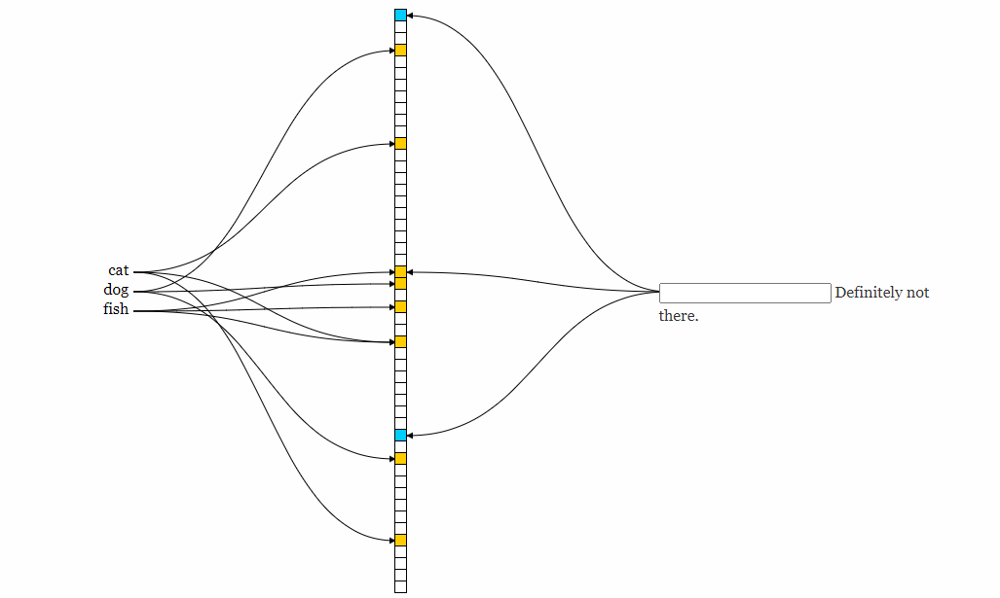
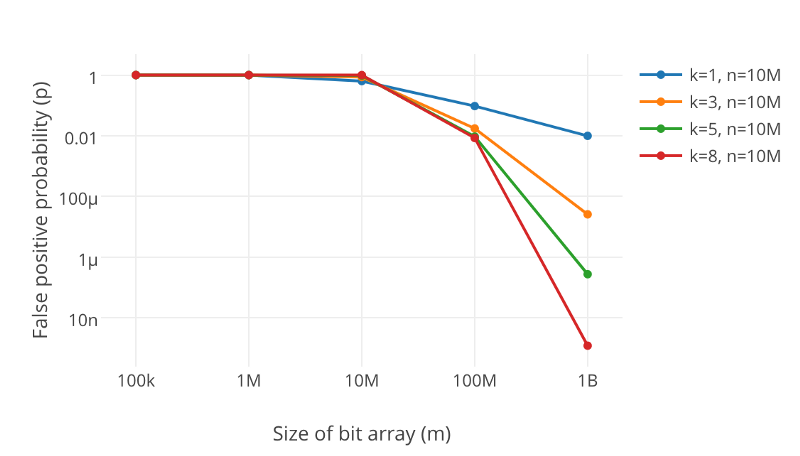

# bloom filter
* 1970年被布隆提出来的
* 属于 Probabilistic Data structures，概率型数据结构
* Bloom filter is all about testing Membership in a set. 
* The classic example of using bloom filters is to reduce expensive disk (or network) lookups for non-existent keys. 
* 时间复杂度O(k), k为哈希的次数
* 解决大数据量带来的时间复杂度和空间复杂度的膨胀问题，即将查询问题拉向了一个极端

## 操作
* add 
* test 
* 不支持remove，如需要支持remove，需要使用count bloom filter(其实就是不使用二进制而是用整型来记录每个哈希的结果)

## 特征
#### 判断特征
* 可能在
* 一定不在
#### 缺点
* 元素无法删除
* 在判断"存在"的时候可能误判

## principle
* 不使用加密型的哈希函数，使用计算复杂度比较低的哈希算法，比如MurmurHash, FVN, HashMix
* 为了降低冲突的概率，需要多次计算哈希
* 当一个元素被加入集合时，通过K个散列函数将这个元素映射成一个位数组中的K个点，把它们置为1。检索时，我们只要看看这些点是不是都是1就（大约）知道集合中有没有它了：如果这些点有任何一个0，则被检元素一定不在；如果都是1，则被检元素很可能在。
* 示意图

* hash的次数与冲突的关系

## 应用场景
#### 特征
* 数据量大但是对准确性有一定的容忍度
* 判断"存在"，不是判断"不存在"
#### 具体场景
* 大数据中广告等业务对DAU等准确性要求不是很高的实时统计场景
* 反垃圾邮件，从数十亿个垃圾邮件列表中判断某邮箱是否垃圾邮箱
* 在网络爬虫里，一个网址是否被访问过
* 字处理软件中，需要检查一个英语单词是否拼写正确
* 在 FBI，一个嫌疑人的名字是否已经在嫌疑名单上
* 缓存穿透问题(大量请求躲过redis的判断而流入到数据库，一般是恶意请求或者缓存失效)，所以在redis前置过滤器
* 抖音推荐功能

## implement 
* 三个重要参数: 容量m，哈希的个数k，容忍的误判率p
* 

## bitmap 
* 相同处，都是用bit来存储信息
* 不同处，bitmap的key不需要哈希转换，可以直接用于访问数据

## reference
* [详解布隆过滤器的原理，使用场景和注意事项](https://zhuanlan.zhihu.com/p/43263751)
* [Probabilistic Data structures: Bloom filter](https://hackernoon.com/probabilistic-data-structures-bloom-filter-5374112a7832)
* [演示动画](https://www.jasondavies.com/bloomfilter/)