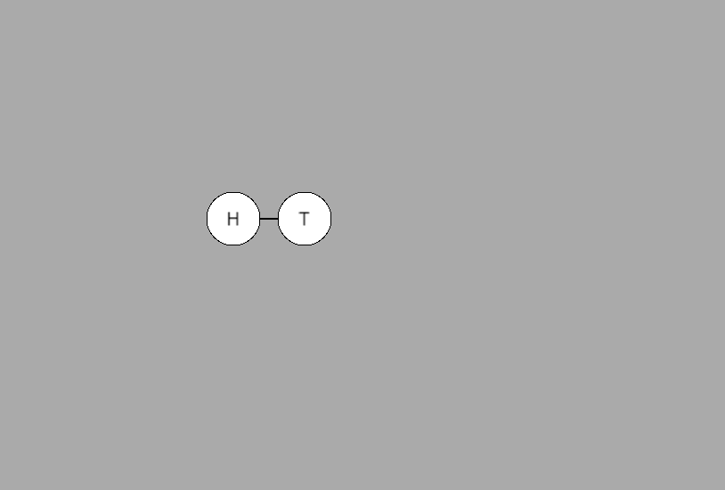
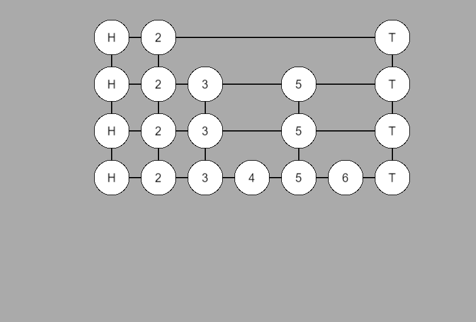
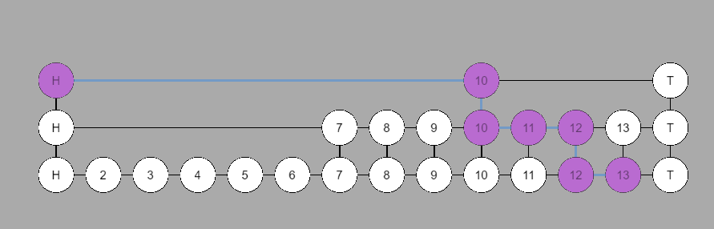

# skip list 
* 全程跳跃链表，是一种类链表的数据结构(或者说是从链表演化过来的，后面可以看到最大层数为1的跳表就是普通的链表)。
* 它允许快速查询一个有序连续元素的数据链表。
* 增删查的时间复杂度都是O(logn)
* 一种空间换取时间的数据结构
* 对标的是平衡树
* "电梯直达"

## 特征
* 多层分布
* 相邻层的上层是下层的子集
* 每层都有序
* 一般都有规定的最大的层数
* 哪个节点能够"突破底层"，全靠随机；随机值越小，则结构越尖（更上的点能够进入"上层"）
* 形象点看，如果层数越多，最终的结构越尖；层数越小，则越扁平
* 体验图 <br/>

## 基础实现
* 数据结构
```
typedef struct NODE {
    T data;
    struct Node *next[i];
} node;
```
* 随机一个层数
```
var level = 0;
while (Math.random() < 0.2 && level < MAX_LEVEL - 1) {
    level ++;
}
return level;
```
* 插入示例<br/>

* 删除示例<br/>

* 查找示例<br/>
如图为查找13的路线<br/>



## 使用软件
* redis
* levelDB

## souce
* [C 实现](https://github.com/fangjiaxiaobai/code_repo/tree/master/01_data_structures/skiplist/c/01_fangjiaxiaobai)
* [JAVA 实现](https://github.com/fangjiaxiaobai/code_repo/tree/master/01_data_structures/skiplist/java/fangjiaxiaobai)

## reference
* [跳表在redis中的实现](https://redisbook.readthedocs.io/en/latest/internal-datastruct/skiplist.html)
* [PAPER](https://www.cl.cam.ac.uk/teaching/0506/Algorithms/skiplists.pdf)