# browser 
## 什么是浏览器
* 访问WorldWideWeb的应用软件
* [浏览器技术家庭发展历史](http://www.evolutionoftheweb.com/)
* 世界第一个浏览器的界面<br/>
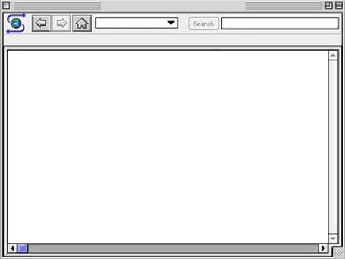

## 渲染引擎(排版引擎)
* 
| 渲染引擎   | 维护公司            | 应用浏览器     |
|--------|-----------------|-----------|
| KHTML  | KDE             | Konqueror |
| WebKit | Apple,基于KHTML   | Safari    |
| Blink  | Google，基于WebKit | Chrome    |
| Gecko  | Mozila          | Firefox   |
* 渲染过程<br/>
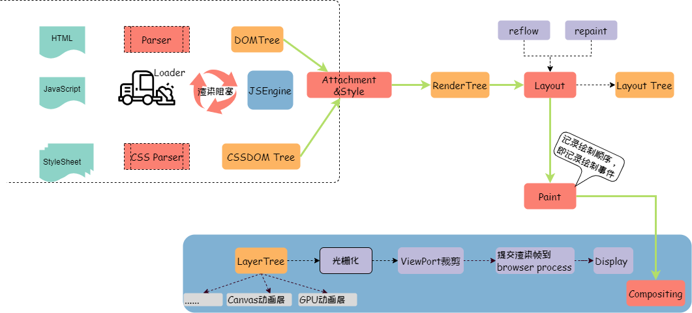

## WebKit
* 用来让网页浏览器绘制网页的排版引擎
* C++实现
* [JS绑定的IDL](https://trac.webkit.org/wiki/WebKitIDL)，[绑定Perl脚本](https://github.com/WebKit/webkit/blob/master/Source/WebCore/bindings/scripts/generate-bindings.pl)
* 架构示意图:<br/>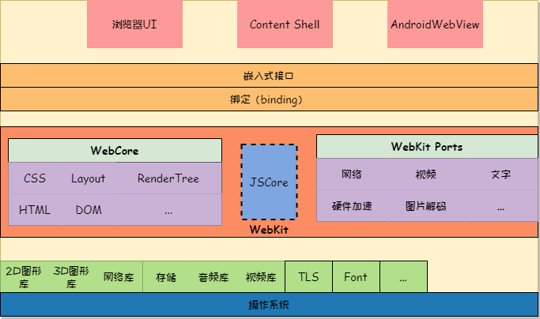

## JavaScritp
* 假装此处写了JS的历史
### JS引擎[虚拟机]
| JS引擎         | 使用的浏览器                        |
|--------------|--------------------------------------|
| V8           | Chrome                               |
| JSCore       | Safari                               |
| SpiderMonkey | Mozilla Firefox                      |
| Chakra       | Internet Explorer  & Microsoft Edge  |
| KJS          | Konqueror                            |
### V8
* 
* 名字就来自于发送机的名字，可见该引擎的效率
* [源码地址](https://github.com/v8/v8)，[文档](https://v8.dev/docs)
* V8 实现了ECMAScript(JS的标准)和[WebAssembly浏览器标准](https://webassembly.github.io/spec/core/intro/introduction.html)
* 虚拟机基于寄存器而不是基于栈
* 整体流程<br/> 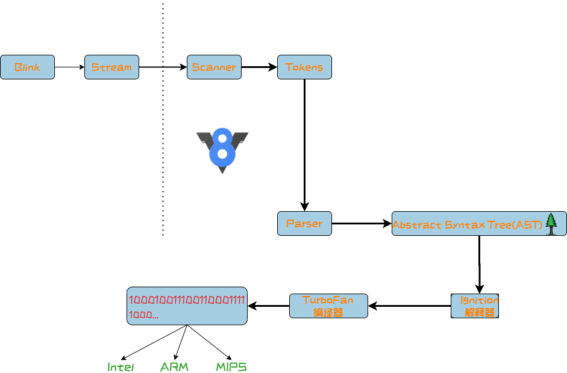
* Parser: 负责将JavaScript源码转换为Abstract Syntax Tree (AST), [动态查看AST](https://esprima.org/demo/parse.html#)
* Ignition, 解释器, 负责将AST转换为Bytecode，解释执行Bytecode, 同时收集TurboFan优化编译所需的信息，比如函数参数的类型 
* TurboFan 编译器, 利用Ignitio所收集的类型信息，将Bytecode转换为优化的汇编代码
* Orinoco, GC, 垃圾回收模块，负责将程序不再需要的内存空间回收 
* Ignition 点火器, TurboFan涡轮增加，都是汽车系的名词
* bytecode生成，从bytecode上可以看出，明显不是机器码
```
function addInteger(a, b) {
    return a + b;
}
addInteger(3,4);
----------------------------------------------------------------------------------------------------------------------------------------
    [generated bytecode for function: addInteger (0x1be7c1aa1261 <SharedFunctionInfo addInteger>)]
Parameter count 3
Register count 0
Frame size 0
   19 E> 0x1be7c1aa19fe @    0 : a7                StackCheck
   29 S> 0x1be7c1aa19ff @    1 : 25 02             Ldar a1
   38 E> 0x1be7c1aa1a01 @    3 : 34 03 00          Add a0, [0]
   42 S> 0x1be7c1aa1a04 @    6 : ab                Return
```
### JSCore
* JavaScriptCore与V8有一些不同之处，其中最大的不同就是新增了字节码的中间表示，并加入了多层JIT编译器（如：简单JIT编译器、DFG JIT编译器、LLVM等）优化性能，不停的对本地代码进行优化。(在 V8 的 5.9 版本中，新增了一个 Ignition 字节码解释器，TurboFan 和 Ignition 结合起来共同完成JavaScript的编译，此后 V8 将与 JavaScriptCore 有大致相同的流程，Node 8.0中 V8 版本为 5.8)

## 技术点
* 几个概念的布局<br/>
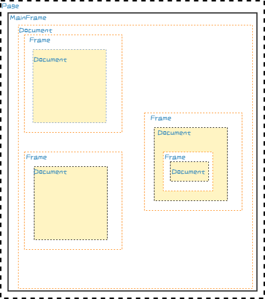
### Canvas
* 通过JS绑定调用WebKit暴露的接口，这些接口是W3C的标准，定义在相应的IDL文件中[IDL](https://github.com/WebKit/webkit/tree/master/Source/WebCore/html/canvas)
* WebKit使用Skia图形库进行最终的图形渲染
### 什么是DOM(Document Object Model)
* DOM defines a platform-neutral model for events, aborting activities, and node trees.[standard](https://dom.spec.whatwg.org/)
* 从名字可以看出，DOM是一种文档信息的结构化(面向对象)表述，也就是文档的内存数据
* DOM将文档与JS脚本建立关联，同时也提供了被其他语言操作的API
* 一个web页面是一个文档，所以DOM是对同一份文档的另一种表现，是信息等价的
```
document.getElementsByTagName("P");
//document就代表一个页面
```
* 开始的时候，JavaScript和DOM是交织在一起的，但它们最终演变成了两个独立的实体。JavaScript可以访问和操作存储在DOM中的内容，因此我们可以写成这个近似的等式：
```
API (web 或 XML 页面) = DOM + JS (脚本语言)
```
DOM 被设计成与特定编程语言相独立，使文档的结构化表述可以通过单一，一致的API获得。
* dom 构建 <br/>
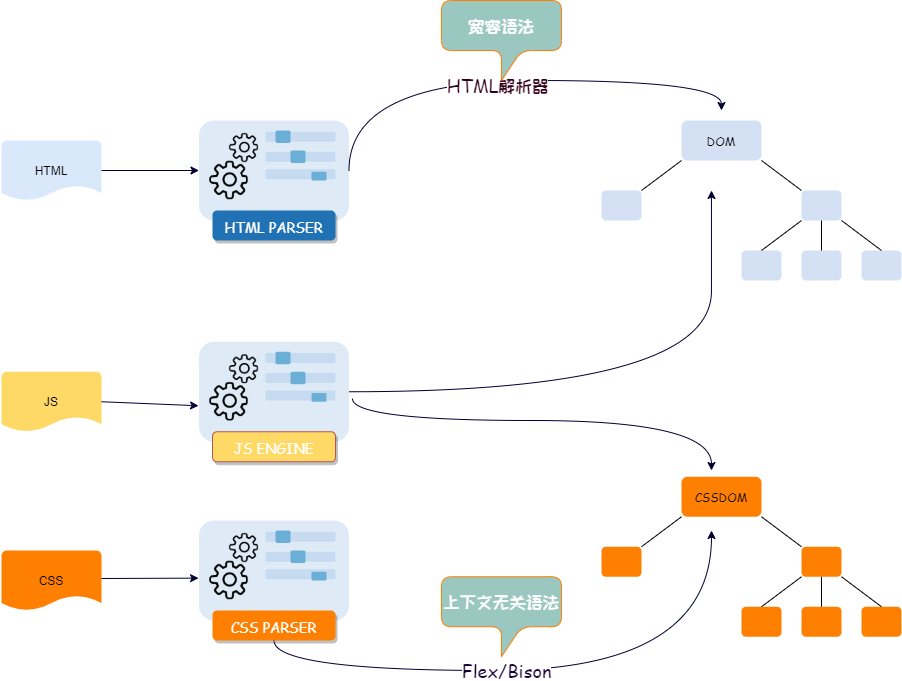
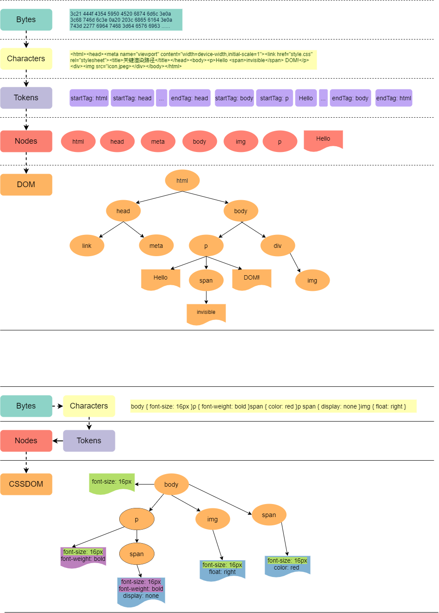

### 什么是CSS(Cascading Style Sheet,层叠样式表)
* a **style sheet language** used for describing the presentation of a document written in a markup language such as HTML.
* style sheet language: a computer language that expresses the presentation of structured documents. 
* cascading: the specified priority scheme to determine which style rule applies if more than one rule matches a particular element. 可以看出，对于样式这个问题，匹配问题多么重要
```
 从低到高的顺序：
    浏览器的设置
    用户的设置
    网页里普通的设置
    网页里重要的设置
    用户重要的设置
```

```
 *             {}  /* a=0 b=0 c=0 d=0 -> specificity = 0,0,0,0 */
 li            {}  /* a=0 b=0 c=0 d=1 -> specificity = 0,0,0,1 */
 li:first-line {}  /* a=0 b=0 c=0 d=2 -> specificity = 0,0,0,2 */
 ul li         {}  /* a=0 b=0 c=0 d=2 -> specificity = 0,0,0,2 */
 ul ol+li      {}  /* a=0 b=0 c=0 d=3 -> specificity = 0,0,0,3 */
 h1 + *[rel=up]{}  /* a=0 b=0 c=1 d=1 -> specificity = 0,0,1,1 */
 ul ol li.red  {}  /* a=0 b=0 c=1 d=3 -> specificity = 0,0,1,3 */
 li.red.level  {}  /* a=0 b=0 c=2 d=1 -> specificity = 0,0,2,1 */
 #x34y         {}  /* a=0 b=1 c=0 d=0 -> specificity = 0,1,0,0 */
 style=""          /* a=1 b=0 c=0 d=0 -> specificity = 1,0,0,0 */
<HEAD>
<STYLE type="text/css">
  #x97z { color: red }
</STYLE>
</HEAD>
<BODY>
<P ID=x97z style="color: green">
</BODY>
------------------------------------------------------------------------------
P的最终颜色会是绿色
```
* diagram 表示<br/>
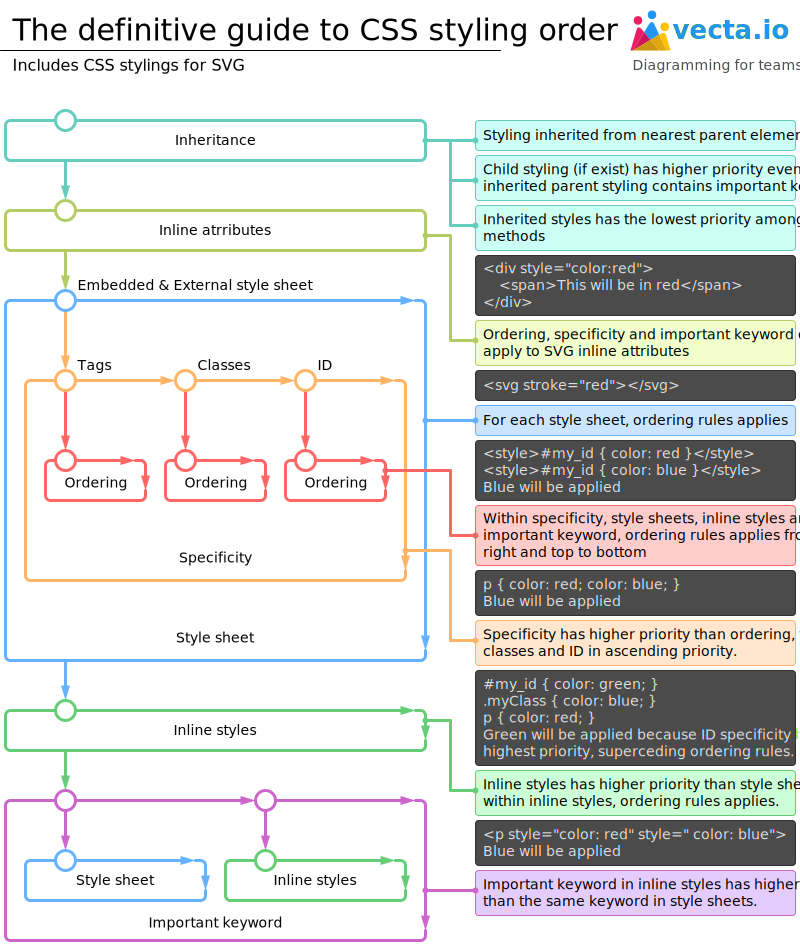
* BNF表达，由于可使用巴斯克范式表达，所以WebKit中使用Flex/Bison(不要与Mongodb的bson混淆)
```
ruleset
  : selector [ ',' S* selector ]*
    '{' S* declaration [ ';' S* declaration ]* '}' S*
  ;
selector
  : simple_selector [ combinator selector | S+ [ combinator selector ] ]
  ;
simple_selector
  : element_name [ HASH | class | attrib | pseudo ]*
  | [ HASH | class | attrib | pseudo ]+
  ;
class
  : '.' IDENT
  ;
element_name
  : IDENT | '*'
  ;
attrib
  : '[' S* IDENT S* [ [ '=' | INCLUDES | DASHMATCH ] S*
    [ IDENT | STRING ] S* ] ']'
  ;
pseudo
  : ':' [ IDENT | FUNCTION S* [IDENT S*] ')' ]
  ;
```
* 所有的 CSS 都是由 CSSStyleSheet 集合组成，CSSStyleSheet 是有多个 CSSRule 组成，每个 CSSRule 由 CSSStyleSelector 选择器和 CSSStyleDeclaration 声明组成。CSSStyleDeclaration 是 CSS 属性的键值集合。
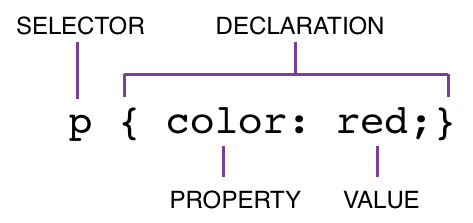
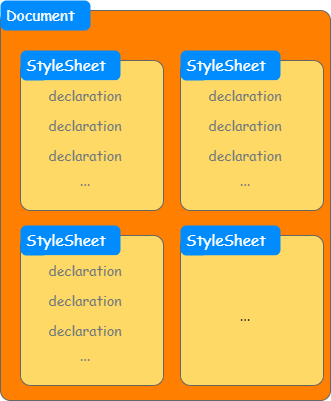
* 为了加速样式的匹配，渲染引擎会生成id map和tag map
* style type: inline style, internal style(html文件内部), external style(css文件)

### 布局(Layout)
* box model: HTML page is a collection of HTML elements (ex: P, DIV, H1). Each element is considered as a box. <br/>
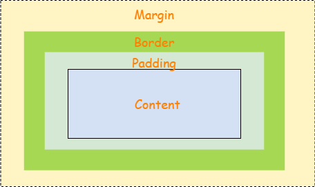
* 从内向外： content -> padding(尿不湿) -> border -> margin

### JQuery
* jQuery 最基本的中心思想就是以「选取一个DOM为开始」，接着对该DOM进行操作

### SVG 
* 可缩放矢量图形（Scalable Vector Graphics，SVG），是一种用于描述二维的矢量图形，基于 XML 的标记语言。作为一个基于文本的开放网络标准，SVG能够优雅而简洁地渲染不同大小的图形，并和CSS，DOM，JavaScript和SMIL等其他网络标准无缝衔接。
* 一种基于XML协议的图像描述文件，使用CSS描述样式

### 矢量图 位图
* 矢量图就是一种抽象图，而位图则是具象的

### 白屏时间
* 白屏时间节点指的是从用户进入网站（输入url、刷新、跳转等方式）的时刻开始计算，一直到页面有内容展示出来的时间节点

### 首屏时间
* 从浏览器输入地址并回车后到首屏内容渲染完毕的时间；

## Chromium
* 谷歌的开源项目，[地址](https://github.com/chromium/chromium)
* [chrome漫画](https://www.google.com/googlebooks/chrome/big_00.html)
* 使用的渲染引擎blink是从基于WebKit的分支，在chrome体现在[BLINK](https://github.com/chromium/chromium/tree/master/third_party/blink)
* [查看GPU加速的信息](chrome://gpu/)
### Chrome的进程、线程机制
* Chrome使用多进程、多线程的模型
* 进程的信息可以在 **菜单栏 >> 更多工具 >> 任务管理器** 或者使用**Shift+Esc**调出
* 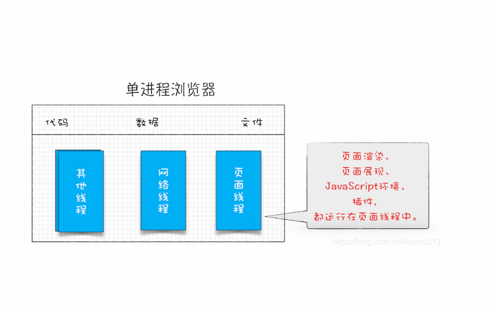
* 进程分类, 1 个浏览器（Browser）主进程、1 个 GPU 进程、1 个网络（NetWork）进程、多个渲染进程和多个插件进程。
    * 浏览器进程
    ```
    主要负责界面显示、用户交互、子进程管理，同时提供存储等功能。
    ```
    * 渲染进程
    ```
    核心任务是将 HTML、CSS 和 JavaScript 转换为用户可以与之交互的网页，排版引擎 Blink 和 JavaScript 引擎 V8 都是运行在该进程中，默认情况下，Chrome 会为每个 Tab 标签创建一个渲染进程(如果是同样的域名，则可能使用同一进程)。出于安全考虑，渲染进程都是运行在沙箱模式下。
    ```
    * GPU 进程
    ```
    其实，Chrome 刚开始发布的时候是没有 GPU 进程的。而 GPU 的使用初衷是为了实现 3D CSS 的效果，只是随后网页、Chrome 的 UI 界面都选择采用 GPU 来绘制，这使得 GPU 成为浏览器普遍的需求。最后，Chrome 在其多进程架构上也引入了 GPU 进程。
    ```
    * 网络进程
    ```
    主要负责页面的网络资源加载，之前是作为一个模块运行在浏览器进程里面的，直至最近才独立出来，成为一个单独的进程。
    ```
    * 插件进程
    ```
    主要是负责插件的运行，因插件易崩溃，所以需要通过插件进程来隔离，以保证插件进程崩溃不会对浏览器和页面造成影响。
    ```
* 进程间通信：使用[Mojo](https://chromium.googlesource.com/chromium/src/+/master/docs/mojo_and_services.md)

* 线程分类：渲染线程、JS引擎线程、定时触发器线程、事件触发线程、异步http请求线程
    * 渲染线程
    ```
    负责渲染浏览器界面HTML元素,当界面需要重绘(Repaint)或由于某种操作引发回流(reflow)时,该线程就会执行。
    ```
    * JS引擎线程, **GUI渲染线程与JS引擎线程是互斥的，所以如果JS执行的时间过长，这样就会造成页面的渲染不连贯，导致页面渲染加载阻塞**
    ```
    JS引擎一直等待着任务队列中任务的到来，然后加以处理，一个Tab页（renderer进程）中无论什么时候都只有一个JS线程在运行JS程序
    ```
    * 定时触发器线程
    ```
    定时器setInterval与setTimeout所在线程
    浏览器定时计数器并不是由JavaScript引擎计数的 因为JavaScript引擎是单线程的, 如果处于阻塞线程状态就会影响记计时的准确, 因此通过单独线程来计时并触发定时是更为合理的方案。
    ```
    * 事件触发线程
    ```
        用来控制事件轮询，JS引擎自己忙不过来，需要浏览器另开线程协助
        当JS引擎执行代码块如鼠标点击、AJAX异步请求等，会将对应任务添加到事件触发线程中
        当对应的事件符合触发条件被触发时，该线程会把事件添加到待处理任务队列的队尾，等待JS引擎的处理
        由于JS的单线程关系，所以这些待处理队列中的事件都得排队等待JS引擎处理（当JS引擎空闲时才会去执行）

    ```
    * 异步http请求线程，比如Ajax
    ```
        在XMLHttpRequest在连接后是通过浏览器新开一个线程请求， 将检测到状态变更时，如果设置有回调函数，异步线程就产生状态变更事件放到 JavaScript引擎的处理队列中等待处理。
    ```
* 关于线程的解释: 其实JS引擎就是不断的处理任务队列，但是这种执行能力是宿主提供的；所以JS引擎其实是一种异步执行能力；而渲染线程则是同步执行能力；定时器是时间使用能力；事件线程是事件触发能力
* 线程之间的关系<br/>
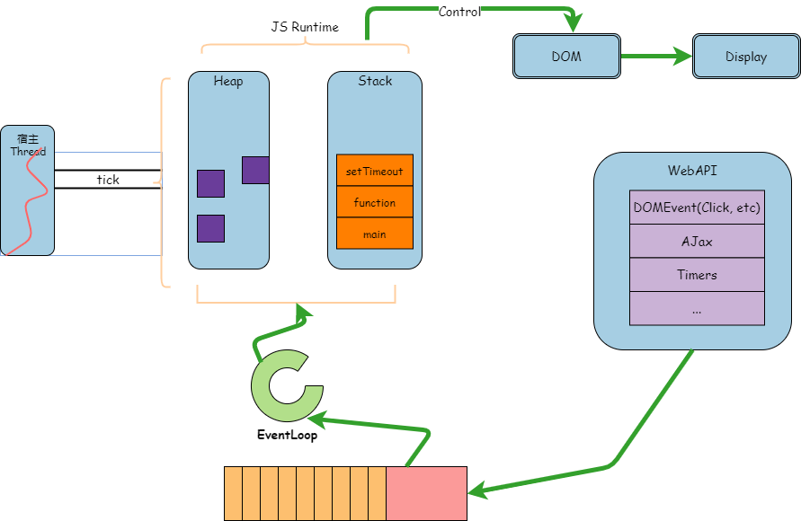 <br/>
* 核心概念：事件循环(EventLoop), JavaScript 引擎本身并没有时间的概念，只是一个按需执行JavaScript 任意代码片段的环境。“事件”（JavaScript 代码执行）调度总是由包含它的环境进行。
### 为什么需要安全沙箱(Sandbox)
* JS的暴露，如果没有沙箱则OS则赤裸裸的暴露在恶意JS的操纵之下
* 避免来自网络的文件对系统资源的使用和占有
* 将渲染进程和OS隔离开的这道墙就是安全沙箱
### 为什么需要站点隔离(Site Isolation)
* iframe 标签允许将其他页面嵌入到当前的页面，那么如果被嵌入了恶意网站，则容易被控制与破坏
* 隔离技术：OOPIFs(Out-of-Process iframes)，简单讲，就是将同一个网站的页面在同一个进程中渲染
#### 技术实现<br/>
* 技术上实现起来有点复杂，抄图过来<br/>
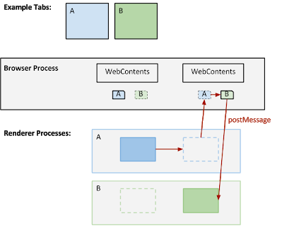<br/>
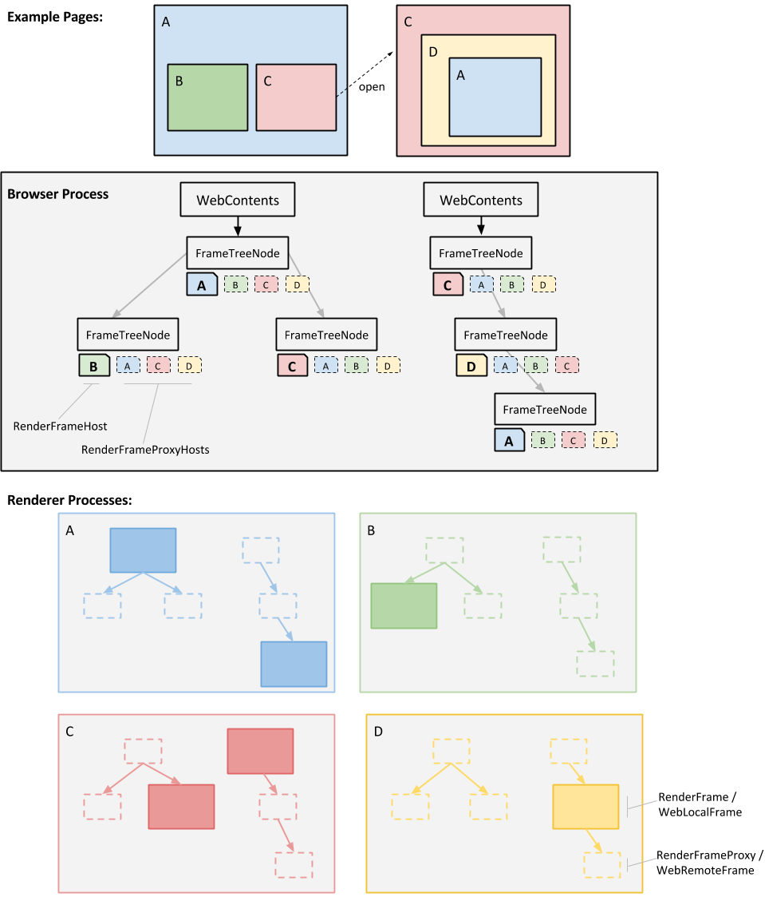
* 虚线代表进程的代理，以一个"tab"为单位，嵌套的iframe的渲染是通过进程代理找到渲染进程渲染完成后返回到标签进行显示
* 里面涉及到比较复杂的进程间通信和代理模式；而browser process则有种"调度器"，"管理器"，"路由器"的作用

## 理解
### 动态化能力
* JS
* 3d加速
* Ajax
* 动画
* Flash

### 分离
* 内容与样式(CSS)的分离
* DOM与JS的分离

### 树树树
| 类型   | 树名   |
|------|---------|
| JS   | AST     |
| HTML | DOM树    |
| CSS  | CSSDOM树 |

### 选择子
* JQuery
* CSS
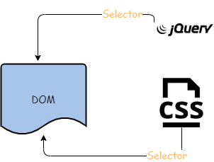
### 浏览器与untiy的区别与相似
* js vs lua 
* dom vs prefeb

## reference
* [WebKit Github](https://github.com/WebKit/webkit)
* [WebKit Web](https://webkit.org/)
* [WebKit Architecture](http://webkithacks.github.io/webkit_presentations/architecture/)
* [Skia Web](https://skia.org/index_zh)
* [Skia GitHub](https://github.com/google/skia)
* [V8 Instroduction](https://zhuanlan.zhihu.com/p/27628685)
* [V8 pricinple](https://developer.51cto.com/art/202010/630315.htm)
* [WebGL文档](https://webglfundamentals.org/webgl/lessons/zh_cn/)
* [JsCore深度解读](https://ming1016.github.io/2018/04/21/deeply-analyse-javascriptcore/)
* [形象分析浏览器](https://hacks.mozilla.org/2017/10/the-whole-web-at-maximum-fps-how-webrender-gets-rid-of-jank/)