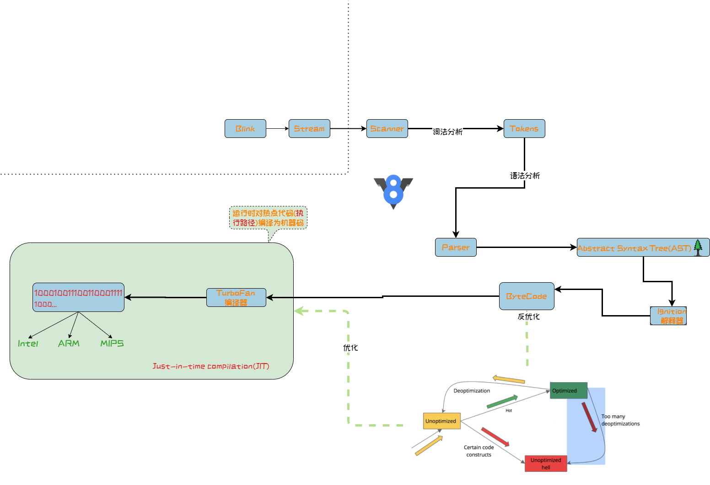

# browser 
## 什么是浏览器
* 访问WorldWideWeb的应用软件
* [浏览器技术家庭发展历史](http://www.evolutionoftheweb.com/)
* 世界第一个浏览器的界面<br/>

## 动态化
* JS
* 3d加速
* Ajax
* 动画
* Flash

## 分离
* 内容与样式(CSS)的分离
* DOM与JS的分离
## 几棵树
* DOM
* CSSDOM
* RenderObject

## 选择子
* JQuery
* CSS

## 渲染引擎(排版引擎)
* 
| 渲染引擎   | 维护公司            | 应用浏览器     |
|--------|-----------------|-----------|
| KHTML  | KDE             | Konqueror |
| WebKit | Apple,基于KHTML   | Safari    |
| Blink  | Google，基于WebKit | Chrome    |
| Gecko  | Mozila          | Firefox   |
* 渲染过程<br/>

* dom 构建<br/>

### 什么是DOM(Document Object Model)
* DOM defines a platform-neutral model for events, aborting activities, and node trees.[standard](https://dom.spec.whatwg.org/)
* 从名字可以看出，DOM是一种文档信息的结构化(面向对象)表述，也就是文档的内存数据
* DOM将文档与JS脚本建立关联，同时也提供了被其他语言操作的API
* 一个web页面是一个文档，所以DOM是对同一份文档的另一种表现，是信息等价的
```
document.getElementsByTagName("P");
//document就代表一个页面
```
* 开始的时候，JavaScript和DOM是交织在一起的，但它们最终演变成了两个独立的实体。JavaScript可以访问和操作存储在DOM中的内容，因此我们可以写成这个近似的等式：
```
API (web 或 XML 页面) = DOM + JS (脚本语言)
```
DOM 被设计成与特定编程语言相独立，使文档的结构化表述可以通过单一，一致的API获得。
### 什么是CSS(Cascading Style Sheet,层叠样式表)
* 为啥是层叠？
## JavaScritp
* 
### JS引擎[虚拟机]
| JS引擎         | 使用的浏览器                        |
|--------------|--------------------------------------|
| V8           | Chrome                               |
| JSCore       | Safari                               |
| SpiderMonkey | Mozilla Firefox                      |
| Chakra       | Internet Explorer  & Microsoft Edge  |
| KJS          | Konqueror                            |

### V8
* 
* 名字就来自于发送机的名字，可见该引擎的效率
* [源码地址](https://github.com/v8/v8)，[文档](https://v8.dev/docs)
* V8 实现了ECMAScript(JS的标准)和[WebAssembly浏览器标准](https://webassembly.github.io/spec/core/intro/introduction.html)
* **直接将JS脚本编译为了机器代码，而不是ByteCode**
* 虚拟机基于寄存器而不是基于栈
* 整体流程<br/> 
* Parser: 负责将JavaScript源码转换为Abstract Syntax Tree (AST), [动态查看AST](https://esprima.org/demo/parse.html#)
* Ignition, 解释器, 负责将AST转换为Bytecode，解释执行Bytecode, 同时收集TurboFan优化编译所需的信息，比如函数参数的类型 
* TurboFan 编译器, 利用Ignitio所收集的类型信息，将Bytecode转换为优化的汇编代码
* Orinoco, GC, 垃圾回收模块，负责将程序不再需要的内存空间回收 
#### 词法分析
#### 语法分析
#### 优化
### JSCore为例解释使用过程

### JSCore与WebCore的交互方式
* 
## WebKit
* 用来让网页浏览器绘制网页的排版引擎
* C++实现
* [JS绑定的IDL](https://trac.webkit.org/wiki/WebKitIDL)，[绑定Perl脚本](https://github.com/WebKit/webkit/blob/master/Source/WebCore/bindings/scripts/generate-bindings.pl)

## Canvas
* 通过JS绑定调用WebKit暴露的接口，这些接口是W3C的标准，定义在相应的IDL文件中[IDL](https://github.com/WebKit/webkit/tree/master/Source/WebCore/html/canvas)
* WebKit使用Skia图形库进行最终的图形渲染

## Chromium
* 谷歌的开源项目，[地址](https://github.com/chromium/chromium)
* 使用的渲染引擎blink是从基于WebKit的分支，在chrome体现在[BLINK](https://github.com/chromium/chromium/tree/master/third_party/blink)
* [查看GPU加速的信息](chrome://gpu/)
### Chrome的进程、线程机制
* Chrome使用多进程、多线程的模型
* 进程的信息可以在 **菜单栏 >> 更多工具 >> 任务管理器** 或者使用**Shift+Esc**调出
* 
* 进程分类, 1 个浏览器（Browser）主进程、1 个 GPU 进程、1 个网络（NetWork）进程、多个渲染进程和多个插件进程。
    * 浏览器进程
    ```
    主要负责界面显示、用户交互、子进程管理，同时提供存储等功能。
    ```
    * 渲染进程
    ```
    核心任务是将 HTML、CSS 和 JavaScript 转换为用户可以与之交互的网页，排版引擎 Blink 和 JavaScript 引擎 V8 都是运行在该进程中，默认情况下，Chrome 会为每个 Tab 标签创建一个渲染进程(如果是同样的域名，则可能使用同一进程)。出于安全考虑，渲染进程都是运行在沙箱模式下。
    ```
    * GPU 进程
    ```
    其实，Chrome 刚开始发布的时候是没有 GPU 进程的。而 GPU 的使用初衷是为了实现 3D CSS 的效果，只是随后网页、Chrome 的 UI 界面都选择采用 GPU 来绘制，这使得 GPU 成为浏览器普遍的需求。最后，Chrome 在其多进程架构上也引入了 GPU 进程。
    ```
    * 网络进程
    ```
    主要负责页面的网络资源加载，之前是作为一个模块运行在浏览器进程里面的，直至最近才独立出来，成为一个单独的进程。
    ```
    * 插件进程
    ```
    主要是负责插件的运行，因插件易崩溃，所以需要通过插件进程来隔离，以保证插件进程崩溃不会对浏览器和页面造成影响。
    ```
* 进程间通信：使用[Mojo](https://chromium.googlesource.com/chromium/src/+/master/docs/mojo_and_services.md)

* 线程分类：渲染线程、JS引擎线程、定时触发器线程、事件触发线程、异步http请求线程
    * 渲染线程
    ```
    负责渲染浏览器界面HTML元素,当界面需要重绘(Repaint)或由于某种操作引发回流(reflow)时,该线程就会执行。
    ```
    * JS引擎线程, **GUI渲染线程与JS引擎线程是互斥的，所以如果JS执行的时间过长，这样就会造成页面的渲染不连贯，导致页面渲染加载阻塞**
    ```
    JS引擎一直等待着任务队列中任务的到来，然后加以处理，一个Tab页（renderer进程）中无论什么时候都只有一个JS线程在运行JS程序
    ```
    * 定时触发器线程
    ```
    定时器setInterval与setTimeout所在线程
    浏览器定时计数器并不是由JavaScript引擎计数的 因为JavaScript引擎是单线程的, 如果处于阻塞线程状态就会影响记计时的准确, 因此通过单独线程来计时并触发定时是更为合理的方案。
    ```
    * 事件触发线程
    ```
        用来控制事件轮询，JS引擎自己忙不过来，需要浏览器另开线程协助
        当JS引擎执行代码块如鼠标点击、AJAX异步请求等，会将对应任务添加到事件触发线程中
        当对应的事件符合触发条件被触发时，该线程会把事件添加到待处理任务队列的队尾，等待JS引擎的处理
        由于JS的单线程关系，所以这些待处理队列中的事件都得排队等待JS引擎处理（当JS引擎空闲时才会去执行）

    ```
    * 异步http请求线程，比如Ajax
    ```
        在XMLHttpRequest在连接后是通过浏览器新开一个线程请求， 将检测到状态变更时，如果设置有回调函数，异步线程就产生状态变更事件放到 JavaScript引擎的处理队列中等待处理。
    ```
* 关于线程的解释: 其实JS引擎就是不断的处理任务队列，但是这种执行能力是宿主提供的；所以JS引擎其实是一种异步执行能力；而渲染线程则是同步执行能力；定时器是时间使用能力；事件线程是事件触发能力
* 线程之间的关系<br/>
 <br/>
* 核心概念：事件循环(EventLoop), JavaScript 引擎本身并没有时间的概念，只是一个按需执行JavaScript 任意代码片段的环境。“事件”（JavaScript 代码执行）调度总是由包含它的环境进行。
## Safari
* 基于WebKit
* 使用JSCore

## reference
* [WebKit Github](https://github.com/WebKit/webkit)
* [WebKit Web](https://webkit.org/)
* [WebKit Architecture](http://webkithacks.github.io/webkit_presentations/architecture/)
* [Skia Web](https://skia.org/index_zh)
* [Skia GitHub](https://github.com/google/skia)
* [V8 Instroduction](https://zhuanlan.zhihu.com/p/27628685)
* [V8 pricinple](https://developer.51cto.com/art/202010/630315.htm)
* [WebGL文档](https://webglfundamentals.org/webgl/lessons/zh_cn/)
* [JsCore深度解读](https://ming1016.github.io/2018/04/21/deeply-analyse-javascriptcore/)
* 