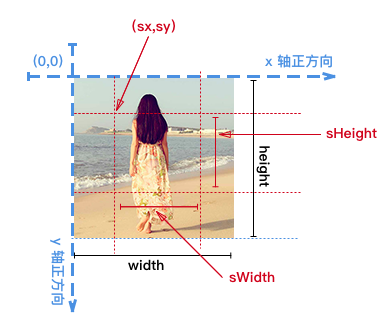
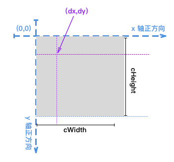

# canvas 
* HTML5提供的一个特性
* canvas就是画布，只要浏览器支持，可以在canvas上获取2D上下文和3D上下文，其中3D上下文一般就是webgl

## enterprise tool 
* Adobe Edge: It is a HTML5 web animation authoring tool that allow web designers to create animated web content by using modern web technologies like HTML5, JavaScript and CSS3. 
* Adobe Animate

## 拿来主义
* animate.css

## 理解
* 如果绘制矩形，从(x,y)向下增长，所以(x,y)为矩形**左上**角的坐标
* 如果绘制字体，因为字体是独立单元，所以所以(x,y)为矩形**左下**角的坐标
#### image
* 绘制函数
```
void ctx.drawImage(image, dx, dy);
void ctx.drawImage(image, dx, dy, dWidth, dHeight);
void ctx.drawImage(image, sx, sy, sWidth, sHeight, dx, dy, dWidth, dHeight);
```
| 值       | 说明                                                                                                            |
|---------|---------------------------------------------------------------------------------------------------------------|
| image   | 绘制到画板的图像资源，可以是任何的 canvas 图像源 \( CanvasImageSource\)，例如：HTMLImageElement，HTMLVideoElement，或者 HTMLCanvasElement |
| dx      | 绘制图像时起点的 X 轴位置                                                                                                |
| dy      | 绘制图像时起点的 Y 轴位置                                                                                                |
| dWidth  | 在目标画布上绘制图像的宽度。 允许对绘制的图像进行缩放，如果不传递，绘制图像 如果不说明， 在绘制时图片宽度不会缩放                |
| dHeight | 在目标画布上绘制图像的高度。 允许对绘制的图像进行缩放。 如果不说明， 在绘制时图片高度不会缩放                                   |
| sx      | 截取图像时指定起点的 X 坐标                                                                                               |
| sy      | 截取图像时指定起点的 Y 坐标                                                                                               |
| sWidth  | 图像截取的高度                                                                                                       |
| sHeight | 图像截取的宽度                                                                                                       |
<br/>


<br/>



## animation
* 平移
```
//平移坐标系之前
ctx.strokeStyle = 'grey'; 
ctx.setLineDash([2, 2]);
ctx.rect(10, 10, 100, 100); //绘制矩形
ctx.stroke(); 

//平移坐标系
ctx.translate(120,20); //平移坐标系，往右平移120px,往下平移20px
ctx.beginPath(); //开始新的路径
ctx.strokeStyle='blue'; 
ctx.setLineDash([]); 
ctx.rect(10, 10, 100, 100); //绘制同样的矩形
ctx.stroke(); 
```
* 缩放
```
ctx.strokeStyle = 'grey'; 
ctx.fillStyle = 'yellow'; 
ctx.globalAlpha = 0.5; 
ctx.fillRect(0, 0, width, height); //填充当前canvas整个区域
ctx.globalAlpha = 1;
ctx.setLineDash([2, 2]); 
ctx.rect(10, 10, 100, 100); //绘制矩形
ctx.stroke(); 
ctx.scale(0.5, 0.5); //缩放坐标系，X轴和Y轴都同时缩放为0.5
ctx.beginPath(); //开始新的路径
ctx.fillStyle = 'green';
ctx.strokeStyle = 'red';
ctx.globalAlpha = 0.5;
ctx.fillRect(0, 0, width, height); //填充缩放之后的canvas整个区域
ctx.globalAlpha = 1;
ctx.setLineDash([]); 
ctx.rect(10, 10, 100, 100); //绘制同样的矩形
ctx.stroke(); 
```

* 旋转
```
//角度转换为弧度
function toAngle(degree) {
  return (degree * Math.PI) / 180;
}

ctx.font = '18px sans-serif';
ctx.textAlign = 'center';
ctx.strokeStyle = 'grey'; //设置描边样式
ctx.fillStyle = 'yellow';
ctx.globalAlpha = 0.5;
ctx.fillRect(0, 0, width, height);
ctx.globalAlpha = 1;
ctx.setLineDash([2, 2]); //设置虚线
ctx.rect(10, 10, 100, 100); //绘制矩形
ctx.stroke(); //描边
ctx.setLineDash([]); //设置实线
ctx.strokeText('我是文字', 60, 60);
ctx.rotate(15* Math.PI/180); //将坐标系旋转15角度
ctx.beginPath(); //开始新的路径
ctx.fillStyle = 'green';
ctx.strokeStyle = 'red'; //设置描边样式
ctx.globalAlpha = 0.5;
ctx.fillRect(0, 0, width, height);
ctx.globalAlpha = 1;
ctx.setLineDash([]); //设置实线
ctx.strokeText('我是文字', 60, 60);
ctx.rect(10, 10, 100, 100); //绘制同样的矩形
ctx.stroke(); //描边
```
* 变换
```
ctx.font = '18px sans-serif';
ctx.textAlign = 'center';
ctx.strokeStyle = 'grey'; //设置描边样式
ctx.fillStyle = 'yellow';
ctx.globalAlpha = 0.5;
ctx.fillRect(0, 0, width, height);
ctx.globalAlpha = 1;
ctx.setLineDash([2, 2]); //设置虚线
ctx.rect(10, 10, 100, 100); //绘制矩形
ctx.stroke(); //描边
ctx.setLineDash([]); //设置实线
ctx.strokeText('我是文字', 60, 60);
// ctx.rotate(15* Math.PI/180); //将坐标系旋转15角度
let angle = (15 * Math.PI) / 180; //计算得到弧度值
let cosAngle = Math.cos(angle); //计算余弦 
let sinAngle = Math.sin(angle); //计算正弦
ctx.transform(cosAngle, sinAngle, -sinAngle, cosAngle, 0, 0); //使用transform旋转
ctx.beginPath(); //开始新的路径
ctx.fillStyle = 'green';
ctx.strokeStyle = 'red'; //设置描边样式
ctx.globalAlpha = 0.5;
ctx.fillRect(0, 0, width, height);
ctx.globalAlpha = 1;
ctx.setLineDash([]); //设置实线
ctx.strokeText('我是文字', 60, 60);
ctx.rect(10, 10, 100, 100); //绘制同样的矩形
ctx.stroke(); //描边
```

## power tool
* js的库实在是太多了，可能是实现比较简单
* [不同的库的介绍](https://zhuanlan.zhihu.com/p/29162699)
### 3d 
* three.js, 3D库默认的WebGL渲染器。Three.js是一个伟大的开源WebGL库,WebGL允许JavaScript操作GPU，在浏览器端实现真正意义的3D。
### list
* [velocity](https://github.com/julianshapiro/velocity)
* [airbnb的Lottie](https://github.com/airbnb/lottie-web)
* [算法的OpenDSA](https://github.com/OpenDSA/OpenDSA)
* [算法的图形库JSAV](https://github.com/vkaravir/JSAV)
* [算法的完成例子](https://github.com/trekhleb/javascript-algorithms)
* [css3的animation.css](https://github.com/animate-css/animate.css)
* [html5tooltips](https://github.com/ytiurin/html5tooltipsjs)
* Xc.js is a JavaScript framework for developing 2D game on HTML5 canvas. With the concept of ‘scenes’, ‘nodes’, ‘actions’, ‘events’, it’s really simple and easy to use, in addition, you just need to write once and run it on any platforms such as desktop and iPhone that with modern web browsers installed. 
* Jcotton is a JavaScript framework for illustrator or animator to create illustration or animation on HTML5 canvas. It’s also a great framework for game makers to create web game too.
* Processing.js is an open source framework developed by Ben Fry and Casey Reas that based on Java for web professionals to create images, animation, and interactions without any 3rd party pulgins.
* Paper.js is another JavaScript framework that similar to other frameworks as well. With paper.js, web professionals create path and add segments to its very easily. Besides, paper.js also offers mouse and keyboard handlers for the different actions you can perform with a mouse or even on touch screen!

### 优质列表
* [Anime.js](https://github.com/juliangarnier/anime)
* [Mo.js](https://zhuanlan.zhihu.com/p/47434077)
* Velocity
* popmotion
* [GSAP](https://zhuanlan.zhihu.com/p/145332205)

#### 引用
* [动画](https://developer.mozilla.org/zh-CN/docs/Web/API/Canvas_API/Tutorial/Basic_animations)