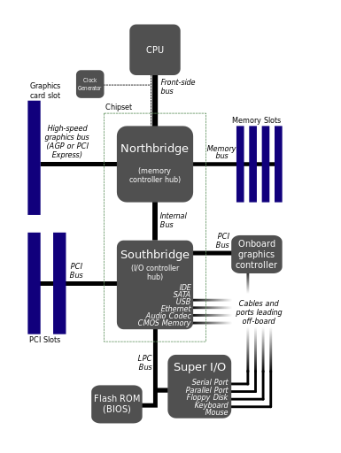

### 总线结构

* 北桥连接的是CPU、显卡、内存
* 南桥联机的是相对比较低速的设备，网卡、硬盘，USB等各种外接设备
* 总线分为很多种，并不是一条BUS就可以完成所有的工作
### 缓存一致性协议
* MESI(梅西协议，为了方便记忆)
### linux 缓存查看
* index0和index1分别是数据缓存和指令缓存，index2是二级缓存，如果有三级缓存则是index3
```
lscpu | grep cache
L1 data (/sys/devices/system/cpu/cpu0/cache/index0) cache:      32K
L1 instruction (/sys/devices/system/cpu/cpu0/cache/index1) cache:      32K
L2 (/sys/devices/system/cpu/cpu0/cache/index2) cache:       256K
L3 (/sys/devices/system/cpu/cpu0/cache/index3)  cache:      8192K
------------------------------------------------------------------------------
cat /sys/devices/system/cpu/cpu0/cache/index0/type
Data
cat /sys/devices/system/cpu/cpu0/cache/index1/type
Instruction
cat /sys/devices/system/cpu/cpu0/cache/index2/type
Unified
cat /sys/devices/system/cpu/cpu0/cache/index3/type
Unified
```
```
/sys/devices/system/cpu/cpu0/cache/index[0,N]目录下的文件:
coherency_line_size  id  level  number_of_sets  physical_line_partition  shared_cpu_list  shared_cpu_map  size  type  ways_of_associativity
存在下面的公式
number_of_sets * coherency_line_size * ways_of_associativity = size
```
### 多线程导致的变量不一致问题
* 线程的并行
* CPU各自的缓存不同
* 线程切换导致的寄存器问题
* 问题：什么是N-Way Set Associative

### 更新缓存的模式
* Cache aside
* Read through
* Write through
* Write behind caching


### 内存 & 外存
内存是外存的缓存，除开一些中间结果，内存中的数据总是要输出或者叫同步到外存中去的（常见的外存包括硬盘/网卡缓冲区/串口缓冲区/帧缓冲。。。）

### jargon 
* 缓存雪崩
* 资源隔离
* 限流
* 降级
* 熔断
* 超时控制
* 缓存穿透
* 缓存预热[如何解决高并发场景下，缓存冷启动导致 MySQL负载过高，甚至瞬间被打死的问题]
* 异步队列串行化
* 缓存双写一致性
* 缓存相关的「热」：预热、热数据
