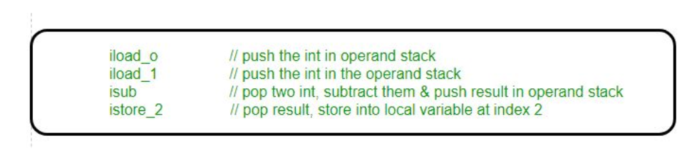
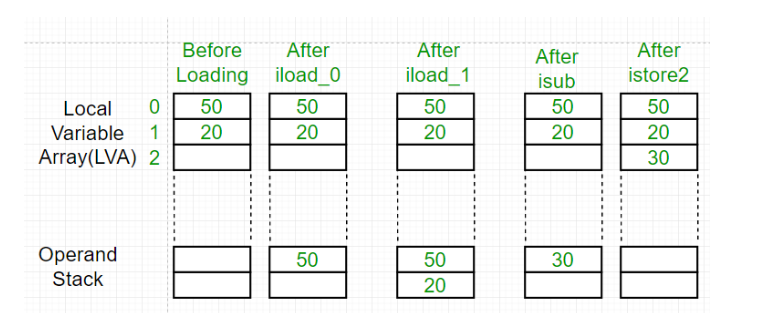

## Java
* Write Once, Run Anywhere (WORA)：Java的主要目标之一是实现一次编写，多平台运行的特性。通过将Java代码编译成中间字节码（Bytecode），然后在Java虚拟机（JVM）上运行，Java程序可以在任何支持JVM的平台上执行，不需要针对每个平台单独编译。这种特性使得Java成为一种非常便于跨平台开发的语言。一旦Java代码被编译成字节码，并打包成JAR（Java Archive）文件，这个JAR文件可以在任何支持Java虚拟机（JVM）的平台上运行，包括Linux、Apple macOS、Windows等操作系统。
* JVM的抽象：Java虚拟机提供了一个硬件和操作系统无关的抽象层，它负责解释和执行Java字节码。这使得Java程序可以在不同的硬件架构和操作系统上运行，而不需要对代码进行修改。JVM负责管理内存、线程和其他系统资源，使得Java程序具有很好的可移植性。
* JVM的抽象：Java虚拟机提供了一个硬件和操作系统无关的抽象层，它负责解释和执行Java字节码。这使得Java程序可以在不同的硬件架构和操作系统上运行，而不需要对代码进行修改。JVM负责管理内存、线程和其他系统资源，使得Java程序具有很好的可移植性。
* 开放标准：Java是一个开放标准，其规范由Java Community Process（JCP）管理。这意味着任何人都可以实现自己的JVM，并且开发自己的Java工具和框架。这种开放性促进了Java生态系统的发展，并帮助Java成为一个广泛采用的编程语言。

### Hot Spot VM 
* 前端编译器
* 即时编译器: C1、C2和Graal
* AOT编译器
* 
* JVM Code Cache is an area where JVM stores its bytecode compiled into native code.
* 执行

### 编译
* On-Stack-Replacement, OSR编译: 它指的是在程序执行过程中，动态地替换掉Java方法栈桢，从而使得程序能够在非方法入口处进行解释执行和编译后的代码之间的切换。
* 循环回边
* 逃逸分析: 逃逸分析是 Java 虚拟机优化编译器在编译过程中的一项重要技术，用于分析对象的生命周期和作用域，以确定对象是在方法内部被创建和使用（不逃逸）还是被方法返回并在方法外部使用（逃逸）。逃逸分析的目标是识别出那些不会逃逸出方法或线程范围的对象，并对它们进行一些优化，如栈上分配、标量替换等，以减少对堆的压力，提高程序的性能。

### 理解
* Jar包是字节码，IL

