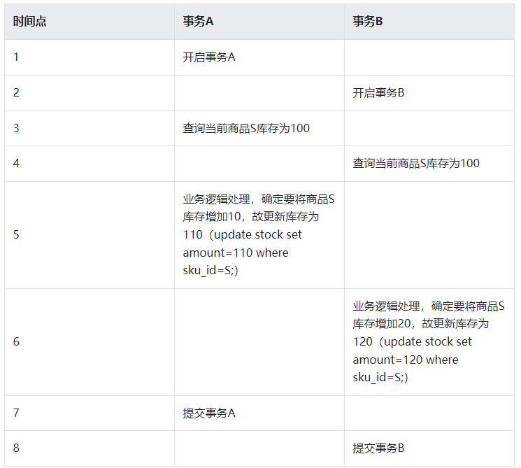

## Mysql
* Slogan: World’s Most Popular Open Source Database。

### 问题
* 锁与mvcc和readview的关系?


### 锁
* 如果锁获取之后直到事务提交后才释放，这种锁称为长锁；如果锁在操作完成之后就被释放，这种锁称为短锁。
* 
### 什么是键
* cascade

### 隐藏字段
* MySQL 8.0.23 版本增加了一个新的功能：隐藏字段（Invisible Column），也称为不可见字段
### B+
* 指针使用6B，即2^48，能表示 2^(48-40)=256T的磁盘空间
* InnoDb的最小储存单元为Page，16KB，这个是一种顺序写的平衡，此处的16K并不是一个Record所独有

### 索引类型(在Mysql中就是Key)
* 覆盖索引（covering index）指一个查询语句的执行只用从索引（或者索引指向的主键）中就能够取得，不必从数据表中读取，索引即数据
* 主键即是PrimaryKey就是主要索引，如果DDL不指定主键，则没有主键
* 索引时效，对索引的任何操作都会导致所以时效，比如+，或者类型转换
* 索引中不能指向地址，因为数据可能会移动
* 回表
* 查询的时候，会根据实际情况来决定使用查找方式，比如主键索引、复合索引、全表扫描等等，有的时候使用索引还没有全表扫描快
* 稀疏索引(CREATE INDEX SparseIndexName ON TableName (ColumnName) WHERE ColumnName IS NOT NULL;)，比如索引指向多个记录的开始位置；稠密索引就是为每个record建立一个索引
* 按照物理存储方式，可以分为聚簇索引（clusterd index,就是索引和数据在一起）和非聚簇索引（辅助索引、二级索引，指向主键索引，secondary index）


### 优化
* Index Condition Pushdown (ICP) : 对InnoDB存储引擎来说，索引下推只适用于二级索引，适用于范围查询的时候

### 命令
* SHOW CREATE TABLE t1;
* select * 不显示隐藏字段
* SELECT *, _rowid FROM t1;
* 查看事务: SELECT * FROM information_schema.INNODB_TRX;
* SELECT * FROM information_schema.PROCESSLIST WHERE command NOT IN ('Sleep', 'Connect');
* SHOW STATUS LIKE 'innodb_row_lock_%';
* SHOW OPEN TABLES WHERE In_use > 0;
* 查看隔离级别： SHOW VARIABLES LIKE 'transaction_isolation'
* SELECT @@autocommit 查看是否自动提交`SET autocommit = 1;`, `当开启自动提交之后，你的每一次sql执行都会立马作为一个事务提交` `如果为0，则insert操作在新的连接中无法查看`
*  SELECT * FROM t1 WHERE a>2 LOCK IN SHARE MODE; 显式加共享锁
*  SELECT * FROM t1 WHERE a>2 FOR UPDATE; 显式加排他锁
* 手动查看事务
```
START TRANSACTION;
SELECT * FROM t1;
 
SELECT * FROM information_schema.INNODB_TRX;
```
* SELECT * FROM INFORMATION_SCHEMA.`INNODB_TABLESPACES`，查看表空间，可以看到undo log
* Lock
```
LOCK TABLE t1 READ;
SELECT COUNT(1) FROM t1;
UNLOCK TABLES;
SELECT COUNT(1) FROM t2;
```
* SHOW VARIABLES LIKE 'datadir';
* SHOW VARIABLES LIKE 'innodb_page_size';
* SHOW VARIABLES LIKE 'key_buffer_size';用于在MyISAM配置索引缓存区的大小
* SHOW VARIABLES LIKE 'innodb_buffer_pool_size'; InnoDB中缓冲区的大小，默认为128MB

### InnoDB
* 
* 数据按照从小到大进行双向链表连接
* 在Page中也是按照从小到大排列,Page为16KB
* SHOW ENGINE INNODB STATUS
#### 锁
* `S`hare锁
* `X`锁，排他锁
* record lock(记录锁,锁住记录本身)
* gap lock(间隙锁,锁定一个范围)
* next-key lock，行锁的一种，其特点是不仅会锁住记录本身(record lock的功能)，还会锁定一个范围(gap lock的功能)，相当于实现了record lock + gap lock
* `如果没有锁，MVCC中会出现被覆盖的问题`，两个事务如果同时修改一份数据的时候会有问题<br> 
* 默认使用行锁，粒度最小
### MVCC
* ReadView + Undo实现
* <br> 
* 只有InnoDb支持MVCC，其他引擎并不支持
* Contention-Aware Transaction Scheduling (CATS) algorithm: The CATS algorithm prioritizes waiting transactions by assigning a scheduling weight, which is computed based on the number of transactions that a transaction blocks. 
### (2PL)  two-phase locking

### 当前读  快照读
* 当前读：select ... for update读取当前最新的数据
* 快照读

### 幻读
```
The so-called phantom problem occurs within a transaction when the same query produces different sets of rows at different times. For example, if a SELECT is executed twice, but returns a row the second time that was not returned the first time, the row is a “phantom” row.
```
* 快照读解决了绝大多数的幻读问题
  * 事务A快照读 => 事务B插入新的数据 => 事务A修改事务B插入的数据 => 事务A快照度
* 当前读的大部分情况通过 next-key lock解决掉了，但是有些特殊情况没有解决
  * 事务A快照度 => 事务B插入新数据 => 事务A当前读

### 隔离级别
* RU Read uncommitted，**不使用readview**
  * 读操作不加锁，读读，读写，写读并行；**写操作加X锁且直到事务提交后才释放**
* RC Read committed，**每次select用新的readview**
  * 读操作加S锁，**写操作加X锁且直到事务提交后才释放**；读操作不会阻塞其他事务读或写，写操作会阻塞其他事务写和读
* RR Repeatable read，**使用事务启动时候的readview**
  * 读操作加S锁且直到事务提交后才释放，**写操作加X锁且直到事务提交后才释放**
* S+ Serializable 
  * 读操作和写操作都加X锁且直到事务提交后才释放，粒度为表锁，也就是严格串行。
* 问题 
### 窗口函数
* 窗口函数，也叫OLAP(Online Anallytical Processing，联机分析处理），可以对数据库数据进行实时分析处理，一般和分析函数搭配使用以达到数据处理的目的。
* 将整体表按照某个字段拆分成多个小表，然后在小表中求排序、聚合、取值等相关操作的函数。
### 快照 ReadView
* 快照读, 读取的是记录数据的可见版本（有旧的版本）。不加锁,普通的select语句都是快照读
  ```
  select * from core_user where id > 2;
  ```
* 当前读,读取的是记录数据的最新版本，显式加锁的都是当前读
  ```
  select * from core_user where id > 2 for update;
  select * from account where id>2 lock in share mode;
  ```
* 一个ReadView包含以下信息
  ```
    m_ids:当前系统中那些活跃(未提交)的读写事务ID, 它数据结构为一个List。
    min_limit_id:表示在生成Read View时，当前系统中活跃的读写事务中最小的事务id，即m_ids中的最小值。
    max_limit_id:表示生成Read View时，系统中应该分配给下一个事务的id值。
    creator_trx_id: 创建当前Read View的事务ID
  ```
* 使用规则
  ```
  如果数据事务ID trx_id < min_limit_id，表明生成该版本的事务在生成Read View前，已经提交(因为事务ID是递增的)，所以该版本可以被当前事务访问。
  如果trx_id>= max_limit_id，表明生成该版本的事务在生成ReadView后才生成，所以该版本不可以被当前事务访问。
  如果 min_limit_id =<trx_id< max_limit_id,需腰分3种情况讨论
  （1）如果m_ids包含trx_id,则代表Read View生成时刻，这个事务还未提交，但是如果数据的trx_id等于creator_trx_id的话，表明数据是自己生成的，因此是可见的。
  （2）如果m_ids包含trx_id，并且trx_id不等于creator_trx_id，则Read   View生成时，事务未提交，并且不是自己生产的，所以当前事务也是看不见的；
  （3）.如果m_ids不包含trx_id，则说明你这个事务在Read View生成之前就已经提交了，修改的结果，当前事务是能看见的。
  ```
### 存储引擎
* 是否可以自动选择？

### 两阶段提交
* redo prepare -> binlog write -> redo commit 
* 准备阶段和提交阶段都会写入record，都带有XID
* binlog与redolog之间通过XID进行关联
### command
* show index from t1;
* create table t1(a int primary key, b int, c int, d int, e varchar(20))engine=Innodb;
* create table t6(a int primary key, b int, c int, d int, e varchar(20))engine=myisam;
* create table t7(a int primary key, b int, c int, d int, e varchar(20))engine=archive;
* create table t8(a int primary key, b int, c int, d int, e varchar(20))engine=memory;
* show table status from Study;
* show index from t1;
* show GLOBAL status;
* create INDEX idx_t1_bcd on t1(b,c,d);


### Row
* Variable-length columns that are too long to fit on a B-tree page are stored on separately allocated disk pages called overflow pages. Such columns are referred to as off-page columns. The values of off-page columns are stored in singly-linked lists of overflow pages, with each such column having its own list of one or more overflow pages.
* Records in the clustered index contain fields for all user-defined columns. In addition, there is a 6-byte transaction ID field and a 7-byte roll pointer field.
* If no primary key is defined for a table, each clustered index record also contains a 6-byte row ID field.

### 理解
* 锁与MVCC的配合使用：在MySQL中，读操作使用MVCC机制，而写操作则使用加锁机制
* 我们应该从新认识log的含义，具有某种顺序性

### InnoDB buffer pool 
* 内部使用Page作为单位来管理，也是InnoDB的默认使用单位
* 其实B+数就活在buffer pool中
* 每个Page都有一个控制块进行管理
* 当我们查询一条记录时，InnoDB 是会把整个页的数据加载到 Buffer Pool 中，因为，**通过索引只能定位到磁盘中的页，而不能定位到页中的一条记录**。将页加载到 Buffer Pool 后，再通过页里的页目录去定位到某条具体的记录。 

### 使用Raw Device
* 意思是**不使用操作系统的PageCache**,直接读写

### 约束
* 主键约束
* 外键约束
  * 主键所在的表就是主表（父表），外键所在的表就是从表（子表）
  * 模式
    * district：严格模式（默认），父表不能删除或更新一个已经被子表数据引用的记录；
    * cascade：级联模式，父表的操作，对应子表关联的数据也跟着被删除；
    * set null：置空模式，父表的操作之后，子表对应的数据（外键字段）被置空。
  * 可以动态添加，但是需要符合规则
  * **要么外键在主表中存在，要么为空**
  * 外键的'外'是针对当前表而言，而其自身为字表或者从表，也就是主从是上帝视角，从使用者的角度来分的
* 唯一约束
* 检查约束
* 非空约束
* 默认值约束

### query cache
* 每个会话一个
* MySQL查询缓存是查询结果缓存。它将以SEL开头的查询与哈希表进行比较，如果匹配，则返回上一次查询的结果。

## 源码
* dd(Data Dictionary) namespace
* THD(thread handler)
### ref
* [Mysql 官方文档](https://dev.mysql.com/doc/refman/5.7/en/innodb-introduction.html)
* [腾讯云MVCC介绍](https://cloud.tencent.com/developer/article/1890727)
