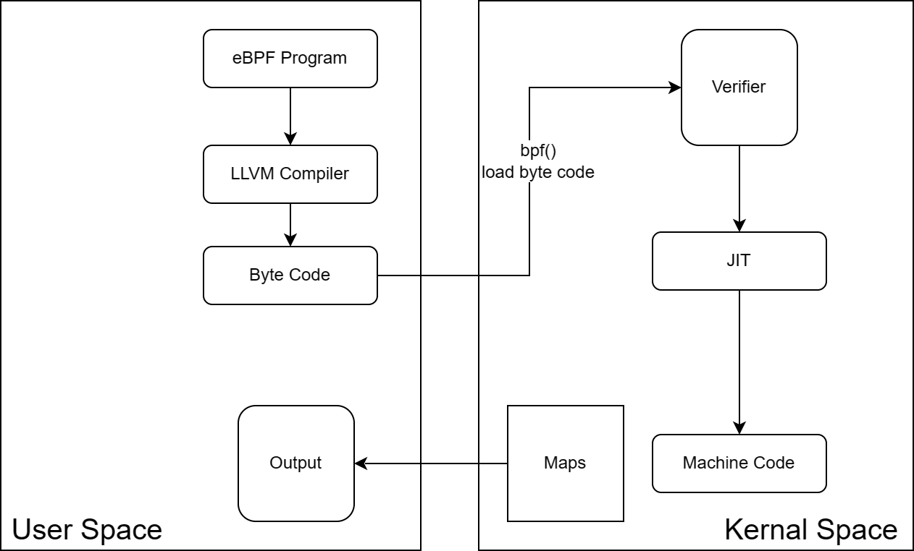

## eBPF
* eBPF（extended Berkeley Packet Filter）是一种虚拟机技术，它被广泛应用于 Linux 内核中的网络和系统监测、过滤、追踪以及安全性增强等方面。
* eBPF 最初是由 Alexei Starovoitov 在 Linux 内核中引入的，它扩展了传统的 Berkeley Packet Filter（BPF）机制，使得用户空间程序可以使用特定的指令集在内核中执行自定义的代码片段。eBPF 提供了一种安全且高效的方式，允许用户对网络数据包进行灵活的处理和监测，以及对系统调用和内核事件进行跟踪和过滤。
* eBPF 使用一种类似于 RISC 指令集的虚拟机，提供了一套丰富的指令和功能，可以在内核中执行自定义的程序片段。用户可以使用 C、Rust、Go 等编程语言编写 eBPF 程序，并通过特定的编译器和加载器将其加载到内核中执行。
* iptables vs ipvs vs ebpf
* 内核提供的可编程的力量，支持Go、Python、C++等
* 虽然名字是eBPF，也可称为BPF，因为目前它覆盖的内容已远远超过了网络部分
* 也是在预定义的钩子处执行
  * 系统调用、函数进入/退出、内核跟踪点、网络事件和其他几个钩子，所以蜜蜂(Bee，投票出的吉祥物)无处不在
* Linux 内核期望 eBPF 程序以**字节码**的形式加载
* JIT: 即时 （JIT） 编译步骤将程序的**通用字节码**转换为**特定于机器**的指令集，以优化程序的执行速度
* eBPF 使用 LLVM 作为后端，前端可以介入任何语言
* 内嵌一个eBPF virtual machine，在没有JIT的时候解释执行
* 最初就是为了筛选数据包而创建的一个虚拟机
* [查看指令集](https://docs.kernel.org/bpf/instruction-set.html)
* 
* 查看应用
  * $ tcpdump -d port 80 -i eth0   # Dump the compiled packet-matching code in a human readable form to standard output and stop.
  ```
  (000) ldh      [12]
  (001) jeq      #0x86dd          jt 2    jf 10
  (002) ldb      [20]
  (003) jeq      #0x84            jt 6    jf 4
  (004) jeq      #0x6             jt 6    jf 5
  (005) jeq      #0x11            jt 6    jf 23
  (006) ldh      [54]
  (007) jeq      #0x50            jt 22   jf 8
  (008) ldh      [56]
  (009) jeq      #0x50            jt 22   jf 23
  (010) jeq      #0x800           jt 11   jf 23
  (011) ldb      [23]
  (012) jeq      #0x84            jt 15   jf 13
  (013) jeq      #0x6             jt 15   jf 14
  (014) jeq      #0x11            jt 15   jf 23
  (015) ldh      [20]
  (016) jset     #0x1fff          jt 23   jf 17
  (017) ldxb     4*([14]&0xf)
  (018) ldh      [x + 14]
  (019) jeq      #0x50            jt 22   jf 20
  (020) ldh      [x + 16]
  (021) jeq      #0x50            jt 22   jf 23
  (022) ret      #262144
  (023) ret      #0
  ```

### 查看