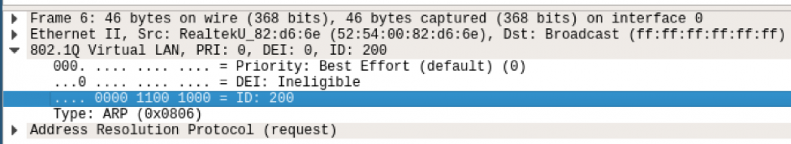

## VLAN
* VLAN又称虚拟网络
* 其基本原理是在二层协议里插入额外的VLAN协议数据（称为 802.1.q VLAN Tag)，同时保持和传统二层设备的兼容性。Linux里的VLAN设备是对 802.1.q 协议的一种内部软件实现，模拟现实世界中的 802.1.q 交换机
* 
* vlan是基于端口的，也就是基于硬件的
### requirement
* 需要一个在以太网网络上支持 IEEE 802.1q 标准的交换机。
* 需要一个与Linux配合使用并支持802.1q标准的NIC（网络接口卡）

### cmds
* apt install vlan
* apt install ethtool

### 使用
* 通过一个网络设备来使用vlan功能
```
apt-get install vlan
vconfig add eth0 100
ip addr add 192.168.1.100/24 dev eth0.100
ifconfig eth0.100 up
ping 192.168.1.200 -I eth0.100
```