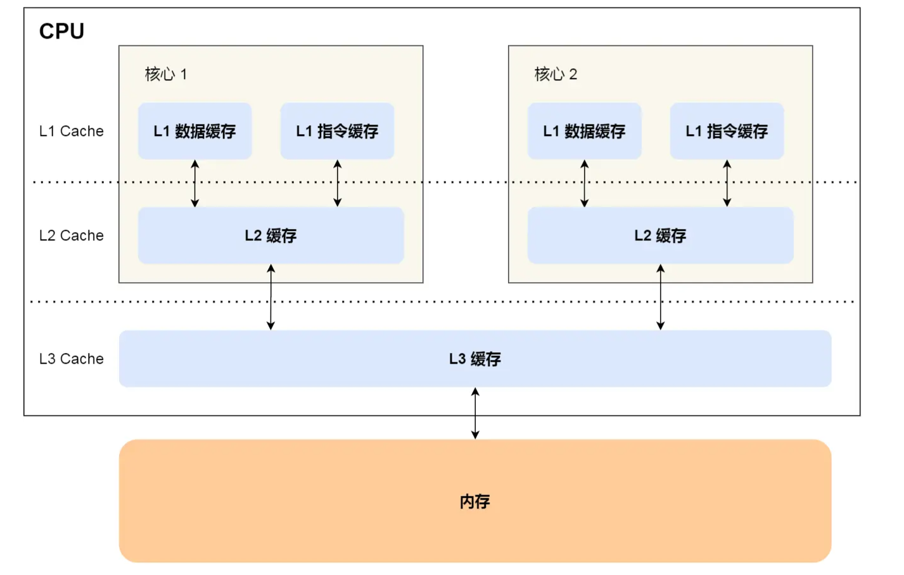
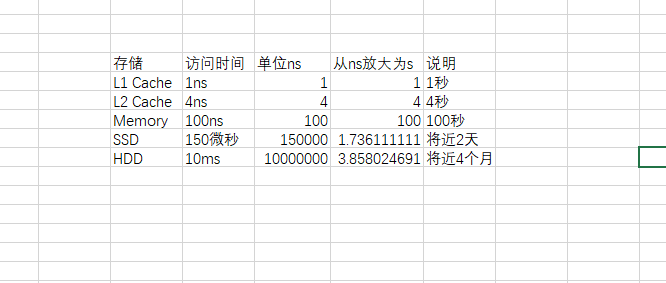
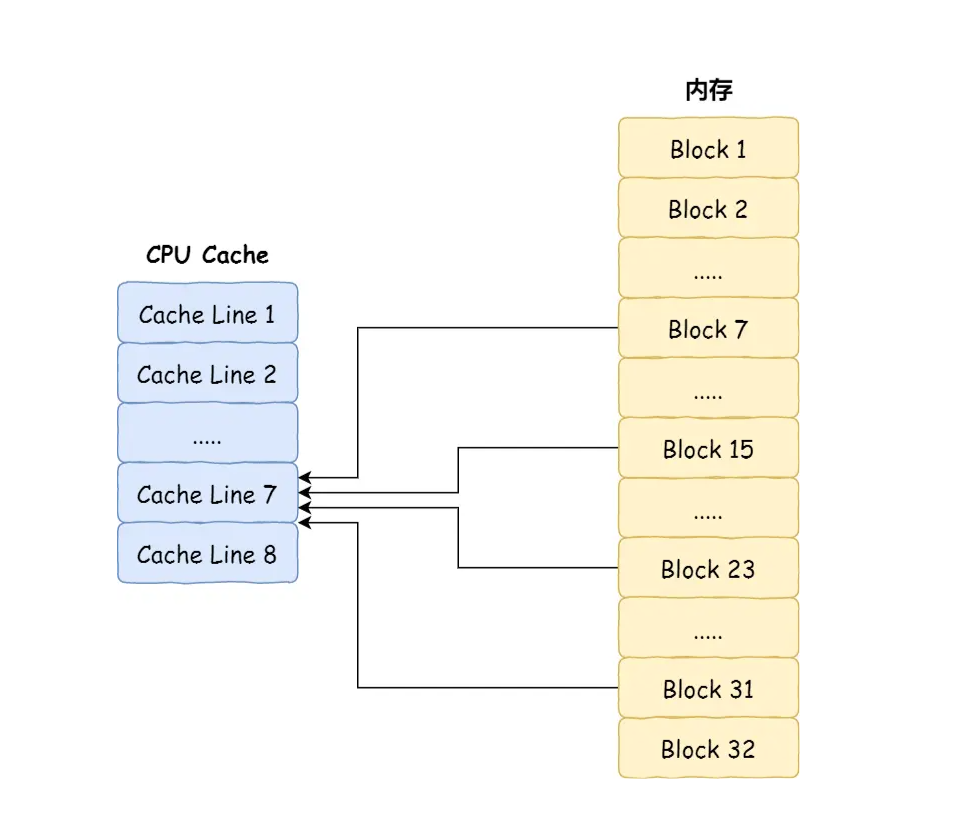
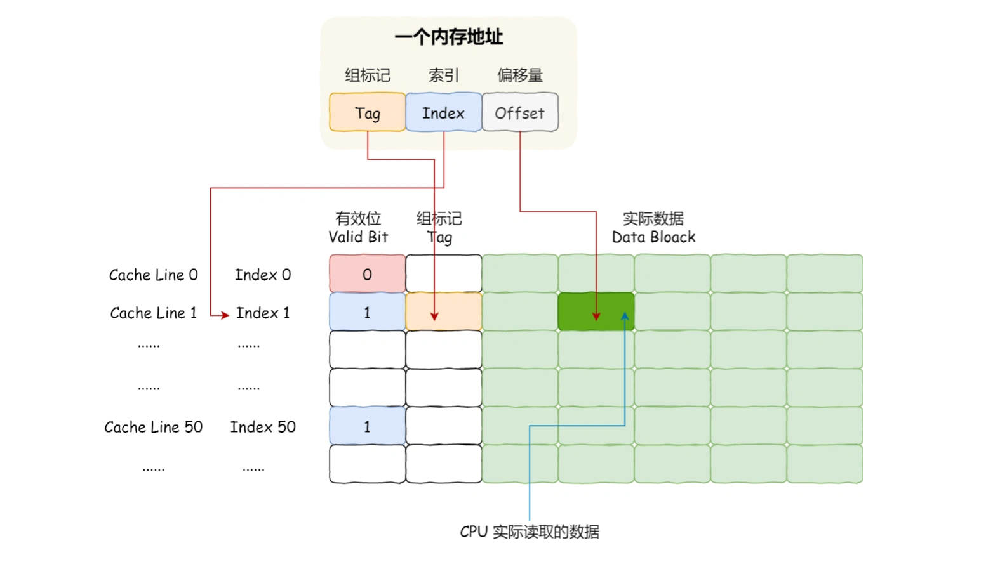
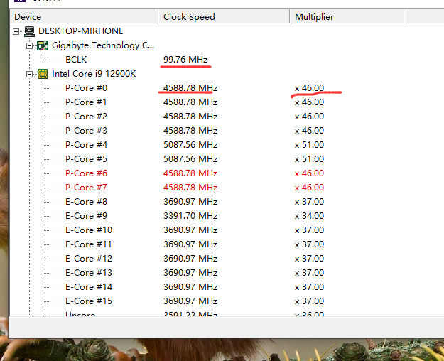
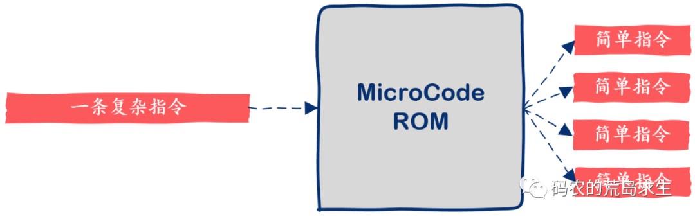

## CPU


### 构成
* CPU的根本任务就是执行指令，即“0”和“1”组成的序列
* 运算器、控制器、cache与寄存器组，这三部分由CPU内部总线连接起来

### 缓存协议
* 计算机CPU的各级缓存（如L1缓存、L2缓存、L3缓存等）通过使用缓存一致性协议来解决失效问题。缓存一致性协议是一种协调多级缓存之间数据一致性的机制，确保在多个缓存中存储的数据保持一致。常见的缓存一致性协议包括MESI（Modified, Exclusive, Shared, Invalid）和MOESI（Modified, Owned, Exclusive, Shared, Invalid）等。
* 可以认为缓存中的数据在用的时候一定是与内存保持一致的
* 在 MESI 缓存一致性协议中当 CPU core0 修改字段 a 的值时，其他 CPU 核心会在总线上嗅探字段 a 的物理内存地址，如果嗅探到总线上出现字段 a 的物理内存地址，说明有人在修改字段 a，这样其他 CPU 核心就会失效字段 a 所在的 cache line 。


### Cache
* L1 Data Cache Size: /sys/devices/system/cpu/cpu0/cache/index0/size   48K ，cpu独享
* L1 Instruction Cache Size: /sys/devices/system/cpu/cpu0/cache/index1/size 32K，cpu独享
* L2 Cache Size: /sys/devices/system/cpu/cpu0/cache/index2/size 512K，cpu独享
* L3 Cache Size: /sys/devices/system/cpu/cpu0/cache/index3/size 16384K cpu共享
* Cache Line Size(L1 Cache 一次载入数据的大小): /sys/devices/system/cpu/cpu0/cache/index[0,1,2,3]/coherency_line_size 64，而64位的机器的word是64bit，所以一次load 8个word进入cache line
* cpu每次从cache中取数据的时候取一个word
* 
* 
* 
* CPU Cache 用的是一种叫 **SRAM**（Static Random-Access Memory，静态随机存储器） 的芯片。之所以叫「静态」存储器，是因为只要有电，数据就可以保持存在，而一旦断电，数据就会丢失了。在 SRAM 里面，一个 bit 的数据，通常需要 6 个晶体管，所以 SRAM 的存储密度不高，同样的物理空间下，能存储的数据是有限的，不过也因为 SRAM 的电路简单，所以访问速度非常快。
* 内存用的芯片和 CPU Cache 有所不同，它使用的是一种叫作 **DRAM** （Dynamic Random Access Memory，动态随机存取存储器） 的芯片。DRAM 存储一个 bit 数据，只需要一个晶体管和一个电容就能存储，但是因为数据会被存储在电容里，电容会不断漏电，所以需要「定时刷新」电容，才能保证数据不会被丢失，这就是 DRAM 之所以被称为「动态」存储器的原因，只有不断刷新，数据才能被存储起来。
* cache的写策略：write-through: Write is done synchronously - both to the cache and to the backing store.
* cache的写策略：write-back: Writing is done only to the cache. A modified cache block is written back to the store, just before it is replaced.
* 在286时代是没有cache的，是随着cpu与主存的速度差距变大后出现的
* 比喻
```
Caches also abound in everyday life. Imagine how life would differ without, say, food storage—if every time you felt hungry you had to walk to a farm and eat a carrot you pulled out of the dirt. Your whole day would be occupied with finding and eating food! Instead, your refrigerator (or your dorm’s refrigerator) acts as a cache for your neighborhood grocery store, and that grocery store acts as a cache for all the food producers worldwide. Caching food is an important aspect of complex animals’ biology too. Your stomach and intestines and fat cells act as caches for the energy stored in the food you eat, allowing you to spend time doing things other than eating. And your colon and bladder act as caches for the waste products you produce, allowing you to travel far from any toilet.
```
* L2缓存比L1缓存慢的原因： 容量、距离

### 直接映射 Cache（Direct Mapped Cache）
* 
* 

### cache的例子
```
对于地址0x00CA，假设缓存行大小为64字节（例如Intel x86架构），根据缓存行对齐的规则，CPU会从0x00C0的地址开始加载数据到缓存中。

具体解释如下：

缓存行大小为64字节，表示一个缓存行从0x00C0到0x00FF的范围。
地址0x00CA处于该范围内，但不是缓存行的起始地址。
因此，CPU会加载从0x00C0开始的64字节数据到缓存中，覆盖0x00CA到0x00FF的范围。
这意味着，CPU会将0x00C0到0x00FF的64字节数据加载到缓存中，以备将来的访问。当程序需要访问地址0x00CA处的数据时，CPU会直接从缓存中获取，而不需要再次访问内存。
```

### Die
* Die或者CPU Die指的是处理器在生产过程中，从晶圆（Silicon Wafer）上切割下来的一个个小方块（这也是为啥消费者看到的CPU芯片为什么都是方的的原因），在切割下来之前，每个小方块（Die）都需要经过各种加工，将电路逻辑刻到该Die上面。

### Package,Socket
* 他们会将1个或者N个CPU Die封装起来形成一个CPU Package，有时候也叫作CPU Socket

### Cache Usage
* CPU 读取数据的时候，无论数据是否存放到 Cache 中，CPU 都是先访问 Cache，只有当 Cache 中找不到数据时，才会去访问内存，并把内存中的数据读入到 Cache 中，CPU 再从 CPU Cache 读取数据。

### 时钟
* CPU喜欢有一个可变的时钟频率，这样它们就可以在有需求时加速“涡轮增压”，在太热或只是为了省电时减速。
* CPU 以同样的方式解决晶体问题和可变时钟问题。输入一个相当慢的时钟，可能是 100 MHz 或 or，然后在内部产生一个快速时钟，该时钟是输入时钟的任意整数倍。这是通过有一个可控振荡器，然后将输出频率除以您想要的乘法器，并将其与基准进行比较来完成的。如果分频后的 CPU 时钟太快，则可控振荡器会稍微减慢速度。如果它太慢，你就加快速度。这被称为锁相环，有一整本书，如“锁相和频率反馈系统”，以及数千篇关于这些东西设计的技术论文。它们是高度非线性的，基本上是黑魔法。换句话说，PLL设计是一个专业领域。
* 常有多个时钟。内核可能以一个频率运行，L3缓存可能以不同的频率运行，而片外通信（如内存控制器和PCI Express）可能以其他频率运行。从某种意义上说，这没什么大不了的，你只需添加更多的PLL，你就可以生成任意数量的时钟。
* 不同时钟的区域称为“时钟域”，处理器上通常有多个。电信号从一个信号交叉到另一个信号是很棘手的，但可以管理。执行此操作的硬件称为“同步器”，通常由两个串联的人字拖组成。如果第一个触发器恰好在输入变化的确切时刻计时（因为它由不同的时钟驱动），则第一个触发器的输出有可能在很长一段时间内保持“亚稳态”。这种情况也发生在第二个触发器上的可能性非常小，以至于在实践中这不是问题。
* L2 及以上的缓存控制器可能与 CPU 共享相同的时钟速率，也可能不共享相同的时钟速率。

### CPU 与内存
* 计算机在管道中运行一系列指令。每条指令都被分解为微操作，在此过程中，它们被标记为依赖关系。因此，当一个操作需要来自 DRAM 的数据时，它会等待，任何依赖于等待操作结果的操作也会等待，**但管道中不依赖于它的其他操作可以运行，尽管它们的结果必须等待**，以便所有指令都可以按照它们开始执行的顺序“停用”。很快，线程就用完了未阻塞的操作，但现在，如果内核有第二个线程（i7），它就可以开始执行该线程的指令。当两个线程都被阻塞时（或者如果 CPU 每个内核只有一个线程），那么内核必须等待数据从 DRAM 到达，但当然其他内核仍然可以执行。(**也就意味着，指令没有执行结束的时候，不能被切换出去??**)
* 内存本身通常是异步内存。CPU 断言了一个读取或写入请求，从RAM的角度来看，许多纳秒后，请求就完成了。只要 CPU 保持请求的时间足够长，事情就会奏效。如果RAM需要更多的时间，额外的逻辑可以断言等待状态以延长它。内存本身没有时钟*，它只是有最短的读写访问时间。
* 异步内存
* https://faculty.kfupm.edu.sa/COE/aimane/assembly/pagegen.aspx-ThemeID=1&PageID=m300_146.htm 
* ` We have seen before that the CPU-Memory interface includes the data bus, address bus and some control signals including Read, Write, and Memory-Function-Complete (MFC). The CPU is interfaced to the data bus and address bus through the MDR and MAR registers, respectively.

In addition to this interface, there is a need for a CPU-Memory interface circuitry to manage their interaction. When the CPU wants to perform a read or write operation, it asserts either the Read or Write signal and puts the address to be read from or written to in the MAR register. Then, the CPU waits for the memory to finish the requested transfer operation. It is required that the CPU keeps the Read or Write signal set until the memory finishes the requested operation. The memory activates the MFC signal when the requested operation is completed. One the MFC is set to 1, and then the Read or Write signal can be set to 0. This interaction process between the CPU and memory is called handshaking.

A versatile CPU can communicate with main memory modules of different speeds
	A fast memory can be accessed within a single clock cycle
	Slower memory may require several clock cycles
The CPU-memory interface circuit should handle both fast and slow memories. Recall that internal signals generated by the control unit are active for one clock cycle during a given control step. Slow memory has to see those signals for more than one clock cycle. So, the CPU-memory interface circuit has to keep the Read or Write signals set to 1 until the MFC signal becomes 1. This is because the CPU will set them to 1 for one clock cycle and then go to the next control step when they may become 0.`

### 多线程
* 这意味着每个内核有 2 个程序计数器和 2 组寄存器来维护程序状态。

### 特殊状态
* 操作系统将检测到没有需要运行的进程，将中断安排在将来几毫秒内发生，然后运行特殊的 HALT 指令，此时 CPU 停止获取新指令。

### 时钟周期

### 指令周期
* Fetch
* Decode
* Execution
* Store

### base clock (BCLK)，外频
* 来自于南桥的ICC（Integrated Clock Control），100MHz
* 决定了主板整体的工作速度
* 晶振可比喻为各板卡的“心跳”发生器，如果主卡的“心跳”出现问题，必定会使其他各电路出现故障。通过一定的外接电路来，可以生成频率和峰值稳定的正弦波。
* 

### 晶振
* 它最早是用在计时，石英表，石英表里面有一个石英晶体，它的频率非常的稳定，所以它一个最基本的作用就是用来计时，因为时间它本身就是一个频率，晶振它本质上就是一个提供基本频率的元件，这是它一个本质的作用
* 石英晶体振荡器，是一种高精度和高稳定度的振荡器
* 晶振利用一种能把电能和机械能相互转化的晶体，在共振的状态下工作可以提供稳定、精确的单频振荡。
* 一般一个主板上都会有2-3个晶振(时钟晶振,实时晶振,声卡晶振,网卡晶振)
* 晶振可以安置在芯片内部，也可以在芯片的外部
* 几乎所有有源的芯片你只要涉及到数据处理、运算，它都需要一个晶振的信号，需要一个频率的信号

### 微指令
* 微指令是指在机器的一个CPU周期中，一组实现一定操作功能的微命令的组合，描述微操作的语句。
* 将一条指令分成若干条**微指令**，按次序执行就可以实现指令的功能。若干条微指令可以构成一个**微程序**，而一个微程序就对应了一条**机器指令**。
*  微指令是计算机中最底层的指令层次。它们是由计算机的控制单元执行的基本控制操作，用于操纵计算机的各个部件，例如寄存器、ALU（算术逻辑单元）、存储器等。微指令通常包含非常简单的操作，如数据传输、运算、存储器访问等。
* 宏指令（Macroinstructions）： 宏指令是更高层次的指令，它们由计算机的指令集架构（Instruction Set Architecture，ISA）定义。宏指令提供了更抽象、更容易理解的操作，它们被翻译成一系列微指令，由硬件执行。

### 晶体管
* CPU中使用的MOS管(MOSFET(Metal Oxide Semiconductor Field Effect Transistor)，即金属氧化物半导体型场效应管，属于场效应管中的绝缘栅型)
* 所谓多少nm，基本上可以认为是里面晶体管的大小
* 晶体管是一种固体半导体器件（包括二极管、三极管、场效应管、晶闸管等，有时特指双极型器件）(贝尔实验室发明看，可以使用电信号进行控制)
* 半导体，它是指一种导电性可受控制，范围可从绝缘体至导体之间的材料，如二极管就是采用半导体制作的器件。常见的半导体材料有硅、锗、砷化镓等，硅是各种半导体材料应用中最具有影响力的一种。

### 芯片
* IC 集成电路
* 对于CPU而言，功耗和散热是遏制其规模的一大因素

### 优化技术
* 多级缓存
* 流水线
* 指令重排

### 理解
* 一个cpu同时只能执行一条指令，但是可以通过流水线技术提高指令的并行度
* 在fetch阶段，如果出现了cache miss，则使用Halt On Pause 或者 Stop and Wait来暂停正在执行的指令，直到所需的数据可用。HOP 技术可以用于处理缓存未命中、分支预测错误、数据相关性等情况，以确保指令的正确执行。**整个流水线会在等待期间暂停，直到所需数据准备好后，流水线才会继续执行。**当某个指令暂停时，处理器可以利用这段时间进行其他操作，例如执行其他线程的指令或进行其他处理器任务。
* CPU上下文切换无非就是更换了CPU 寄存器的值，也就是换一个施工现场
* 执行上下文切换的是操作系统，也就是它来重新布置寄存器的值，或者说是一个寄存器布置程序在重新布置寄存器的值
* 什么是进程呢，说到底，进程是申请使用计算机资源的抽象和代表，进程使用cpu的资源需要靠OS将其指令序列安排到cpu的现场中。
* 硬件的意思是说，固定下来之后就很难改变，从软件到硬件是一个慢慢抽象的过程，所以硬件能执行基础的指令保证上层的多样性。但是硬件同样也可以做很多事情，或者根据时代的变化来调整自己的设计。
* CPU执行争取的时间资源

### 线程
* 线程切换并没有固定的时间，也就是说不是完全按照时间进行调度的
* 线程也就是逻辑的执行上下文，上下文构成了执行的意义

### 进程上下文
* 包括 虚拟地址空间、硬件上下文
* 另一种划分
```
上文：已经执行的指令和数据，及在寄存器堆栈中的内容。
正文：正在执行的。
下文：待执行的。
```
* 包括
```
A virtual address space (pointed to by %cr3)
The next instruction to execute (pointed to by %rip)
A stack (pointed to by %rsp)
Other register state (e.g., %rax, %rbx, %r8)
```

### 上下文切换
* 进程上下文切换: 进程是由内核来管理和调度的，进程的切换只能发生在内核态。所以，进程的上下文不仅包括了 虚拟内存、栈、全局变量等用户空间的资源 ，还包括了 内核堆栈、寄存器等内核空间的状态.
* 线程上下文切换
* 中断上下文切换
* 系统调用上下文切换: 两次 CPU 上下文切换

### 微处理器
* A microprocessor is a processor built on a **single** chip. Until the 1970’s, processors were too complicated to fit on one chip, so ainframe processors were built from boards containing many chips. Intel introduced the first 4-bit microprocessor, called the 4004, in  1971.


### 制程
* 制程节点越小意味着晶体管越小、速度越快、能耗表现越好
* 2023年最高工艺3nm，台积电

### 台积电 vs 苹果
* 台积电是生产芯片电路的公司 
* 苹果是设计芯片电路的公司
* 任何东西需要量产都需要一个放大的过程，台积电就是那个放大的过程

### Apple 的CPU
* MacPro、MacAir一般为M系统
* 手机一般A系列，ARM架构，[查看](https://kylebing.cn/tools/apple-chip/)


### 80x86
* 80代表最初的 Intel 8086 处理器。8086 是 Intel 公司于 1978 年推出的 16 位微处理器，标志着 x86 架构的诞生。
* x86：代表后续的 Intel x86 微处理器系列。这个系列包括了多种型号的处理器，如 8086、80286、80386、80486，以及后来的 Pentium 系列、Core 系列等。这些处理器都是基于 x86 架构，并且兼容之前的 16 位指令集。

### Power Architecture 
* IBM
* RISC
* Unix、嵌入式、汽车领域，家用领域较少


### 标量指令
* 一条指令执行只得到一个数据结果
* SISD: Single Instruction Single Data，单指令流单数据

### 向量指令
* 计算机中的vector向量或者矢量通常指代一个有序的数据集合，其中的元素按照特定的顺序排列。矢量可以是一维的，也可以是多维的，具体取决于所涉及的领域和上下文。
* **与数学中说的向量或者矢量的概念不同**
* SIMD: Single Instruction Multiple Data，即单指令流多数据技术
* vectorization: 向量化计算,也叫vectorized operation，也叫array programming，说的是一个事情：将多次for循环计算变成一次计算


### TSS
* Task State Segment
* 用于保存当前进程的上下文信息，包括GDT、LDT和段选择子等。当进程切换时，处理器会将当前进程的上下文信息保存到TSS中，然后加载下一个进程的TSS，并将其上下文信息恢复到处理器寄存器中。

### 硬件标准
* 几路： 就是几个CPU硬件
* 1U 2U 3U:  1Unit, 2Unit, 3Unit 服务器规定的尺寸是服务器的宽（48.26cm=19英寸）与高（4.445cm的倍数），厚度（高度））以4.445cm为基本单位。U(unit的缩略语)是一种表示组合式机架外部尺寸的单位，详细尺寸由作为业界团体的美国电子工业协会（EIA）决定。

### 寄存器
#### CS 
* 在实模式下，CS寄存器存储的是段选择子（Segment Selector）
* 在保护模式下，CS寄存器存储的是段选择子，通过段选择子可以在全局描述符表（Global Descriptor Table）或局部描述符表（Local Descriptor Table）中查找到段的描述符，从而得到段的虚拟地址。

#### IP
* segment中的偏移量

### CICS 与 MicroCode
* 对于指令集中的每一条机器指令都有一小段对应的程序，这些程序存储在CPU中，这些程序都是由更简单的指令组成，这些指令就是所谓的微代码，Microcode。
* 
* 注意，中间有个ROM来保存复杂指向向microcode的转化


### TDP (Thermal Design Power)
* CPU功耗

#### 工具
* [cpu-z](https://www.cpuid.com/softwares/cpu-z.html)


### RISC
* 精简指令集思想不是说指令集中指令的数量变少，而是说一条指令背后代表的动作更简单了
* “Relegate Interesting Stuff to Compiler”，把一些有趣的玩意儿让编译器来完成。
* 精简指令集下有专用的 load 和 store 两条机器指令来负责内存的读写，其它指令只能操作CPU内部的寄存器，这是和复杂指令集一个很鲜明的区别。
* 流水线技术是初期精简指令集的杀手锏。
* 精简指令给编译器更多的操作与优化的空间