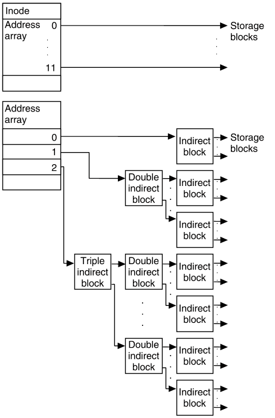
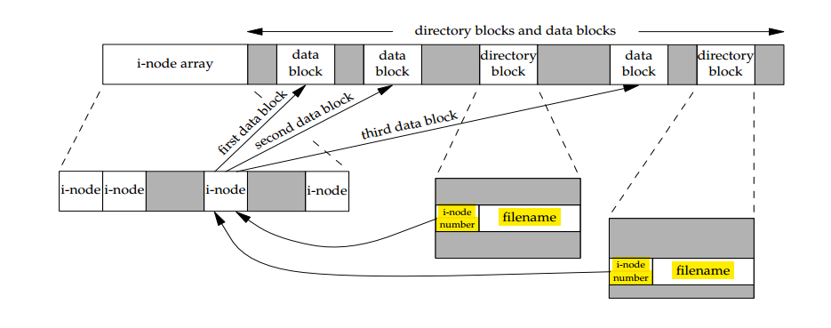
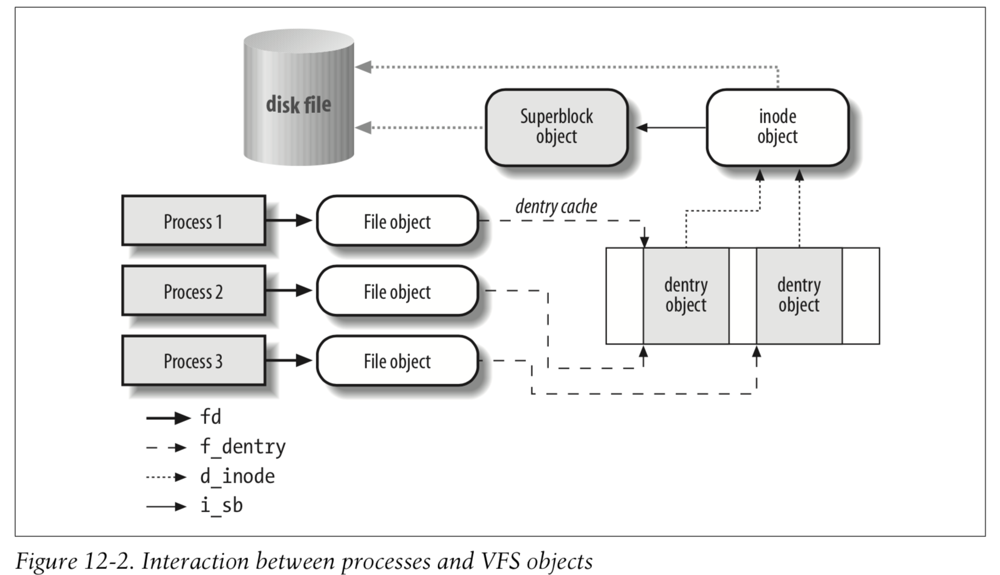

# 文件系统
* file: A computer file is a computer resource for recording data discretely in a computer storage device. Just as words can be written to paper, so can information be written to a computer file. 
* fs: In computing, a file system or filesystem (often abbreviated to fs) controls how data is stored and retrieved. Without a file system, data placed in a storage medium would be one large body of data with no way to tell where one piece of data stops and the next begins. By separating the data into pieces and giving each piece a name, the data is easily isolated and identified. Taking its name from the way **paper-based** data management system is named, each group of data is called a "file." **The structure and logic rules** used to manage the groups of data and their names is called a "file system."
* Formally, **a Unix file is simply a sequence of bytes**. All I/O devices (e.g., disks, keyboards, displays, and networks) are modeled as files. This simple abstraction turns out to be extremely elegant and powerful. It, for instance, hides much of the difficult details of individual technologies from user programs.
* linux 查看文件系统
```
df -T -h 
Filesystem     Type      Size  Used Avail Use% Mounted on
/dev/vda1      ext4       40G   12G   26G  32% /
...
--------------------------------------------------------------------------------------------------------------------------------------------------------
df -T -h
Filesystem     Type      Size  Used Avail Use% Mounted on
/dev/sda3      xfs       126G   26G  100G  21% /
...
```
* ext3(Third extended filesystem)、ext4(Fourth extended filesystem)、xfs(由Silicon Graphics为他们的IRIX操作系统而开发)都是linux下的**日志文件系统(JFS)**。
* centos7.0开始默认文件系统是xfs，centos6是ext4，centos5是ext3
* JFS的三个级别

    * data=writeback, 不执行任何形式的数据日志记录
    * data=ordered, 记录元数据
    * data=journal, 完整数据和元数据日志记录
```
 dmesg | grep -B 1 "mounted filesystem"  
[    2.199792] random: fast init done
[    2.255141] EXT4-fs (vda1): mounted filesystem with ordered data mode. Opts: (null)
--
[   93.604809]  vdb: vdb1
[   99.004345] EXT4-fs (vdb1): mounted filesystem with ordered data mode. Opts: (null)
``` 
* classify

## 硬盘
* 总体结构如下图

* 磁盘 => 盘片(N) => 盘面(2)&磁头(2) =>  track堆叠形成cylinder, 「cylinder, surface, sector」定位一个扇面 (这个是磁盘坐标系统中的x,y,z, 只不过是定位一个sector, 一般为512Byte)，查看sector的size,
```
fdisk -l
...
Units = sectors of 1 * 512 = 512 bytes
Sector size (logical/physical): 512 bytes / 512 bytes
...
```
* Latency: 

    寻道时间(对应track)

    旋转延迟(sector)

    数据传输时间
* IOPS = 1000ms/(Tseek, Trotation + Ttransfer)
* 吞吐量: 单位时间内可以成功传输的数据数量
* 命名规则: sd[a-z]x, sd是磁盘的主设备号，比如fd表示软盘, a-z表示真实的物理磁盘, x表示磁盘分区. 比如sda1，表示第一块磁盘的第一个分区
* 查看block的size, stat /boot/，**硬盘最小的存储单位是sector，而操作系统存取的最小单元是block**, 连续八个sector组成一个block
* Windows 下的 FAT，FAT32 和 NTFS 文件系统中称为簇（cluster），Linux 下的 Ext4 等文件系统中称为块（block），对应内存的最小单元叫做Page，也就是对于一块连续的空间而言，总要有一个最小分配单位来平衡管理与使用的成本

## inode(index node)
* 一种inode与block存储的模型 ,这种结构给了文件大小足够的可伸缩空间，这也是“通用文件系统”
    ```
    * The first array contains 12 direct addresses, that is, addresses that point directly to the first 12 logical storage blocks of the contents of the file (addresses 0-11). If the file is larger than 12 logical blocks, the first address of the second array (address 0) points to an indirect block, which contains direct addresses instead of file contents.
    * The second address (1) points to a double indirect block, which contains addresses of indirect blocks.
    * The third address (2) points to a triple indirect block, which contains addresses of double indirect blocks.
    ```
* inode date impl 
*  block的大小和 unix file system中最大文件的关系

| Logical Block Size   | Direct Blocks   | Single Indirect Blocks	 | Double Indirect Blocks |
|----------------------|-----------------|-------------------------|------------------------|
| 2048 bytes           | 24KB            | 1MB	                    | 512MB                  |
| 4096 bytes           | 48KB            | 4MB                     | 4GB                    |
| 8192 bytes           | 96KB            | 16MB                    | 32GB                   |
|                      |                 |                         |                        |
* ls -li 查看文件的索引值, df -i 查看系统inode的使用情况

## 文件系统 
* 一个inode对应一个文件，文件名是inode对应的名称(类似于ip有对应的dns一样，inode有对应的名字)，软连接就是小名(引用计数)。
* 使用bitmap记录使用信息，大规模数据的标记问题
* layout: , , 
* linux fs layers: 

## 文件的访问
* 
* 
* 
* 
* 
* 
* 
* 
* 可以看出，dentry是应用层和vfs之间的中间层，实现目录名和inode的映射
* 文件描述符是进程可用的数据，内核级别是共享打开的文件表(这里是多个进程共享的数据)，所以多个进程读写同一个文件的时候，可能会出现不同步的问题

## 标准IO & 文件IO
* 标准IO就是标准C(ANSI, 美国国家标准学会，是标准学会)库的IO函数，减少纯粹的read/write引起的系统调用
* 系统调用是开销比较大
* 
* 也可以看做带缓冲和不带缓冲的io
* 标准io的缓冲类型

    行, 比如标准输出(没有被重定向)

    无，stderr

    全，block设备
* 标准io的累计发送类似tcp的nagle算法，都是为了减少系统或者网络开销
* IO的核心目的是与磁盘存储交互，这里面有多重交互方式，根据场合不同一层层的穿透

    * 标准io
    * 文件io
    * mmap
    * direct io

* 
* 
### read/write
* write函数通过调用系统调用接口，将数据从应用层copy到内核层，所以write会触发内核态/用户态切换。当数据到达page cache后，内核并不会立即把数据往下传递。而是返回用户空间。数据什么时候写入硬盘，有内核IO调度决定，所以write是一个异步调用(这点与Tcp的write函数一样)。这一点和read不同，read调用是先检查page cache里面是否有数据，如果有，就取出来返回用户，如果没有，就同步传递下去并等待有数据，再返回用户，所以read是一个同步过程。

* 缓冲实例：
```
#include <stdio.h>

int stream_attribute(FILE *fp)
{
    if(fp->_flags & _IO_UNBUFFERED)
    {
        printf("fd %d unbuff size %d\n", fileno(fp), fp->_IO_buf_end - fp->_IO_buf_base);
    }
    else if(fp->_flags & _IO_LINE_BUF)
    {
       printf("fd %d line buff size %d\n", fileno(fp), fp->_IO_buf_end - fp->_IO_buf_base);
    }
    else
    {
       printf("fd %d full buff size %d\n", fileno(fp), fp->_IO_buf_end - fp->_IO_buf_base );
    }
    return 0;
}

int main()
{
      FILE *fp;
      char buf[16];

      printf("input a string:");
      scanf("%s", buf);

      stream_attribute(stdin);

      stream_attribute(stdout);

      stream_attribute(stderr);

      if((fp = fopen("test.txt","w+")) == NULL)
          perror("fail to fopen");

      fputs(buf, fp);
      stream_attribute(fp);
      return 0;
}
----------------------------------------------------------------------------------------------
input a string:test
fd 0 line buff size 1024
fd 1 line buff size 1024
fd 2 unbuff size 0
fd 3 full buff size 4096
```

## pdflush(Page Dirty Flush)
* pdflush唤醒的比例阈值： /proc/sys/vm/dirty_background_ratio
* write比阻塞的阈值阈值: /proc/sys/vm/dirty_ratio
* 唤醒周期： /proc/sys/vm/dirty_writeback_centisecs,单位是(1/100)秒

## address_space 
* Linux内核中的一个关键抽象，它是页缓存和外部设备中文件系统的桥梁，上层应用读取数据会进入到该结构内的page cache，上层应用对文件的写入内容也会缓存于该结构内的page cache。
* 
* 通过address_space来找到空间对应的地址，即确认文件的某处偏移的地址

## buff cache & page cache
* Linux-2.4版本中对Page Cache、Buffer Cache的实现进行了融合，融合后的Buffer Cache不再以独立的形式存在，**Buffer Cache的内容，直接存在于Page Cache中**，同时，保留了对Buffer Cache的描述符单元：buffer_head
* Page Cache和Buffer Cache是一个事物的两种表现：对于一个Page而言，对上，他是某个File的一个Page Cache，而对下，他同样是一个Device上的一组Buffer Cache
* 
* page => buff => block => sector
* 所以，三处缓存，标准库的缓存，page cache，磁盘自身的缓存
* 页缓存就是将一个文件在内存中的所有物理页所组成的一种树形结构，我们称之为基数树，用于管理属于同一个文件在内存中的缓存内容。
* 所有的文件内容的读取（无论一开始是命中页缓存还是没有命中页缓存）最终都是直接来源于页缓存(如果页缓存缺失，那么产生一个缺页异常，首先创建一个新的空的物理页框，通过该inode找到文件中该页的磁盘地址，读取相应的页填充该页缓存（DMA的方式将数据读取到页缓存），更新页表项)

## The block I/O layer
* The block I/O layer is the kernel subsystem in charge of managing input/output operations performed on block devices. 
* 位于驱动和vfs之间
* 
* 想想吧，整个os的所有的文件操作都汇集到这个层面，当然要优化一下才能向驱动发送请求，一个很繁忙的交通站

### io scheduler
* sorting（排序）和merging（合并）
* 电梯算法
* 查看调度算法 cat /sys/block/sda/queue/scheduler

## mmap
* 直接将page cache的内存地址映射到用户空间，减少了page cache到用户空间的数据拷贝
* 用户可以不使用read/write这样的函数来操作文件，而直接使用访问内存的方式来操作文件
* 主要是零拷贝，减少了中间的系统调用与上下文切换

## DMA(Direct Memory Access)
* 在cpu不参与的情况下完成外设与内存之间的数据转移（一般针对数据量比较大的情形）,否则如果使用中断的方式，cpu会被累死

## vfs 文件系统虚拟化，
* VFS是物理文件系统与服务之间的一个接口层，它对Linux的每个文件系统的所有细节进行抽象，使得不同的文件系统在Linux核心以及系统中运行的进程看来都是相同的。
* VFS在系统启动时建立，在系统关闭时消亡。
* VFS并不是一种实际的文件系统。它只存在于内存中，不存在于任何外存空间。管理VFS数据结构的组成部分主要包括超级块和inode,只需要通过超级结点挂载就可以了,VFS只存在于内存中
* VFS使Linux同时安装、支持许多不同类型的文件系统成为可能。
* VFS拥有关于各种特殊文件系统的公共界面，当某个进程发布了一个面向文件的系统调用时，内核将调用VFS中对应的函数，这个函数处理一些与物理结构无关的操作，并且把它重定向为真实文件系统中相应的函数调用，后者用来处理那些与物理结构相关的操作。

## dentry(directory entry)，目录结构体的内存化
* 在读取一个文件时，总是从根目录开始读取，每一个目录或者文件，在VFS中，都是一个文件对象，每一个文件对象都有唯一的一个inode与之对应
* 根目录的inode号为0，在superblock里，可以很快根据inode号索引到具体的inode，因此读取到的第一个inode就是根目录的,读取到了该目录后，内核对象会为该文件对象建立一个dentry，并将其缓存起来，方便下一次读取时直接从内存中取。
* 目录本身也是一个文件，目录文件的内容即是该目录下的文件的名字与inode号，目录文件的内容就像一张表，记录的文件名与其inode number之间的映射关系
* 根据路径即可找到当前需要读取的下一级文件的名字和inode，同时继续为该文件建立dentry，dentry结构是一种含有指向父节点和子节点指针的双向结构，多个这样的双向结构构成一个内存里面的树状结构，也就是文件系统的目录结构在内存中的缓存了。有了这个缓存，我们在访问文件系统时，通常都非常快捷。

## Resouce Usage
* 页面缓存，闲着也是闲着，不如让出来做文件缓存
* 网络资源，闲着也是闲着，不如让tcp多用点，但是一旦拥堵，则立刻好人模式

## stdin stdout stderr
* stdout到底是什么，是不是就是打开的一个文件

## buffer & cache 
* 个人理解： buffer侧重于等待加速，cache侧重于等着临幸

### 带缓冲的io和不带缓冲的io
* stdio中的fwrite 带缓冲，指的是在用户态有缓存，fwrite的时候不会产生系统调用，就是使用stdio cache
* write的每次使用都会产生系统调用
  * Here’s what happens at a high level when w03-byte writes bytes to the file:
    1. The application makes a write system call asking the operating system to write a byte.
    2. The operating system performs this write to the buffer cache.
    3. The operating system immediately returns to the application!

### buffer vs cache
* buffer: 缓冲， cache： 缓存
* 无论缓存还是缓冲，其实本质上解决的都是读写速度不匹配的问题
* 硬盘的读写缓存的起名： read cache、write buffer
* Buffer的核心作用是用来缓冲，缓和冲击。比如你每秒要写100次硬盘，对系统冲击很大，浪费了大量时间在忙着处理开始写和结束写这两件事嘛。用个buffer暂存起来，变成每10秒写一次硬盘，对系统的冲击就很小，写入效率高了，日子过得爽了。极大缓和了冲击。
* Cache的核心作用是加快取用的速度。比如你一个很复杂的计算做完了，下次还要用结果，就把结果放手边一个好拿的地方存着，下次不用再算了。加快了数据取用的速度。