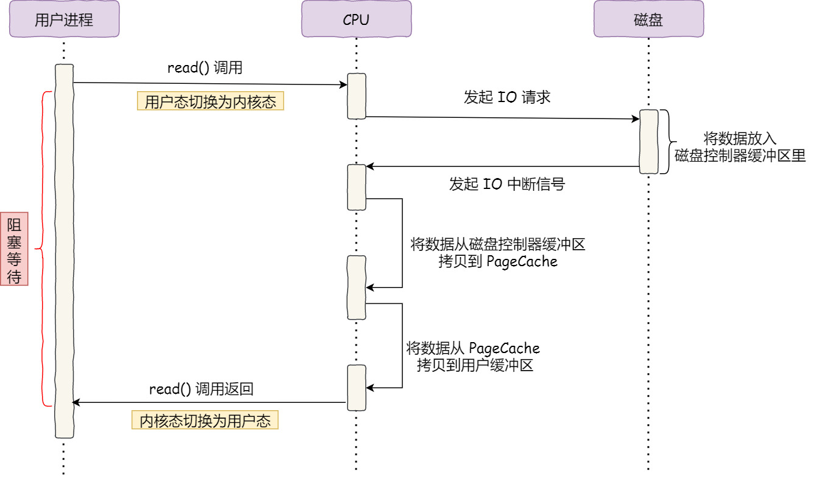
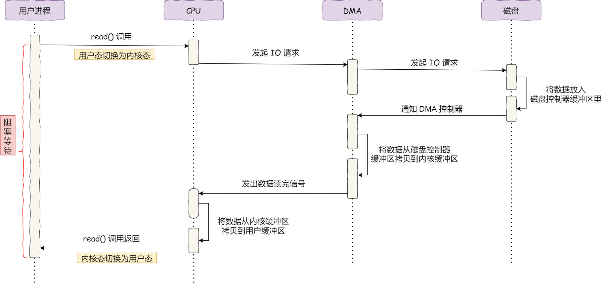
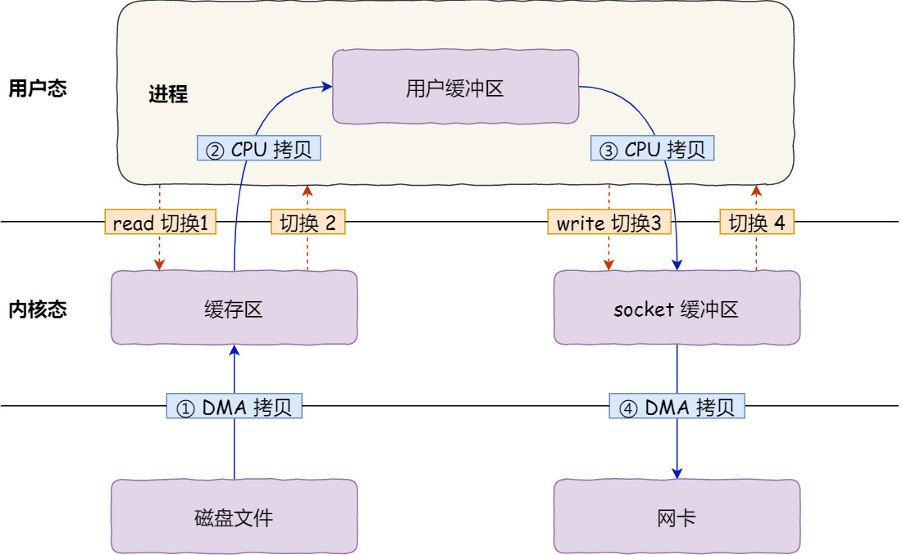
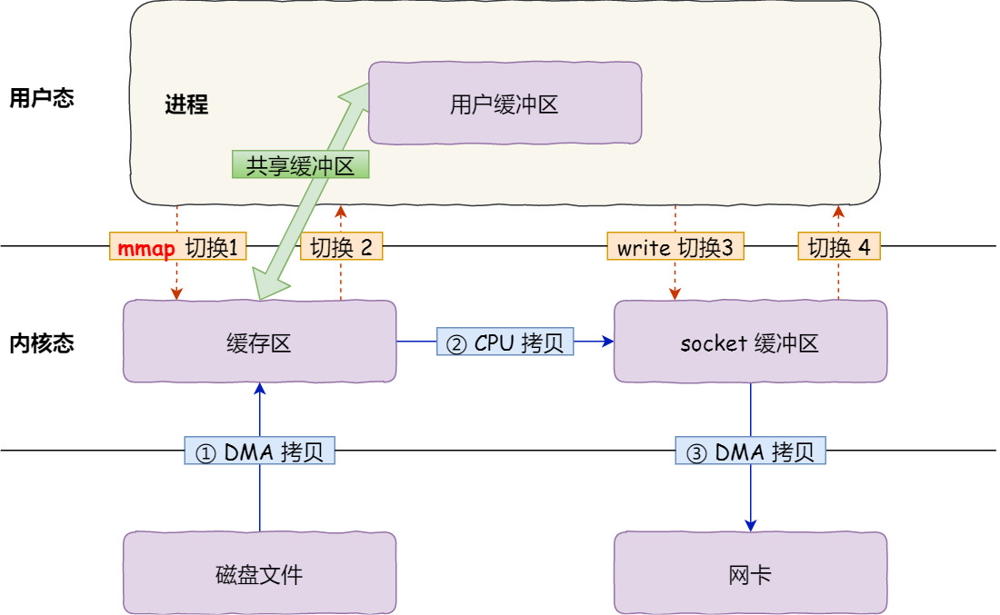
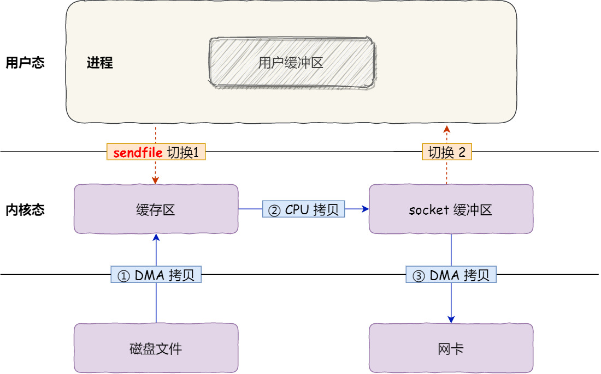
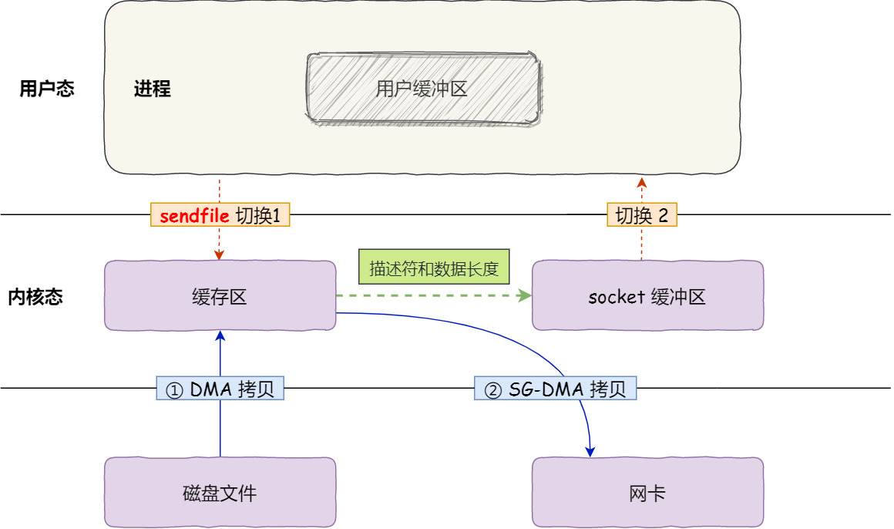

# IO 
## 网络IO
#### blocking & nonblocking
* 阻塞指的是进程被挂起
* 阻塞指的是取数据进程本身

#### Synchronous & Asynchronous 
* 同步、异步指的是两边的信息的传递方式
* 所有阻塞或者非阻塞都是同步的方式，因为都是等待新的返回，只是方式不同，一个是睡着等，一个是"动"着等
* 同步异步指的是取数据与提供数据两者的关系

#### 多路复用
* 使用一种方式来处理多个socket
* epoll高效的原因： 红黑树组织所有监控的fd、链表处理事件、用户和内核的数据共享（存在疑问？mmap）

#### LT(Level Trigger) & ET (Edge Trigger)
* LT: 有数据是高电平(可以想象为一个水桶)
* ET: 有数据到来是高电平
* 高低电平的概念来自于时钟周期的触发，时钟从0->1的时候激活一次机器周期
* 可写事件：比如写缓冲已经满的时候

#### 发展
* 单个io的阻塞问题
* select 有限个，使用数组
* poll使用链表，个数无上限
* epool即event poll，基于事件的方式，红黑树组织数据
* 核心是：需要一种机制来高效的管理大量的socket


### 加速技术
* 单次读取在POSIX中规定最长为
```
getconf SSIZE_MAX 
32767
```
* 当需要多次读取的时候，必然会引起CPU的反复拷贝与中断
* 在没有DMA的情况下，CPU直接与磁盘控制器通信，CPU发送读取请求到磁盘控制器，而磁盘控制器读取数据到磁盘缓冲区后，则发送中断给CPU，**CPU停下当前的进程，接着把磁盘控制器的缓冲区的数据一次一个字节地读进自己的寄存器，然后再把寄存器里的数据写入到内存，而在数据传输的期间 CPU 是无法执行其他任务的**。如果有多次读取，则会反复上述过程
  * 

### DMA
* 
* DMA 只存在在主板上，如今由于 I/O 设备越来越多，数据传输的需求也不尽相同，大部分I/O 设备里面都有自己的 DMA 控制器，但是一些简单的输入设备（如键盘、鼠标）通常不会直接使用 DMA 控制器进行数据传输，而是通过中断方式将数据传递给 CPU 进行处理。
* DMA 控制器通常由设备硬件中的专用电路和逻辑组成，用于控制数据传输的起始地址、传输长度、传输方向等。控制器可以根据配置信息直接访问系统内存，并通过总线接口与 I/O 设备进行数据传输。

### Zero Copy
* ，四次拷贝，要想提高文件传输的性能，就需要减少「用户态与内核态的上下文切换」和「内存拷贝」的次数，这里面有权限问题(安全问题)导致的额外的拷贝成本，安全管理的代价
* mmap: 直接把内核缓冲区里的数据「映射」到用户空间,操作系统内核与用户空间就不需要再进行任何的数据拷贝操作
  * 模式变为: 
* 在 Linux 内核版本 2.1 中，提供了一个专门发送文件的系统调用函数 sendfile()，就是OS在底层直接将两个文件描述符的内容进行拷贝
  ```
  #include <sys/socket.h>
  ssize_t sendfile(int out_fd, int in_fd, off_t *offset, size_t count);
  ```
  * 
* SG-DMA: The Scatter-Gather Direct Memory Access，查看网卡是否支持
  ```
  ethtool -k eth0 | grep scatter-gather
  ```
  * 对于支持SG-DMA的网卡，sendfile发生变化
  * 
* 这就是目前zero-copy的最终形态，没有在内存层面去拷贝数据，也就是说全程没有通过 CPU 来搬运数据，所有的数据都是通过 DMA 来进行传输的。
* 支持零拷贝的项目，kafka和nginx，查看ngxin的配置项
  ```
  http {
  ...
      sendfile on
  ...
  }
  ```
* 这种模式的运行是基于PageCache高效的情况下的
### Page Cache (磁盘高速缓存)
* 从名字上看，起名字是从内存的角度出发的，但是面向的是磁盘
  * 缓存最近被访问的数据
  * 预读功能；
* 在大文件传输的过程中，由于局部性原理失效，会导致PageCache的效率变低影响到别的任务的运行

### Direct IO (直接IO)
* open的时候指定，O_DIRECT标记，不使用操作系统的PageCache，应用层自己做文件系统的缓存


### sync fsync fdatasync 
* sync 操作系统刷新
* fsync fdatasync 具体的某个文件刷新，fdatasync只刷数据，不刷metadata


### 三种IO传输方式
* Programmed I/O (PIO)
  * Memory Mapped I/O，将IO地址纳入到内存的地址空间总，不用额外的io指令
  * Port Mapped I/O, x86使用，使用独立的地址空间供io使用，同时提供了专用的IO传输指令
* Interrupt I/O
* Direct Memory Access (DMA)