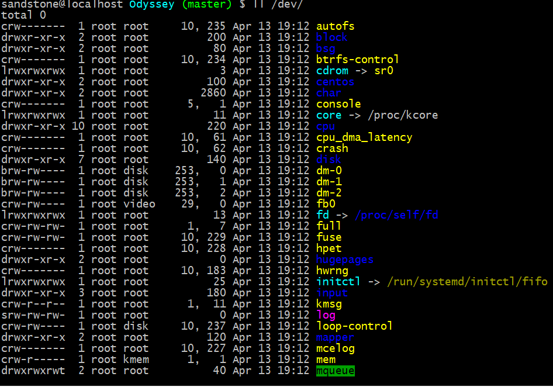
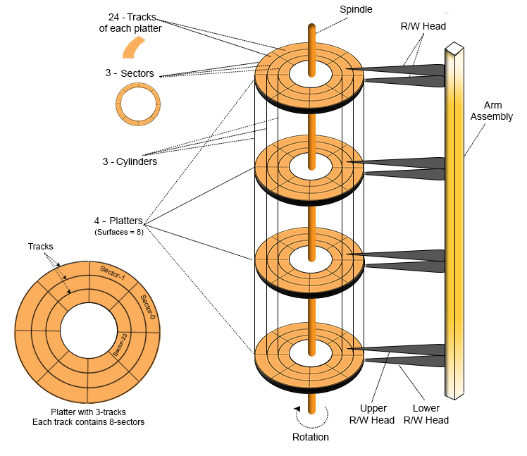
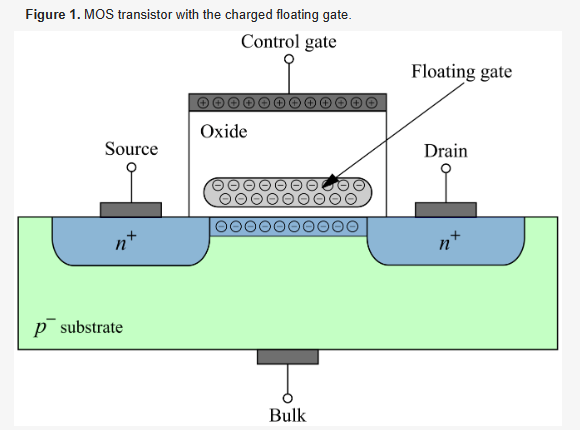

## disk 

### 设备类型
* The Linux Operating System consists of many different devices. **Devices can be seen in the OS as a file** whose purpose is to handle inputs and outputs.
* block-device interface (BDI)
  * A Block Device is a device whose driver communicates by sending entire blocks of data. Example - hard disks, USB cameras, Disk-On-Key.
* character-device interface (CDI)
  * A Character Device is a device whose driver communicates by sending and receiving single characters (bytes, octets). Example - serial ports, parallel ports, sound cards, keyboard.
* 
  * d 目录
  * c 字符设备文件，支持以character为单位进行线性访问
  * l 软链接文件
  * b 块设备文件，支持以块为单位进行随机访问
* raw device: 就是Character device，只能顺序访问
* block device: 支持随机访问


### flash
* Flash Memory，全名叫Flash EEPROM Memory，又名闪存，是一种长寿命的非易失性(在断电情况下仍能保持所存储的数据信息)的存储器，数据删除不是以单个的字节为单位而是以固定的区块为单位，区块大小一般为256KB到20MB。

### 接口
* ATA（Advanced Technology Attachment），即IDE, 并行总线硬盘
* SATA: Serial Advanced Technology Attachment, 串口硬盘, Serial ATA
* SCSI（Small Computer System Interface），并行总线
* SAS（Serial Attached SCSI） ，串行化
* FC(Fiber Channel)
* 趋势： 串行化总线逐渐替代并行化总线, 由于并行传送方式的前提是用同一时序传播信号，用同一时序接收信号，而过分提升时钟频率将难以让数据传送的时序与时钟合拍，布线长度稍有差异，数据就会以与时钟不同的时序送达，另外，提升时钟频率还容易引起信号线间的相互干扰，导致传输错误。因此，并行方式难以实现高速化。从制造成本的角度来说，增加位宽无疑会导致主板和扩充板上的布线数目随之增加，成本随之攀升。

### Advanced Format 
* 2010 年左右，硬盘公司正在将扇区从传统大小 512 字节迁移到更大、更高效的 4096 字节（一般称为 4K 扇区），国际硬盘设备与材料协会（International Disk Drive Equipment and Materials Association，IDEMA）将之称为高级格式化。
* 扇区的大小从512B提高到4096B
* 
### 磁性存储技术
* 
磁性存储技术的基本原理是使用磁性材料（通常是一种氧化铁化合物）来创建磁场。磁性材料被分成小的区域，每个区域称为磁区或磁颗粒。每个磁区可以具有两个稳定的磁场方向，通常表示为磁化的北极和南极。在写入数据时，一个外部的磁场或磁头会对磁区施加一个特定的磁场，改变磁区的磁化方向。根据磁场的方向，磁区可以表示为0或1，即二进制数据的位。
* 硬盘的盘片一般用铝合金材料做基片，高速硬盘也有用玻璃做基片的。玻璃基片更容易达到所需的平面度和光洁度，而且有很高的硬度。
* 有一个0磁道检测器，由它来完成硬盘的初始定位。0磁道存放着用于操作系统 启动所必需的程序代码，因为PC启动后BIOS程序在加载任何操作系统或其他程序时，总是默认从磁盘的0磁道读取程序代码来运行。(0磁道在外圈，因为老式的磁盘每个磁道上的sector一样，外面的密度较低，安全比较有保障)
* 一般的5400RPM (Round Per Minute)，好一点的7200RPM，基本上等于民用汽车发动机的最高转速
* 
* 柱面（Cylinder）、磁头（Header）和扇区（Sector）三者简称CHS，CHS寻址方式已经过时(因为寻址范围有限)，现在基本是**LBA(Logical Block Address)**方式进行寻址(线性寻址)
* 同一时刻只能有一个磁头在工作，磁头的切换可以通过电路进行控制，而选择柱面则需要机械切换，**所以数据的存储是优先按照柱面进行的**。
```
每个圆柱上的磁头由上而下从0开始编号。数据的读写按柱面进行， 即磁头读写数据时首先在同一柱面内从0磁头开始进行操作，依次向下在同一柱面的不同盘面（即磁头）上进行操作。只有在同一柱面所有的磁 头全部读写完毕后磁头才转移到下一柱面。
```
* 磁头的容量与精度与磁头的大小有关，如果磁头够小，则可以增加更多的磁道。
* Cylinder, Track 形成了磁盘的二维表示，cylinder和track的交点就是sector
*  每个磁道上的扇区数目是一样的么？
```
早期的磁盘每个磁道上的扇区数目是一样，限制了磁盘的容量；后来为了增大磁盘容量采用了新技术，也就是说越往外每磁道扇区数目越多，并且外圈的读取速度也快于内圈
```
* 磁盘的**基本读写单位为Sector**，这里是指**物理扇区**,一般情况下逻辑扇区512B，物理扇区4K，之所有有逻辑扇区是为了保持兼容性
* 为磁盘划分分区时，是以逻辑扇区为单位进行划分的，分区可以从任意编号的逻辑扇区开始（可以认为逻辑扇区是磁盘对外提供的接口，不用物理的实现方式，各种接口是以逻辑扇区进行呈现）。如果分区的起始位置没有对齐到某个物理扇区的边缘，格式化后，所有的“簇”也将无法对齐到物理扇区的边缘。可能导致一个簇跨越两个物理扇区，这对效率有比较大的影响。
* cluster是文件系统的专用概念，是文件系统向磁盘申请内存的最小单元，这个单元可能与磁盘的逻辑、物理扇区都不同，这样文件系统能更加灵活的利用磁盘.
* 一般disk不会很多，比如5个
* 延迟计算
```
旋转延迟基本上和寻道延迟在一个数量级
三部分： 旋转延迟、寻道延迟、传输延迟
读取一个扇区的平均时间： 一秒120圈，如果一个track有n个sector，则平均读取时间为  1/120/n，这个时间完全是电路级别的
```
### 固态硬盘存储技术
* SSD内部的闪存芯片由许多存储单元组成，每个存储单元可以存储多个比特的数据。每个存储单元通常是一个闪存单元（NAND或NOR），它由一对浮动栅和控制栅组成。通过在浮动栅上施加电压来改变栅内电荷的分布，从而改变存储单元的电荷状态，进而表示数据的0和1。
* 在写入数据时，SSD会将数据转换为电荷状态，并将其存储在适当的存储单元中。**写入操作通常是以页（通常为4KB或8KB）为单位进行的**。
* 由于闪存芯片的特性，SSD在长期使用或频繁写入操作时可能会出现性能下降或寿命减少的情况，因此需要采取相应的管理和优化策略来维护其性能和可靠性。
* 
* 原理
```
当MOS管栅极加上较高的电压（20V左右），源极接地，漏极浮空，然后会产生大量高能电子，由于电子密度大，有的电子到衬底和浮栅之间的二氧化硅层，由于选择栅有高电压，这些电子通过隧穿氧化层(Tunnel Oxide）到达浮栅。

当移除外部电压，由于浮栅没有放电回路，所以电子会留在浮栅上。当浮栅带有电子，衬底表面感应的是正电荷，这样使得MOS管导通电压变高。

反之，当控制栅极接地，衬底加上较高电压，源、漏极开路，电子会从浮栅中“吸出”，MOS管导通电压变低。

浮栅中电荷量，影响到MOS管的导通电压，从而代表不同的存储信息。比如说一个杯子，没有水的时候，代表“0”，当水超过一半，代表“1”。
```