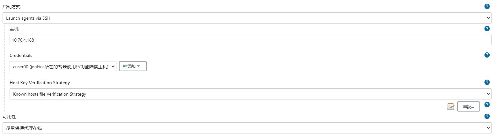

## jenkins 

### comand
* docker run \
  -u root \
  --rm \
  -d \
  -p 8080:8080 \
  -p 50000:50000 \
  -v /data/cuser00/var/jekins:/var/jenkins_home \
  -v /data/cuser00/var/jekins/run/docker.sock:/var/run/docker.sock \
  jenkinsci/blueocean

* 将数据与容器分离

### 和宿主机通信
* ssh 方式
* 在容器内执行
```
* 通信方式
```
创建目录
mkdir ~/.ssh && cd ~/.ssh
--生成密钥
ssh-keygen -t rsa
-- 一直回车即可
-- 生成私钥id_rsa，公钥id_rsa.pub
-- 退出镜像
exit
``

* 将公钥拷贝到宿主机中的id_rsa.pub
* 将~/.ssh/known_hosts放入到/var/jenkins_home/.ssh/known_hosts中
* 配置节点 <br/> 


### 错误历程
* -it错误
```
docker exec -it static_builder /bin/bash /static/run.sh hotfix_wb_docker_apply_v1
the input device is not a TTY
Build step 'Execute shell' marked build as failure
Finished: FAILURE
```
* 时间不对
```
打开jenkins的【系统管理】---> 【脚本命令行】，在命令框中输入一下命令【时间时区设为 亚洲上海】：

System.setProperty('org.apache.commons.jelly.tags.fmt.timeZone', 'Asia/Shanghai')
```

### 快捷方式
* http://39.107.141.206:8080/updateCenter/ 更新中心
* http://39.107.141.206:8080/restart
* http://39.107.141.206:8080/exit


### 插件
* https://cloud.tencent.com/developer/article/1644686
* AnsiColor 输入格式化颜色
* build user vars plugin 采集build人
* description setter plugin 格式化构建历史，栗子:
```
本次构建由? <span style="font-size:10px;color:red;"> $BUILD_USER</span>发起<span style="font-size:10px;color:green;"> $BRANCH_NAME</span>构建
```
* Git Parameter git分支选择